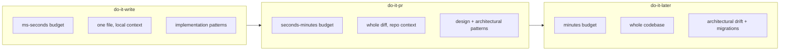

# 1. Concepts & principles

## 1.1 Vocabulary

- **Catalogue** — the corpus of patterns (`patterns/*.yaml`), each with id, scale,
  applicability tags, synergies, examples, and per-size ratings.
- **Pattern profile** — a per-repo declaration (`patterns.config.yaml`) of which catalogue
  patterns this project has **adopted**, which are **banned**, and at what **enforcement
  level**. The profile is the contract the validator checks against. See [config](09-config.md).
- **Change set** — the unit under review: a single written file (do-it-write), the diff of
  a PR (do-it-pr), or a whole subtree/repo (do-it-later).
- **Finding** — a single conformance observation about a change set: a violation, a missed
  opportunity, a reuse problem, or a confirmation. Carries severity + confidence + a
  suggested action and a link to the catalogue. See [types](08-types.md).
- **Detector** — a unit that inspects a change set for one concern and emits findings.
  Detectors are layered: deterministic → heuristic → LLM.
- **Altitude** — the abstraction level a check operates at: `implementation`, `design`,
  `integration`, `architectural` (mirrors the catalogue `scale`).

## 1.2 Design principles

These mirror the repo's engineering values and keep false positives low.

1. **Selected patterns, not all patterns.** The validator only enforces what the project's
   profile adopts. The catalogue is a menu; the profile is the order. This prevents the
   "lint everything against 275 patterns" noise that would make the tool ignorable.

2. **Right altitude, right phase.** Cheap local patterns are checked at write-time; design
   and architectural patterns need whole-change context and are checked at PR-time;
   codebase-wide drift is a batch concern. A pattern is never judged where it cannot be
   judged well. See [routing](06-pattern-routing.md).

3. **Strict core, tolerant boundary.** Deterministic detectors are strict and block; LLM
   judgement is advisory unless confidence is high and a human/CI threshold is met.
   Ambiguity degrades to a suggestion, never a hard failure.

4. **Confidence-gated, evidence-bearing.** Every finding states *why* (the evidence: a
   matched AST node, a duplicated symbol, a heuristic signal) and a calibrated confidence.
   Findings below the phase's threshold are dropped or demoted, never surfaced as blockers.

5. **Detect, then prescribe.** The engine separates "this code is relevant to pattern X"
   (applicability) from "X is/ isn't correctly applied" (conformance) from "do this"
   (suggestion). Each stage can be tuned and tested independently.

6. **Reuse is a first-class check.** "Does an abstraction for this already exist?" runs
   alongside pattern conformance, because the most common agent failure is reinvention,
   not mis-implementation. See [reuse](07-reuse-enforcement.md).

7. **Idempotent & non-flapping.** Re-running on unchanged code yields identical findings;
   a suggestion that was explicitly dismissed (via an inline waiver) stays dismissed.

8. **Advisory before blocking.** Every rule ships at `advise`, earns trust with measured
   precision, and is promoted to `block` deliberately. See [rollout](10-maturity-rollout.md).

## 1.3 Why three phases (and not one)

The three phases trade **latency** against **context**:

A low-level idiom (guard clause, null object, parameter object) can be judged from a single
file in milliseconds — perfect for write-time. Whether a change respects **Hexagonal
Architecture** or correctly extends an **Aggregate** boundary needs the *whole* change and
surrounding code — a PR concern. Whether the *whole repo* still matches its target
architecture, and how to migrate it incrementally, is a batch concern. Forcing all three
into one trigger either makes write-time too slow or PR-time too shallow.

## 1.4 What "conformance" means precisely

For a selected pattern `P` and a change set `C`, the engine answers three questions:

1. **Applicability** `A(P, C) ∈ [0,1]` — how strongly is `C` in the situation `P` addresses?
   (e.g. `C` makes a network call → `retry`/`circuit-breaker` applicable.)
2. **Conformance** `K(P, C) ∈ {applied, violated, partial, n/a}` — given applicability, is
   `P` actually applied, and correctly? (e.g. the network call has no timeout → `timeout`
   violated.)
3. **Action** — if `violated`/`partial`/missed, the concrete refactor toward `P`, with a
   catalogue link and (where deterministic) an autofix.

Banned patterns invert this: applicability + presence ⇒ a violation (e.g. profile bans
`service-locator`; a service locator appears ⇒ finding).
