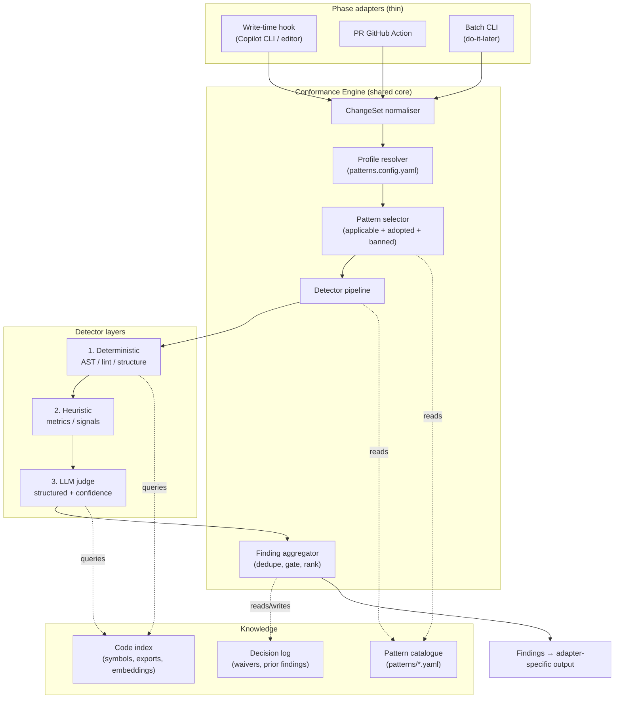
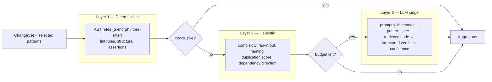

# 2. Architecture

## 2.1 Shape: one engine, three adapters



The **engine is identical** across phases; phases differ only in:

- the **ChangeSet** they construct (one file / a diff / a tree),
- the **altitude filter** (which `scale`s of pattern they enable — see [routing](06-pattern-routing.md)),
- the **latency budget** (which detector layers may run, and the LLM token budget),
- the **output adapter** (inline note / PR review comments / report + branch of refactors).

## 2.2 The detector pipeline (layered, fail-soft)

Each selected pattern contributes one or more **detectors**. Detectors run in three layers,
cheapest first, and later layers can be skipped when the budget is tight or an earlier layer
is already conclusive.



- **Layer 1 — Deterministic.** Pure functions over the AST/structure. High precision, no
  cost, safe to **block**. Examples: "function has >2 nesting levels and an early-return is
  possible" (`guard-clause`); "class field typed as raw `string` for a domain id"
  (`newtype-wrapper`); "`new ConcreteRepo()` inside a domain class" (DI violation);
  "outbound HTTP call with no timeout option" (`timeout`).
- **Layer 2 — Heuristic.** Cheap metrics that *raise applicability* and feed the LLM, e.g.
  cyclomatic complexity, copy-paste similarity to existing symbols, import-direction
  violations (infrastructure imported by domain). Heuristics rarely block alone; they
  decide whether Layer 3 is worth running.
- **Layer 3 — LLM judge.** For design/architectural altitude where intent matters. Given
  the change, the **pattern spec from the catalogue** (description, positive/negative
  examples, consequences), and **retrieved surrounding code**, it returns a *structured*
  verdict: `{applicable, conformance, confidence, evidence, suggestion}`. Confidence-gated;
  advisory unless the profile + phase permit blocking.

This layering is the **strict-core / tolerant-boundary** principle in practice: deterministic
truth blocks; probabilistic judgement advises.

## 2.3 Knowledge sources

- **Philosophies** — the project's adopted design philosophies are the **north star**. Their
  catalogue text (tenets, `applies_when`, consequences) grounds the LLM judge's rubric, and
  their graph edges (`associated_patterns`, `at_odds_patterns`) drive which patterns are in
  scope. See [philosophy-first selection](11-philosophy-selection.md).
- **Catalogue** — the pattern specs themselves are the rubric. The LLM judge is handed the
  exact `description`, `examples.negative/positive`, `consequences`, and `synergies` of the
  pattern being checked, so judgement is grounded in the catalogue, not the model's priors.
- **Code index** — a per-repo index built once and updated incrementally: exported symbols,
  signatures, module dependency graph, and embeddings of functions/classes. Powers reuse
  detection ("is there already a `Money` type / a retry helper / a repository for this
  aggregate?") and provides retrieval for the LLM judge. See [reuse](07-reuse-enforcement.md).
- **Decision log** — prior findings and explicit waivers (inline `// conformance:allow
  service-locator reason=...` or a `.conformance/waivers.yaml`). Guarantees non-flapping and
  records intentional deviations.

## 2.4 How a pattern declares its detectors

Detectors are keyed to catalogue ids. A pattern's machine-checkable behaviour lives in a
sibling **rule pack** (design sketch — not implemented here):

```
rules/
  guard-clause/            -> deterministic AST rule + autofix
  timeout/                 -> deterministic rule (outbound calls need a deadline)
  repository/              -> heuristic (data access outside a repo) + LLM judge
  hexagonal-architecture/  -> heuristic (import-direction) + LLM judge (boundary intent)
```

A pattern with no rule pack is still usable for **LLM-only** checks (its catalogue spec is
the rubric) and for documentation/onboarding; it simply cannot block. This lets all 275
patterns participate at the advisory tier on day one, while deterministic packs are added
for the highest-value adopted patterns over time.

## 2.5 Determinism, caching, performance

- **Content-addressed cache.** Findings are cached by `hash(changeSet, pattern, ruleVersion,
  modelVersion)`. Re-running is free; only changed hunks are re-judged.
- **Incremental.** Write-time only ever sees one file; PR-time diffs only changed files plus
  their direct dependents (via the code index); batch chunks the repo by module.
- **Budget governor.** Each phase has a token/time budget; the governor runs Layer 3 on the
  highest-applicability candidates first and stops at the budget, so checks degrade
  gracefully rather than time out.
