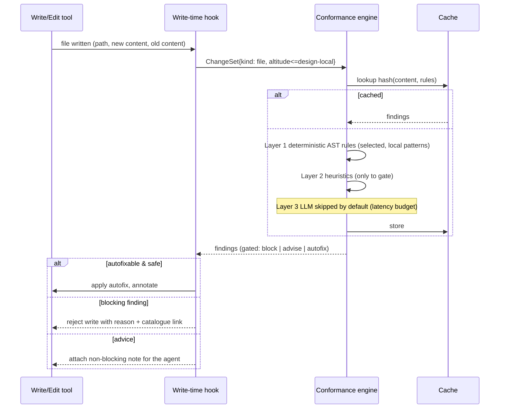

# 3. Phase — do-it-write (write-time hook)

## 3.1 Trigger & intent

Fires **every time a tool writes a file** (an agent edit/create, or an editor save). Its job
is to catch **local, low-altitude** pattern opportunities and violations *at the moment of
writing*, while the change is small and the cost of fixing is near-zero. It must be **fast**
(single-file, low/zero-LLM) and **quiet** (only the highest-precision findings interrupt).

In Copilot CLI this is a `postToolUse`-style hook on the write/edit tools; in an editor it is
an on-save action; in CI it never runs (PR phase covers that).

## 3.2 Altitude

Only `implementation` and *local* `design` patterns are enabled here (see
[routing](06-pattern-routing.md)) — things judgeable from one file without whole-program
context: guard-clause, null-object, parameter-object, options-object, fail-fast,
smart-constructor, newtype-wrapper, fluent-interface, raii, dependency-injection (local
"don't `new` your dependencies"), map-filter-reduce, pure-function hints, input-validation,
output-encoding. Architectural/integration patterns are **deliberately excluded** — a single
file cannot show whether Hexagonal or Saga is respected, and false alarms here destroy trust.

## 3.3 Flow

## 3.4 Output contract

The hook returns one of:

- **autofix** — deterministic, behaviour-preserving rewrite applied in place (e.g. collapse
  nested conditionals into guard clauses; wrap a raw id in its newtype). The agent sees a
  note: *"applied guard-clause (catalogue/implementation/guard-clause)"*.
- **block** — only for high-precision deterministic violations of a `block`-level adopted or
  banned pattern (e.g. domain class instantiates a concrete infrastructure adapter; a banned
  `service-locator` lookup appears). Returns a short reason + the catalogue link so the agent
  can self-correct and re-write.
- **advise** — a non-blocking note appended to the agent's context: *"consider option-maybe
  here; this returns null on three paths."* The agent may act or waive.

Because the agent is *in the loop*, write-time findings are best delivered as **machine-
readable notes the agent reads on its next turn**, turning the validator into a fast tutor
rather than a gate.

## 3.5 Latency & noise controls

- **Budget:** target < 150 ms/file; LLM disabled unless `writeTime.llm: true` in the profile
  and then only for files under a size threshold with a hard token cap.
- **Debounce:** rapid successive writes to the same file coalesce; only the settled content
  is checked.
- **One-interruption rule:** at most one *blocking* finding is surfaced per write (the
  highest-severity, highest-confidence one); the rest are advisory, to avoid thrash.
- **Waivers:** an inline `// conformance:allow <pattern-id> reason=...` suppresses that
  finding for that span permanently (recorded in the decision log).

## 3.6 What it explicitly does *not* do

- It does not judge cross-file or architectural conformance (no context).
- It does not run reuse-similarity across the whole repo on every keystroke (too costly);
  it may do a **cheap local** reuse check (exact/near-duplicate of a symbol in the same
  module) and defers repo-wide reuse to PR/batch phases.
