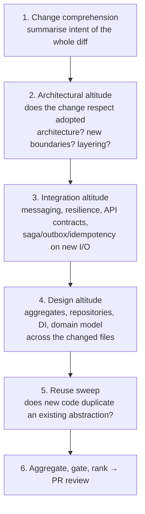
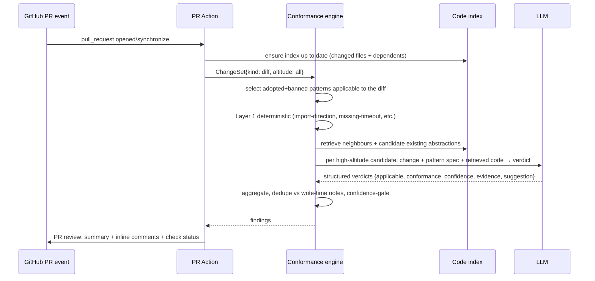

# 4. Phase — do-it-pr (PR-level, top-down)

## 4.1 Trigger & intent

Runs when a **PR is opened or updated** (GitHub Action / equivalent). It is the phase that
**understands the whole change top-down** and judges it against the **high-altitude**
patterns the write-time phase cannot see: architectural, integration, and cross-file design
patterns, plus **repo-wide reuse**. It is allowed seconds-to-minutes and a real LLM budget.

## 4.2 Top-down strategy

The order matters: judge the **largest structures first**, because a high-level verdict
constrains the lower-level ones (e.g. if the change introduces a new bounded context, the
expectations for its internal repositories/DI follow). 

## 4.3 Flow

## 4.4 Output contract

- A **single PR review** with:
  - a **summary**: which adopted patterns the change touched, conformance per pattern, and a
    short top-down narrative ("introduces an outbound payment call — `circuit-breaker` and
    `timeout` are adopted and present; `idempotency` is adopted but missing").
  - **inline comments** anchored to the offending lines, each with severity, confidence,
    catalogue link, and a concrete suggested diff.
  - a **check run** status: `success` / `neutral` / `failure` per the rollout level of the
    violated patterns (blocking patterns at `block` fail the check; everything else is
    advisory/neutral).
- A machine-readable artdefact (`conformance-report.json`) for dashboards and the
  [batch phase](05-phase-do-it-later.md) to consume as a trend baseline.

## 4.5 Why PR-time owns architectural & reuse

- **Whole-change context.** Only here is the complete set of added/modified files visible, so
  layering, boundaries, and synergistic pattern sets (e.g. `outbox` + `idempotent-receiver`,
  `cqrs` + `event-sourcing`) can be evaluated as a unit.
- **Affordable LLM.** PRs are infrequent relative to writes, so per-candidate LLM judgement
  with retrieval is economical.
- **Authoritative gate.** CI is the natural enforcement point, so promotion to `block` lives
  here, not at write-time.

## 4.6 Anti-false-positive measures

- **Diff-scoped:** only patterns whose applicability is triggered *by the change* are judged;
  pre-existing debt is not flagged on unrelated PRs (the batch phase owns that).
- **Dedupe with write-time:** findings already surfaced (and acted on or waived) at write-time
  are not repeated.
- **Confidence gate + evidence required:** an LLM finding with no concrete evidence span is
  demoted to advisory regardless of confidence.
- **Waivers honoured:** `.conformance/waivers.yaml` and inline waivers suppress known,
  intentional deviations and explain them in the summary instead of re-flagging.
