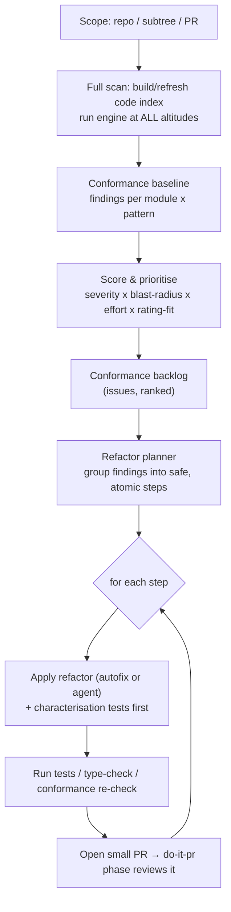

# 5. Phase — do-it-later (batch / incremental refactor)

## 5.1 Trigger & intent

Runs **on demand or on a schedule** over a **whole PR, a subtree, or the entire repo**. Two
jobs:

1. **Baseline** the codebase: measure how far current code is from the adopted profile and
   produce a prioritised **conformance backlog**.
2. **Incrementally refactor** toward the selected patterns — opening small, reviewable PRs
   rather than one big-bang change — including large **migrations** (e.g. Transaction Script
   → Domain Model, anaemic data access → Repository + Unit of Work, monolith → Strangler Fig
   extraction).

This is how a project that adopts the catalogue *after* it already has code converges on it
safely, and how architectural drift is paid down over time.

## 5.2 Flow



## 5.3 Prioritisation model

Each backlog item is scored so the highest-value, lowest-risk refactors go first:

```
priority = (severity * confidence * blastRadius * ratingFit) / effort
```

- **severity / confidence** — from the finding.
- **blastRadius** — how many modules depend on the offending code (from the index); fixing a
  widely-depended-upon violation pays compound interest.
- **ratingFit** — the adopted pattern's catalogue **rating for this project's size band**.
  A pattern rated 5/5 at the repo's size is worth more than one rated 3/5. This is where the
  catalogue's per-size ratings feed the engine directly.
- **effort** — estimated change size (deterministic autofix ≈ trivial; cross-cutting
  architectural migration ≈ large, gets decomposed by the planner).

## 5.4 Safe incremental refactoring

- **Characterisation tests first.** Before any non-trivial refactor, generate/confirm tests
  that pin current behaviour (`golden-master` for legacy code), so refactors are provably
  behaviour-preserving.
- **Atomic steps.** The planner splits a migration into independently-mergeable steps (e.g.
  Strangler Fig: 1) introduce facade, 2) route one capability to new module, 3) move logic,
  4) delete old path). Each step is a small PR that the **do-it-pr** phase reviews — the
  phases compose.
- **Stop-on-regression.** If tests/type-check/conformance re-check fail, the step is reverted
  and parked back on the backlog with the failure noted — fail-fast, fix-fast.
- **Per-altitude waves.** Optionally run lowest-altitude items first (cheap deterministic
  autofixes across the repo) to bank quick wins, then design, then architectural migrations.

## 5.5 Output contract

- A committed **baseline report** + `conformance-backlog.{json,md}` (ranked findings as
  issues, optionally synced to the tracker).
- A **stream of small PRs**, each scoped to one step, each green, each reviewed by do-it-pr.
- A **trend line**: conformance score over time, so convergence (or regression) is visible.

## 5.6 Relationship to the other phases

do-it-later is the **only** phase that may flag pre-existing debt (write-time and PR-time are
change-scoped to avoid noise). It uses the **same engine and findings**, just unrestricted in
scope, and it **feeds work back through do-it-pr**, so every automated refactor is held to the
same review bar as human changes.
