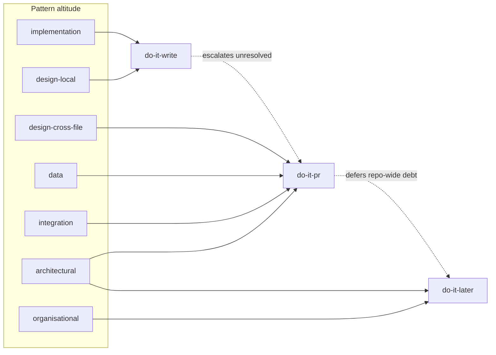

# 6. Pattern routing — high vs low level

The single most important correctness decision in the system is **judging each pattern at the
altitude and phase where it can actually be judged well**. A pattern checked with too little
context produces false positives; checked too late, it lets bad code land first. Routing is a
deterministic function of a pattern's catalogue `scale` plus a small per-pattern override.

## 6.1 Altitude → phase mapping

| Catalogue `scale` | Primary phase | Also runs in | Rationale |
| --- | --- | --- | --- |
| `implementation` | **do-it-write** | pr (diff-scoped), later | Judgeable from one file; fix while writing. |
| `design` (local) | **do-it-write** | pr, later | Single-class/function design (null-object, DI-local, smart-constructor). |
| `design` (cross-file) | **do-it-pr** | later | Needs multiple files (repository usage, aggregate boundary, domain-model vs transaction-script). |
| `data` | **do-it-pr** | later | Persistence choices (unit-of-work, outbox, optimistic-locking) span call sites. |
| `integration` | **do-it-pr** | later | Messaging/resilience/API conformance needs the whole call path. |
| `architectural` | **do-it-pr** + **do-it-later** | — | Boundaries/layering need whole change (pr) or whole repo (later); never write-time. |
| `organisational` | **do-it-later** (report only) | — | Ubiquitous-language, test-pyramid: advisory metrics, not gating. |

## 6.2 The `design` split (local vs cross-file)

`design`-scale patterns are routed by whether their **detector needs more than the current
file**. This is a property of the *rule pack*, not the catalogue:

- **Local** (`guard-clause`, `null-object`, `parameter-object`, `smart-constructor`,
  `fluent-interface`, local DI "don't instantiate dependencies"): AST of one file suffices →
  write-time.
- **Cross-file** (`repository`, `aggregate`, `domain-model`, `service-layer`, `mediator`
  across modules): needs the dependency graph / multiple files → PR-time.

A rule pack declares `requiresContext: file | module | repo`, and the router maps that to the
earliest phase that can supply it.

## 6.3 Synergy- and conflict-aware routing

The catalogue encodes `synergies` and `conflicts_with`. The router uses them so high-level
patterns pull in their partners and rule out their opposites **at the right altitude**:

- When the PR phase confirms an **architectural** pattern is in play (e.g. `event-sourcing`),
  it **raises the applicability** of its synergistic patterns (`cqrs`, `snapshotting`,
  `outbox`) for the same change, and **lowers** that of conflicting ones — so the change is
  judged as a coherent set, not isolated rules.
- `conflicts_with` becomes a hard signal: if the profile adopts `data-mapper` and a change
  introduces `active-record`, that is a conformance violation surfaced at the owning phase.

## 6.4 Escalation & de-escalation

- **Escalation:** a write-time finding the agent neither fixed nor waived is **not dropped**;
  it is recorded and re-evaluated at PR-time with full context, where it can be confirmed or
  dismissed (the extra context may exonerate it).
- **De-escalation:** repo-wide debt that the PR phase *could* detect but that is **unrelated
  to the diff** is intentionally **not** raised on that PR; it is deferred to do-it-later so
  PRs stay focused. This keeps each phase's signal-to-noise high.

## 6.5 Worked example — an outbound payment call is added

| Altitude | Phase | Check |
| --- | --- | --- |
| implementation | write | the new function has guard clauses; raw money handled via `Money` newtype, not `number` |
| design-local | write | the HTTP client is **injected**, not `new`-ed inside the domain |
| integration | pr | adopted `timeout` + `circuit-breaker` present; adopted `idempotency` **missing** → finding |
| design-cross-file | pr | payment access goes through the `payment-gateway` port (Hexagonal), not inline |
| architectural | pr + later | the new dependency does not make the `billing` context import `ordering` internals (boundary intact) |
| reuse | pr | a `RetryingHttpClient` already exists — don't hand-roll another (see [reuse](07-reuse-enforcement.md)) |

Each row is judged exactly where its context exists — nothing is guessed from too little.
