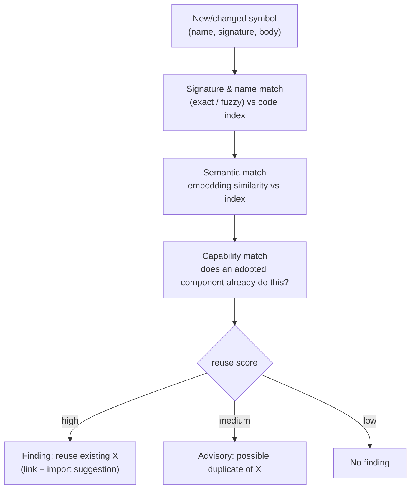

# 7. Reuse enforcement

The most frequent and most damaging agent failure is **reinvention**: writing a new helper,
type, or service that already exists. Reuse enforcement is therefore a **first-class check
that runs alongside pattern conformance**, not an afterthought. Its question: *"Before you add
this abstraction, does the codebase already provide one?"*

## 7.1 What counts as a reuse violation

1. **Duplicate utility** — a function/class that is structurally near-identical to an existing
   exported symbol (e.g. a second `formatMoney`, a second exponential-backoff helper).
2. **Parallel abstraction** — a new interface/port that overlaps an existing one (a second
   `HttpClient`, a second `OrderRepository`).
3. **Copy-edit drift** — code clearly copied from another module and lightly edited instead of
   extracted and shared (violates `dry`).
4. **Bypass** — re-implementing behaviour that an adopted pattern's existing component already
   centralises (hand-rolled retry when a `RetryingHttpClient` exists; raw SQL when a
   `repository` exists for that aggregate).

## 7.2 Mechanism



- **Code index** (built per repo, updated incrementally) holds: exported symbols + signatures,
  the module dependency graph, and **embeddings** of every function/class. New code is matched
  three ways — lexical (name/signature), semantic (embedding nearest-neighbours), and
  capability (does an adopted pattern component already cover this behaviour).
- **Thresholds** are tuned per match type; only high-confidence matches with a concrete
  existing target become findings. Medium becomes advisory. This keeps precision high.

## 7.3 Per-phase reuse responsibilities

| Phase | Reuse scope | Why |
| --- | --- | --- |
| do-it-write | local module only (cheap, exact/near-dup) | Latency budget; full-repo similarity is too slow per write. |
| do-it-pr | whole repo (lexical + semantic + capability) | The authoritative reuse gate; affordable per PR. |
| do-it-later | whole repo + cross-module extraction | Finds *existing* duplication and proposes shared extraction. |

## 7.4 From detection to action

A reuse finding is only useful if it points to the thing to reuse:

```
finding:
  kind: reuse
  message: "Hand-rolled retry loop duplicates utils/http/RetryingHttpClient."
  existing:
    symbol: RetryingHttpClient
    path: src/utils/http/retrying-client.ts
    importHint: "import { RetryingHttpClient } from '@/utils/http';"
  suggestion: "Replace the manual loop with RetryingHttpClient (adopted: retry, circuit-breaker)."
  catalogue: [retry, circuit-breaker, dry]
  confidence: 0.88
```

When the existing component is itself the realisation of an **adopted pattern**, the reuse
finding and the pattern finding reinforce each other: not reusing it is simultaneously a
DRY violation and a deviation from the project's chosen way of doing retries.

## 7.5 Encouraging reuse, not just blocking duplication

- **Discoverability output.** When applicability for an adopted pattern is detected, the
  engine surfaces the **existing components** that already implement it ("this module already
  has `Money`, `Email`, `RetryingHttpClient`"), so the agent reaches for them first.
- **Extraction proposals (later phase).** When the same logic appears in N places with no
  shared home, the batch phase proposes a single extraction PR rather than N inline fixes —
  paying down the duplication at its root.
- **Waivers for deliberate divergence.** Sometimes a parallel abstraction is intentional
  (a genuinely different `HttpClient` for a different protocol). An inline/`waivers.yaml`
  entry records the rationale so it is not re-flagged.
