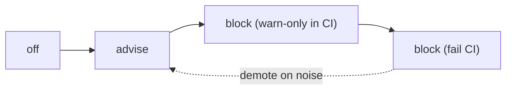
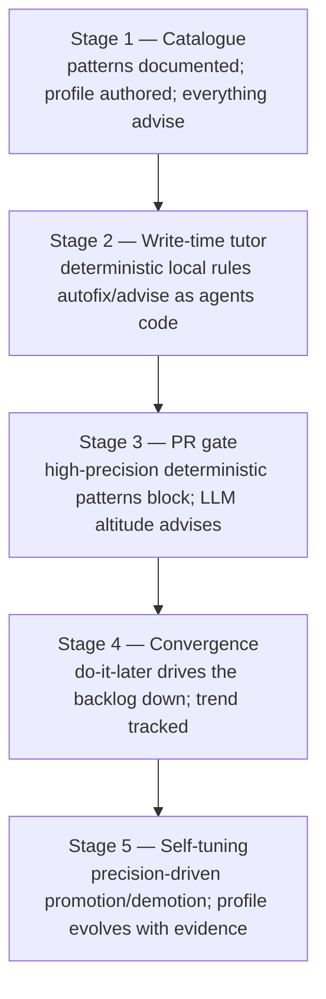

# 10. Maturity model & rollout

A conformance gate is only adopted if it earns trust. The system ships **advisory-first** and
promotes rules to **blocking** only on measured precision, so it never becomes the tool teams
route around.

## 10.1 Enforcement ladder (per adopted pattern)

- **off** — rule pack exists but is dormant (catalogue/onboarding use only).
- **advise** — findings surface as non-blocking notes (agent context, PR comments). Precision
  is measured here.
- **block (warn-only)** — would-fail decisions are recorded but CI stays green; a shadow
  period to confirm precision at gate strength.
- **block (fail)** — violations fail the check run / reject the write.

Promotion criteria (per pattern, measured over a rolling window of real PRs):

| To | Requires |
| --- | --- |
| advise → block(warn) | ≥ N findings, precision ≥ 0.9 (sampled human review), no unresolved false-positive class |
| block(warn) → block(fail) | warn-only shadow ≥ M PRs with ≤ X% override rate and stable precision |
| any → demote | precision drops below threshold or override rate spikes → auto-demote + alert |

## 10.2 Organisation maturity stages

Most teams sit comfortably at Stage 3: deterministic, high-value patterns block at PR; design
and architectural judgement advises with strong suggestions; the batch phase pays down debt.

## 10.3 Calibration & precision tracking

- **Labelled outcomes.** Every finding's fate is logged: accepted (acted on), waived (with
  reason), or overridden (merged despite block). These feed per-rule precision/override
  metrics that drive the ladder.
- **Confidence calibration.** LLM-judge confidences are calibrated against sampled human
  labels so the phase thresholds mean what they say; miscalibrated rule packs are held at
  advise.
- **False-positive budgets.** Each phase has an explicit FP budget; exceeding it auto-demotes
  the noisiest rule and opens a tuning task rather than degrading the whole tool's credibility.

## 10.4 Why this stays trustworthy

- **Selected, not universal** — only profile patterns are enforced ([config](09-config.md)).
- **Right altitude** — nothing is judged with too little context ([routing](06-pattern-routing.md)).
- **Strict core / tolerant boundary** — deterministic truth blocks; judgement advises.
- **Evidence + confidence on every finding** — no hand-wavy verdicts.
- **Earned blocking** — rules prove precision before they can fail a build, and auto-demote if
  they regress.

## 10.5 Open design questions (called out honestly)

- **LLM determinism:** Layer-3 verdicts vary across runs/models; mitigated by caching on
  `(content, ruleVersion, modelVersion)` and by keeping blocking decisions deterministic, but
  advisory drift remains. Worth pinning model + temperature per rule version.
- **Index freshness vs cost:** repo-wide embeddings/reuse need incremental indexing; stale
  indexes weaken reuse detection. Needs a cheap invalidation strategy.
- **Cross-repo / org patterns:** the profile is per-repo; shared org patterns (a company
  `RetryingHttpClient`) need a shared component registry the reuse check can consult — out of
  scope for v1 but anticipated by `CodeIndex.componentsImplementing`.
- **Rule-pack authoring effort:** 263 catalogue patterns, far fewer deterministic rule packs at
  first. LLM-only advisory coverage bridges the gap, but high-value adopted patterns need hand-
  written packs to ever block.
