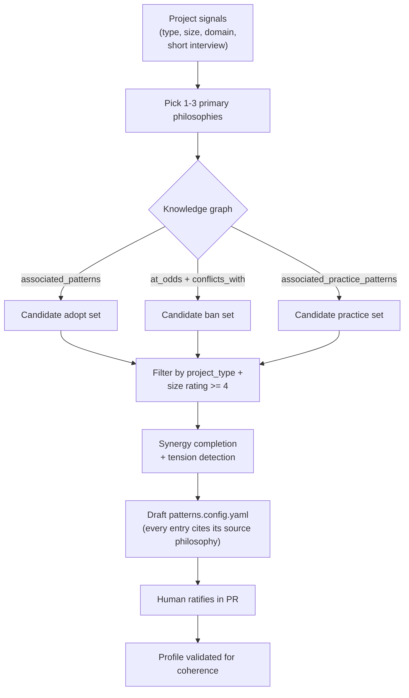

# 11. Philosophy-first selection & bootstrap

> Added in the Part-D scope expansion. This document specifies how a project moves from
> "nothing selected" to a coherent, enforceable `patterns.config.yaml` **driven by design
> philosophies**, and how those philosophies stay the north star for every later check.

## 11.1 Why philosophy-first

Patterns are tactics; philosophies are the strategy that decides *which* tactics cohere. A
pile of individually-good patterns can still be incoherent (transaction-script + rich
domain-model; shared-mutable singletons + functional-core). Selecting **philosophies first**
gives the system three things a bare pattern list cannot:

1. **Coherence** — the knowledge graph expands a philosophy into a *mutually-reinforcing*
   bundle (its `associated_patterns`) and rules out its opposites (`at_odds_patterns`).
2. **A judge rubric** — the LLM judge ([architecture §2.2](02-architecture.md)) is grounded
   in the philosophy's own description, tenets, and `applies_when`, not the model's priors.
   "Define errors out of existence" is judgeable as a rubric clause; it is not a lint rule.
3. **Scale resilience** — as the codebase grows, new code is judged against stable *values*,
   not just a frozen list of rules, so the architecture stays recognisable at 10k and 500k
   lines.

## 11.2 The selection pipeline



### Step detail

1. **Signals → primary philosophies.** `conformance init` reads `project_types`, an estimated
   size band, and (optionally) answers to a 4-question interview (domain criticality, team
   size, change frequency, product/UX surface yes/no). It proposes primary philosophies whose
   `best_for` / `applies_when` match, ranked by graph centrality (see the "most-connected
   philosophies" table the [graph](../../docs/graph/index.md) emits). The human confirms.
2. **Expand via graph.** For each adopted philosophy, pull `associated_patterns` (→ adopt) and
   `at_odds_patterns` (→ ban). For each *rejected* philosophy, its `associated_patterns` are
   demoted (proposed ban unless another adopted philosophy also endorses them).
3. **Filter & rank.** Keep candidates whose `project_types` include the repo's type and whose
   `ratings[sizeBand].score ≥ 4`. Lower-rated candidates become commented `# optional` lines so
   the human sees them without them being enforced.
4. **Synergy completion & tension detection.** Add `synergies` of adopted patterns; if two
   adopted philosophies are `tensions_with` each other, emit a `tie_breakers:` stub the human
   must fill (the profile will not validate until they do — see [§9.3](09-config.md)).
5. **Emit a sourced draft.** Every `adopt`/`ban` entry is annotated with `# from: <philosophy>`
   so the rationale is visible in the diff. Enforcement defaults to `advise`.
6. **Human ratifies.** Reviewed and merged as a PR.

## 11.3 Decomposing a philosophy into checks

> **Enforcement boundary (review-incorporated, see [§13.1](13-mvp-and-trust.md)):** philosophies
> ground *selection, ranking and explanation* — they are **advisory** and **never block** on
> their own. A philosophy tenet only gates a change once it has been projected into a **certified
> pattern rule pack** with fixtures and measured precision. The table below is the *target*
> decomposition; until a row ships fixtures + precision, it stays advisory (LLM rubric only).

A philosophy is made enforceable by projecting it onto the three detector layers — the same
"strict-core / tolerant-boundary" split as [architecture §2.2](02-architecture.md). This is
the operational core of the system; the research survey
(`files/research-conformance-tooling.md` §6.4) backs each row with real tooling.

| Philosophy tenet (example: *A Philosophy of Software Design*) | Layer | Concrete check |
| --- | --- | --- |
| Deep modules (small interface, large implementation) | Heuristic | public-surface-to-LOC ratio; `max-params ≤ 4`; cognitive complexity ≤ 15 |
| No information leakage | Deterministic | import/export boundary rules (dependency-cruiser / eslint-plugin-boundaries): internal types not exported |
| Define errors out of existence | LLM judge | rubric clause: "are error conditions designed away (types/defaults) rather than pushed onto callers as codes/flags?" |
| Pull complexity downward | LLM + heuristic | "does the caller carry config the module could own?" + fan-in/param metrics |
| Comments explain *why*, not *what* | LLM judge | rubric clause over changed comments |

Each philosophy ships (as design intent) a **decomposition file** keyed to its id:

```
philosophy-rules/
  a-philosophy-of-software-design/
    deterministic.yaml   # import/boundary/export rules (dep-cruiser / eslint-boundaries / semgrep)
    heuristic.yaml        # metric thresholds (complexity, params, public-surface ratio)
    rubric.md             # LLM judge clauses, grounded in the philosophy's catalogue text
  domain-driven-design/
    ...
```

A philosophy with no decomposition file still participates at the **advisory LLM tier** (its
catalogue text *is* the rubric) and for onboarding/docs; it simply cannot block. This mirrors
the pattern rule-pack story in [§2.4](02-architecture.md) — every philosophy is usable on day
one; deterministic packs are added for the highest-value adopted ones over time.

## 11.4 How philosophies, patterns and practice patterns compose at runtime

When a change set is selected ([architecture §2.1](02-architecture.md)), the engine now
resolves **three** coherent layers, highest-leverage first:

1. **Philosophy rubric** (always in scope) — the north-star clauses for the adopted primary
   philosophies are attached to every LLM-judged finding, so judgement is value-grounded.
2. **Patterns** — adopted/banned patterns are selected and routed by altitude exactly as
   [§6](06-pattern-routing.md) describes; their *source philosophy* is attached so a finding
   can explain "this violates **Repository**, which your project adopts to honour **DDD**'s
   persistence-ignorance."
3. **Practice patterns** — included only for matching `appliesTo` surfaces, PR/later altitude,
   advisory.

Findings therefore carry a **rationale chain**: `philosophy → pattern → concrete suggestion`,
which is both better feedback for an agent and a stronger audit trail for a human.

## 11.5 `conformance init` (the bootstrap command)

```
$ conformance init
  ? Project type:           web-app
  ? Approx size:            medium (<=100k)
  ? Domain criticality:     high (correctness > velocity)
  ? Has product/UX surface: yes
  ? Team size:              small

  Proposing philosophies (graph-ranked):
    [x] a-philosophy-of-software-design   (primary)
    [x] domain-driven-design              (primary)
    [ ] functional-core-imperative-shell  (secondary)  ← toggle to add
    [x] lean-startup                      (product)
    [x] design-of-everyday-things         (ux)

  → wrote patterns.config.yaml (18 adopt, 5 ban, 4 practice) — every entry sourced to a philosophy.
  → run `conformance check --profile` to validate coherence, then open a PR to ratify.
```

`init` only ever **proposes**; it never enforces silently. The PR-review-as-ratification step
is what makes the project's values an explicit, version-controlled decision.

## 11.6 Keeping the north star (drift control)

- The profile validator ([§9.3](09-config.md)) refuses incoherent profiles (pattern at odds
  with an adopted primary philosophy; unresolved philosophy tension).
- Every enforced finding cites its source philosophy, so silently drifting away from a value
  requires visibly removing the philosophy from the profile in a PR.
- `do-it-later` ([§5](05-phase-do-it-later.md)) reports a **philosophy-conformance score** per
  module (how well the module honours each adopted philosophy), turning the north star into a
  trackable metric rather than a slogan.
