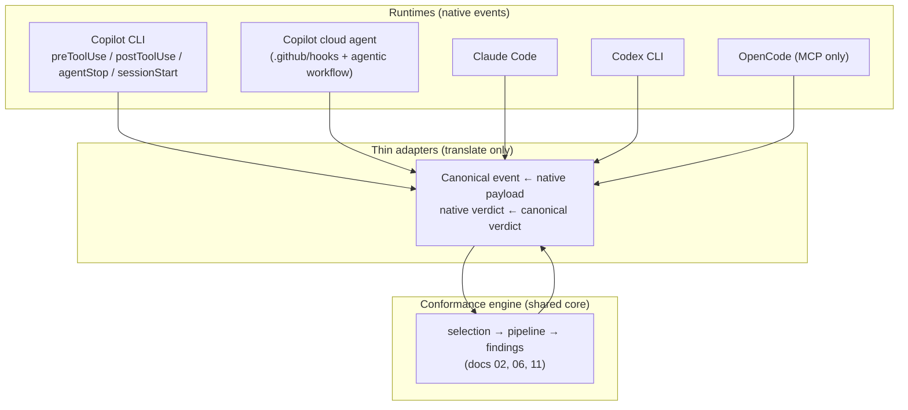

# 12. Runtime-agnostic integration contract

> Added in the Part-D scope expansion. This document specifies how the conformance engine
> plugs into real agentic runtimes — **GitHub Copilot CLI first** (hooks, skills, MCP,
> plugin), then **Copilot cloud agent / GitHub agentic workflows**, and expandably
> **Claude Code, Codex CLI, OpenCode**. It is grounded in the integration-surface research
> (`files/research-agent-surfaces.md`), with capability claims verified against the
> [Copilot hooks reference](https://docs.github.com/en/copilot/reference/hooks-reference).

## 12.1 Principle: one engine, one contract, thin adapters

The [engine](02-architecture.md) is runtime-agnostic. Every runtime differs only in *how* it
delivers an event and *what* it can do with the verdict. We therefore define **one canonical
event + verdict contract** and write a **thin adapter per runtime** that translates the
runtime's native hook payload to/from it. No conformance logic lives in an adapter.



## 12.2 Canonical events

The engine understands exactly these events. The adapter maps native → canonical.

| Canonical event | Fires | Engine phase | Default action |
| --- | --- | --- | --- |
| `SESSION_START` | session begins | — (bootstrap) | inject profile summary + adopted philosophies as context |
| `PRE_WRITE` | before a file-mutating tool | do-it-write | **block** on deterministic violation; else allow |
| `POST_WRITE` | after a file-mutating tool | do-it-write | **advise** (inject finding as feedback) |
| `PRE_SHELL` | before a shell/command tool | (guardrails) | block destructive/banned commands |
| `TURN_END` | agent finishes a turn | do-it-write (sweep) | optionally **continue the loop** with unresolved findings |
| `PR_REVIEW` | PR opened/updated | do-it-pr | review comments; fail CI on `block`-level |
| `BATCH` | on demand / scheduled | do-it-later | report + refactor branch |

The engine's `requiresContext` ([§6.2](06-pattern-routing.md)) and altitude routing decide
which patterns actually run for each event, so `PRE_WRITE` only ever runs file-local
deterministic checks (fast), while `PR_REVIEW` runs the cross-file/architectural set.

## 12.3 The verdict contract

The engine returns a single canonical verdict; the adapter projects it onto the runtime.

```typescript
interface ConformanceVerdict {
  decision: "allow" | "deny" | "advise";
  findings: Finding[];               // see 08-types.md
  reason?: string;                   // human/agent-readable, required when deny
  modifiedArgs?: unknown;            // optional auto-fix of the tool input
  additionalContext?: string;        // feedback to inject into the agent's context
  continueLoop?: { prompt: string }; // ask the runtime to run another turn to fix findings
}
```

Capabilities are **degraded gracefully** per runtime: an adapter advertises which verdict
fields it can honour, and the engine never relies on a capability the target lacks (it falls
back to advisory text).

## 12.4 Capability matrix (verified)

| Capability | Copilot CLI | Copilot cloud | Claude Code | Codex CLI | OpenCode |
| --- | :-: | :-: | :-: | :-: | :-: |
| Block file write (`deny`) | ✅ `preToolUse` | ✅ `preToolUse` | ✅ | ✅ | ❌ (MCP tool only) |
| Auto-fix tool input (`modifiedArgs`) | ✅ `preToolUse.modifiedArgs` | ✅ | ✅ `updatedInput` | ✅ | ❌ |
| Inject feedback (`additionalContext`) | ✅ `postToolUse`/`sessionStart` | ✅ `postToolUse` | ✅ | ✅ | ❌ |
| Continue loop to fix | ✅ `agentStop.decision:"block"` | ✅ | ✅ `Stop` | ✅ | ❌ |
| Per-tool matcher | ✅ `matcher` on `toolName` | ✅ | ✅ `if`-guard | ✅ regex | ❌ |
| Bootstrap context at start | ✅ `sessionStart` (`prompt`/`additionalContext`) | ⚠️ non-interactive | ✅ | ✅ | ❌ |
| Expose engine as MCP tool | ✅ `mcp-config.json` | ✅ | ✅ | ✅ | ✅ (only surface) |

> **Correction to first-pass research:** Copilot CLI is a *first-class* block **and** advise
> target. The hooks reference confirms `preToolUse` returns
> `{permissionDecision, permissionDecisionReason, modifiedArgs}` (block + auto-fix),
> `postToolUse` returns `{modifiedResult, additionalContext}` (inject feedback), and
> `agentStop` returns `{decision:"block", reason}` (loop continuation). Earlier notes that
> Copilot CLI "cannot inject feedback / rewrite input" were wrong.

## 12.5 Copilot CLI binding (primary target)

Four artefacts, all shippable as a **Copilot plugin** (`plugin.json` bundling hooks + skill +
MCP) or installed individually:

### a. Hooks — `.github/hooks/conformance.json`

```json
{
  "version": 1,
  "hooks": {
    "sessionStart": [
      { "type": "command", "bash": "conformance hook session-start", "timeoutSec": 10 }
    ],
    "preToolUse": [
      { "type": "command", "matcher": "edit|create", "bash": "conformance hook pre-write", "timeoutSec": 5 }
    ],
    "postToolUse": [
      { "type": "command", "matcher": "edit|create", "bash": "conformance hook post-write", "timeoutSec": 5 }
    ],
    "agentStop": [
      { "type": "command", "bash": "conformance hook turn-end", "timeoutSec": 10 }
    ]
  }
}
```

- `preToolUse` is **fail-closed** (a crash denies the write) — correct for a guardrail. The
  adapter keeps it to *deterministic, file-local* checks only, honouring the write-time
  latency budget ([§3](03-phase-do-it-write.md)); anything slower degrades to `postToolUse`
  advice.
- `sessionStart` injects the profile's adopted philosophies + top adopted patterns as
  `additionalContext`, so the agent is *primed* with the north star before it writes anything
  (cheap, high-leverage prevention).
- `agentStop` may return `decision:"block"` with a `reason` listing unresolved `block`-level
  findings, giving the agent one bounded chance to self-correct before the turn ends.

### b. Skill — `skills/conformance-review/SKILL.md`

A cross-compatible AgentSkills.io skill the agent invokes (auto or `/conformance-review`) to
run a full review of the working tree against the profile and explain findings with their
philosophy rationale. Skills are portable to Claude Code and Codex CLI unchanged.

### c. MCP server — `conformance` (stdio)

Registered in `~/.copilot/mcp-config.json`. Exposes tools the agent can call deliberately:

| MCP tool | Purpose |
| --- | --- |
| `conformance_profile` | return the active profile (adopted philosophies/patterns/bans) |
| `conformance_check_change` | judge a proposed diff/file → findings + rationale chain |
| `conformance_suggest_reuse` | given an intent, return existing abstractions to reuse ([§7](07-reuse-enforcement.md)) |
| `conformance_init` | run the philosophy-first bootstrap ([§11.5](11-philosophy-selection.md)) |

MCP is the **lowest-common-denominator** surface — it is the *only* integration OpenCode
supports, so exposing the engine as MCP guarantees every runtime can at least call it.

### d. Plugin — `plugin.json`

Bundles the above so a team installs conformance with one command and gets hooks + skill +
MCP configured together.

## 12.6 Remote: Copilot cloud agent & GitHub agentic workflows

- **`.github/hooks/*.json`** is honoured by the cloud agent too (Linux sandbox, `bash`/`http`
  only, no user-level config). The same `preToolUse`/`postToolUse` hooks therefore enforce
  conformance on cloud-agent jobs with no extra work — but `sessionStart` `prompt` entries may
  not fire (non-interactive), so bootstrap context is delivered via `additionalContext` only.
- **`copilot-setup-steps.yml`** pre-installs the `conformance` binary into the agent
  environment so the hooks resolve.
- **PR-level GitHub Action** runs the `BATCH`/`PR_REVIEW` engine on every PR (the existing
  do-it-pr adapter, [§4](04-phase-do-it-pr.md)) — independent of which agent authored the
  change, so human PRs and remote-agent PRs are gated identically.
- For network egress from the sandbox, an `http` hook must target an allow-listed host;
  default to the bundled `command` hook (local binary) to avoid firewall configuration.

## 12.7 Expansion adapters (Claude Code / Codex / OpenCode)

Each is a translation shim over the same canonical contract:

- **Claude Code** — `.claude/settings.json` hooks (`PreToolUse`/`PostToolUse`/`Stop`); richest
  surface (HTTP hooks, `if`-guards, `updatedInput`, async). Maps 1:1 to the verdict contract.
- **Codex CLI** — `.codex/hooks.json`; like Claude minus async + per-file `if`-guards; note the
  `apply_patch`/Bash interception gap (some writes may be missed) and the hook-trust prompt.
- **OpenCode** — no hooks; integrate **only** via the MCP server (§12.5c). The agent must call
  `conformance_check_change` deliberately; there is no automatic blocking.

Because all four share the stdin-JSON / stdout-JSON convention, a single
`scripts/conformance-hook` entry point with runtime detection (`hook_event_name` vs
`hookEventName`, `tool_name` vs `toolName`) serves Copilot CLI, Claude Code, and Codex with
one binary; the per-runtime JSON files differ only in event names and output field mapping.

## 12.8 Build order

1. `conformance` engine skeleton + canonical contract + Copilot CLI adapter (hooks + skill + MCP) — the primary target.
2. Plugin packaging.
3. Cloud-agent wiring (`copilot-setup-steps.yml` + PR Action).
4. Multi-runtime shim (Claude Code, Codex, OpenCode-via-MCP).

This order ships value on the user's primary runtime first, then widens without reworking the
core — the contract in §12.2–12.3 is the stable seam.
