# Cross-Source Knowledge Graph

A generated, machine-readable graph (`knowledge-graph.json`) linking software patterns, product & UX practice patterns, and design philosophies. This is the substrate the selection/bootstrap mechanism uses to expand a chosen philosophy into a coherent bundle of patterns. See [design/validator](../../design/validator/README.md).

## Totals

- Software patterns: **290**
- Practice patterns (product + UX): **145**
- Philosophies: **49**
- Edges: **2627**

## Cross-domain bridges

How the three sources connect (philosophy → pattern, philosophy → practice, practice → software, practice → philosophy). Intra-collection links (pattern↔pattern synergies, philosophy↔philosophy) are in the JSON but omitted here for legibility.

```mermaid
flowchart LR
  classDef phil fill:#e8d5ff,stroke:#7c3aed;
  classDef prac fill:#d1fae5,stroke:#059669;
  classDef sw fill:#dbeafe,stroke:#2563eb;
  a_philosophy_of_software_design["A Philosophy of Software Design"] --> facade["Facade"]
  a_philosophy_of_software_design["A Philosophy of Software Design"] --> hexagonal_architecture["Hexagonal Architecture (Ports & Adapters)"]
  a_philosophy_of_software_design["A Philosophy of Software Design"] --> repository["Repository"]
  a_philosophy_of_software_design["A Philosophy of Software Design"] --> guard_clause["Guard Clause (Early Return)"]
  a_philosophy_of_software_design["A Philosophy of Software Design"] --> layered_architecture["Layered (N-Tier) Architecture"]
  activity_centered_design["Activity-Centred Design"] --> command_palette["Command Palette"]
  activity_centered_design["Activity-Centred Design"] --> contextual_inquiry["Contextual Inquiry"]
  atomic_design["Atomic Design"] --> atomic_design_components["Atomic Design Components"]
  atomic_design["Atomic Design"] --> design_tokens["Design Tokens"]
  atomic_design["Atomic Design"] --> pattern_library_governance["Pattern Library Governance"]
  behaviour_driven_development["Behaviour-Driven Development"] --> given_when_then["Given-When-Then (BDD)"]
  behaviour_driven_development["Behaviour-Driven Development"] --> arrange_act_assert["Arrange-Act-Assert"]
  behaviour_driven_development["Behaviour-Driven Development"] --> page_object["Page Object"]
  behaviour_driven_development["Behaviour-Driven Development"] --> object_mother["Object Mother"]
  calm_technology["Calm Technology"] --> toast_notification["Toast Notification"]
  calm_technology["Calm Technology"] --> skeleton_loading["Skeleton Loading"]
  calm_technology["Calm Technology"] --> system_status_visibility["System Status Visibility"]
  classicist_tdd["Classicist Test-Driven Development"] --> arrange_act_assert["Arrange-Act-Assert"]
  classicist_tdd["Classicist Test-Driven Development"] --> fake_object["Fake Object"]
  classicist_tdd["Classicist Test-Driven Development"] --> stub["Stub"]
  classicist_tdd["Classicist Test-Driven Development"] --> test_data_builder["Test Data Builder"]
  classicist_tdd["Classicist Test-Driven Development"] --> test_double["Test Double"]
  clean_architecture_solid["Clean Architecture & SOLID"] --> clean_architecture["Clean Architecture"]
  clean_architecture_solid["Clean Architecture & SOLID"] --> hexagonal_architecture["Hexagonal Architecture (Ports & Adapters)"]
  clean_architecture_solid["Clean Architecture & SOLID"] --> onion_architecture["Onion Architecture"]
  clean_architecture_solid["Clean Architecture & SOLID"] --> dependency_injection["Dependency Injection"]
  clean_architecture_solid["Clean Architecture & SOLID"] --> inversion_of_control["Inversion of Control"]
  clean_architecture_solid["Clean Architecture & SOLID"] --> repository["Repository"]
  clean_architecture_solid["Clean Architecture & SOLID"] --> service_layer["Service Layer"]
  conceptual_integrity["Conceptual Integrity"] --> facade["Facade"]
  conceptual_integrity["Conceptual Integrity"] --> modular_monolith["Modular Monolith"]
  conceptual_integrity["Conceptual Integrity"] --> bounded_context["Bounded Context"]
  conceptual_integrity["Conceptual Integrity"] --> contract_first_api["Contract-First API (OpenAPI)"]
  conceptual_integrity["Conceptual Integrity"] --> domain_model["Domain Model"]
  conceptual_integrity["Conceptual Integrity"] --> microkernel["Microkernel (Plugin) Architecture"]
  continuous_delivery_lean["Continuous Delivery & Lean Software"] --> feature_toggle["Feature Toggle"]
  continuous_delivery_lean["Continuous Delivery & Lean Software"] --> strangler_fig["Strangler Fig"]
  continuous_delivery_lean["Continuous Delivery & Lean Software"] --> circuit_breaker["Circuit Breaker"]
  continuous_delivery_lean["Continuous Delivery & Lean Software"] --> outbox["Transactional Outbox"]
  continuous_delivery_lean["Continuous Delivery & Lean Software"] --> deployment_stamp["Deployment Stamp (Cells)"]
  continuous_delivery_lean["Continuous Delivery & Lean Software"] --> database_per_service["Database per Service"]
  continuous_discovery["Continuous Discovery"] --> opportunity_solution_tree["Opportunity Solution Tree"]
  continuous_discovery["Continuous Discovery"] --> continuous_interviewing["Continuous Customer Interviewing"]
  continuous_discovery["Continuous Discovery"] --> assumption_mapping["Assumption Mapping"]
  conways_law_team_topologies["Conway's Law & Team Topologies"] --> bounded_context["Bounded Context"]
  conways_law_team_topologies["Conway's Law & Team Topologies"] --> microservices["Microservices"]
  conways_law_team_topologies["Conway's Law & Team Topologies"] --> modular_monolith["Modular Monolith"]
  conways_law_team_topologies["Conway's Law & Team Topologies"] --> backend_for_frontend["Backend for Frontend (BFF)"]
  conways_law_team_topologies["Conway's Law & Team Topologies"] --> anti_corruption_layer["Anti-Corruption Layer"]
  conways_law_team_topologies["Conway's Law & Team Topologies"] --> published_language["Published Language"]
  customer_development["Customer Development"] --> continuous_interviewing["Continuous Customer Interviewing"]
  customer_development["Customer Development"] --> the_mom_test["The Mom Test Interviewing"]
  customer_development["Customer Development"] --> business_model_canvas["Business Model Canvas"]
  data_oriented_design["Data-Oriented Design"] --> flyweight["Flyweight"]
  data_oriented_design["Data-Oriented Design"] --> object_pool["Object Pool"]
  data_oriented_design["Data-Oriented Design"] --> memoization["Memoization"]
  data_oriented_design["Data-Oriented Design"] --> cache_aside["Cache-Aside"]
  data_oriented_design["Data-Oriented Design"] --> copy_on_write["Copy-on-Write"]
  data_oriented_design["Data-Oriented Design"] --> map_filter_reduce["Map-Filter-Reduce"]
  design_by_contract["Design by Contract"] --> guard_clause["Guard Clause (Early Return)"]
  design_by_contract["Design by Contract"] --> fail_fast["Fail Fast"]
  design_by_contract["Design by Contract"] --> input_validation["Input Validation (Allow-List)"]
  design_by_contract["Design by Contract"] --> contract_testing["Consumer-Driven Contract Testing"]
  design_by_contract["Design by Contract"] --> property_based_testing["Property-Based Testing"]
  design_by_contract["Design by Contract"] --> specification["Specification"]
  design_by_contract["Design by Contract"] --> null_object["Null Object"]
  design_for_production["Design for Production / Stability"] --> timeout["Timeout"]
  design_for_production["Design for Production / Stability"] --> circuit_breaker["Circuit Breaker"]
  design_for_production["Design for Production / Stability"] --> bulkhead["Bulkhead"]
  design_for_production["Design for Production / Stability"] --> retry["Retry with Backoff"]
  design_for_production["Design for Production / Stability"] --> fallback["Fallback"]
  design_for_production["Design for Production / Stability"] --> backpressure["Backpressure"]
  design_for_production["Design for Production / Stability"] --> health_endpoint_monitoring["Health Endpoint Monitoring"]
  design_of_everyday_things["The Design of Everyday Things"] --> optimistic_ui_feedback["Optimistic UI Feedback"]
  design_of_everyday_things["The Design of Everyday Things"] --> progressive_disclosure["Progressive Disclosure"]
  design_thinking["Design Thinking"] --> how_might_we["How Might We Framing"]
  design_thinking["Design Thinking"] --> opportunity_solution_tree["Opportunity Solution Tree"]
  design_thinking["Design Thinking"] --> customer_journey_map["Customer Journey Map"]
  domain_driven_design["Domain-Driven Design"] --> bounded_context["Bounded Context"]
  domain_driven_design["Domain-Driven Design"] --> ubiquitous_language["Ubiquitous Language"]
  domain_driven_design["Domain-Driven Design"] --> aggregate["Aggregate"]
  domain_driven_design["Domain-Driven Design"] --> anti_corruption_layer["Anti-Corruption Layer"]
  domain_driven_design["Domain-Driven Design"] --> value_object["Value Object"]
  domain_driven_design["Domain-Driven Design"] --> domain_event["Domain Event"]
  domain_driven_design["Domain-Driven Design"] --> repository["Repository"]
  dont_make_me_think["Don't Make Me Think"] --> progressive_disclosure["Progressive Disclosure"]
  dont_make_me_think["Don't Make Me Think"] --> microcopy["Microcopy"]
  dont_make_me_think["Don't Make Me Think"] --> usability_testing_session["Usability Testing Session"]
  dual_track_agile["Dual-Track Agile"] --> dual_track_discovery_delivery["Dual-Track Discovery & Delivery"]
  dual_track_agile["Dual-Track Agile"] --> opportunity_solution_tree["Opportunity Solution Tree"]
  dual_track_agile["Dual-Track Agile"] --> definition_of_ready_done["Definition of Ready & Done"]
  emotional_design["Emotional Design"] --> empty_state_content["Empty State Content"]
  emotional_design["Emotional Design"] --> microcopy["Microcopy"]
  emotional_design["Emotional Design"] --> visual_hierarchy["Visual Hierarchy"]
  empowered_product_teams["Empowered Product Teams"] --> product_operating_model["Product Operating Model"]
  empowered_product_teams["Empowered Product Teams"] --> outcome_based_roadmap["Outcome-Based Roadmap"]
  empowered_product_teams["Empowered Product Teams"] --> dual_track_discovery_delivery["Dual-Track Discovery & Delivery"]
  extreme_programming_tdd["Extreme Programming & Test-Driven Development"] --> arrange_act_assert["Arrange-Act-Assert"]
  extreme_programming_tdd["Extreme Programming & Test-Driven Development"] --> given_when_then["Given-When-Then (BDD)"]
  extreme_programming_tdd["Extreme Programming & Test-Driven Development"] --> test_pyramid["Test Pyramid"]
  extreme_programming_tdd["Extreme Programming & Test-Driven Development"] --> test_double["Test Double"]
  extreme_programming_tdd["Extreme Programming & Test-Driven Development"] --> mock_object["Mock Object"]
  extreme_programming_tdd["Extreme Programming & Test-Driven Development"] --> property_based_testing["Property-Based Testing"]
  extreme_programming_tdd["Extreme Programming & Test-Driven Development"] --> feature_toggle["Feature Toggle"]
  functional_core_type_driven["Functional Core & Type-Driven Design"] --> pure_function["Pure Function"]
  functional_core_type_driven["Functional Core & Type-Driven Design"] --> immutability["Immutability"]
  functional_core_type_driven["Functional Core & Type-Driven Design"] --> option_maybe["Option / Maybe"]
  functional_core_type_driven["Functional Core & Type-Driven Design"] --> either_result["Either / Result"]
  functional_core_type_driven["Functional Core & Type-Driven Design"] --> newtype_wrapper["Newtype / Wrapper Type"]
  functional_core_type_driven["Functional Core & Type-Driven Design"] --> type_state["Type State"]
  functional_core_type_driven["Functional Core & Type-Driven Design"] --> smart_constructor["Smart Constructor"]
  human_centered_design["Human-Centred Design"] --> usability_testing_session["Usability Testing Session"]
  human_centered_design["Human-Centred Design"] --> contextual_inquiry["Contextual Inquiry"]
  hypothesis_driven_development["Hypothesis-Driven Development"] --> ab_test_design["A/B Test Design"]
  hypothesis_driven_development["Hypothesis-Driven Development"] --> assumption_mapping["Assumption Mapping"]
  hypothesis_driven_development["Hypothesis-Driven Development"] --> hypothesis_statement["Hypothesis Statement"]
  inclusive_design["Inclusive Design"] --> wcag_conformance["WCAG Conformance"]
  inclusive_design["Inclusive Design"] --> screen_reader_semantics["Screen Reader Semantics"]
  inclusive_design["Inclusive Design"] --> reduced_motion["Reduced Motion"]
  information_hiding["Information Hiding & Modular Decomposition"] --> facade["Facade"]
  class a_philosophy_of_software_design phil;
  class facade sw;
  class hexagonal_architecture sw;
  class repository sw;
  class guard_clause sw;
  class layered_architecture sw;
  class activity_centered_design phil;
  class command_palette prac;
  class contextual_inquiry prac;
  class atomic_design sw;
  class atomic_design_components prac;
  class design_tokens prac;
  class pattern_library_governance prac;
  class behaviour_driven_development phil;
  class given_when_then sw;
  class arrange_act_assert sw;
  class page_object sw;
  class object_mother sw;
  class calm_technology phil;
  class toast_notification prac;
  class skeleton_loading prac;
  class system_status_visibility prac;
  class classicist_tdd phil;
  class fake_object sw;
  class stub sw;
  class test_data_builder sw;
  class test_double sw;
  class clean_architecture_solid phil;
  class clean_architecture sw;
  class onion_architecture sw;
  class dependency_injection sw;
  class inversion_of_control sw;
  class service_layer sw;
  class conceptual_integrity phil;
  class modular_monolith sw;
  class bounded_context sw;
  class contract_first_api sw;
  class domain_model sw;
  class microkernel sw;
  class continuous_delivery_lean phil;
  class feature_toggle sw;
  class strangler_fig sw;
  class circuit_breaker sw;
  class outbox sw;
  class deployment_stamp sw;
  class database_per_service sw;
  class continuous_discovery phil;
  class opportunity_solution_tree prac;
  class continuous_interviewing prac;
  class assumption_mapping prac;
  class conways_law_team_topologies phil;
  class microservices sw;
  class backend_for_frontend sw;
  class anti_corruption_layer sw;
  class published_language sw;
  class customer_development phil;
  class the_mom_test prac;
  class business_model_canvas prac;
  class data_oriented_design phil;
  class flyweight sw;
  class object_pool sw;
  class memoization sw;
  class cache_aside sw;
  class copy_on_write sw;
  class map_filter_reduce sw;
  class design_by_contract phil;
  class fail_fast sw;
  class input_validation sw;
  class contract_testing sw;
  class property_based_testing sw;
  class specification sw;
  class null_object sw;
  class design_for_production phil;
  class timeout sw;
  class bulkhead sw;
  class retry sw;
  class fallback sw;
  class backpressure sw;
  class health_endpoint_monitoring sw;
  class design_of_everyday_things phil;
  class optimistic_ui_feedback prac;
  class progressive_disclosure prac;
  class design_thinking phil;
  class how_might_we prac;
  class customer_journey_map prac;
  class domain_driven_design phil;
  class ubiquitous_language sw;
  class aggregate sw;
  class value_object sw;
  class domain_event sw;
  class dont_make_me_think phil;
  class microcopy prac;
  class usability_testing_session prac;
  class dual_track_agile phil;
  class dual_track_discovery_delivery prac;
  class definition_of_ready_done prac;
  class emotional_design phil;
  class empty_state_content prac;
  class visual_hierarchy prac;
  class empowered_product_teams phil;
  class product_operating_model prac;
  class outcome_based_roadmap prac;
  class extreme_programming_tdd phil;
  class test_pyramid sw;
  class mock_object sw;
  class functional_core_type_driven phil;
  class pure_function sw;
  class immutability sw;
  class option_maybe sw;
  class either_result sw;
  class newtype_wrapper sw;
  class type_state sw;
  class smart_constructor sw;
  class human_centered_design phil;
  class hypothesis_driven_development phil;
  class ab_test_design prac;
  class hypothesis_statement prac;
  class inclusive_design phil;
  class wcag_conformance prac;
  class screen_reader_semantics prac;
  class reduced_motion prac;
  class information_hiding phil;
```

## Most-connected philosophies

| Philosophy | Discipline | Connections |
| --- | --- | :-: |
| The Design of Everyday Things | ux | 50 |
| Nielsen's Usability Heuristics | ux | 37 |
| The Lean Startup | product | 34 |
| Inclusive Design | ux | 30 |
| Domain-Driven Design | software | 27 |
| Human-Centred Design | ux | 27 |
| Outcome Over Output | product | 27 |
| Worse Is Better | software | 27 |
| Continuous Delivery & Lean Software | software | 26 |
| Simple Made Easy | software | 26 |
| Don't Make Me Think | ux | 24 |
| Extreme Programming & Test-Driven Development | software | 24 |
| Product-Led Growth | product | 24 |
| A Philosophy of Software Design | software | 23 |
| Conceptual Integrity | software | 23 |

