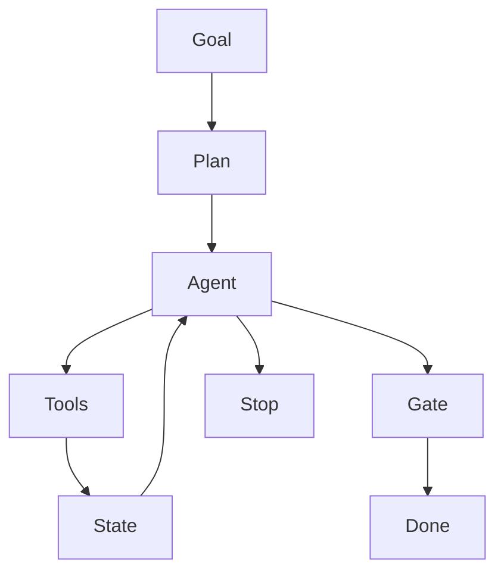

# Agent Orchestration

> Coordinate LLM-driven agents, tools, memory, approvals, and termination policies so autonomous workflows remain bounded and observable.

**Scale:** architectural · **Altitude:** high · **Category:** ai-ml · **Maturity:** emerging

## Description

Agent Orchestration structures an AI workflow as one or more agents that plan, call tools, inspect results, and decide next steps under explicit control. A production orchestrator defines roles, allowed tools, budgets, retry and timeout rules, handoff points, memory access, human approval gates, and audit logs. The pattern is cutting-edge because the engineering surface is still changing quickly, but its core discipline is conventional distributed-systems design: bound loops, isolate capabilities, observe every action, and make unsafe transitions explicit.

**Problem.** Naive agents loop indefinitely, call unsafe tools, lose track of state, or perform irreversible actions without review because the model is treated as the whole control plane.

**Context.** Use for multi-step tasks where an LLM must choose actions based on intermediate results. Avoid for deterministic workflows that can be expressed as normal code or a simple pipeline.

## Diagram



## Consequences / Trade-offs

- Enables adaptive workflows that can inspect, decide, and recover from partial failures.
- Increases safety burden: permissions, tool allow-lists, budgets, traces, and approvals become load-bearing.
- Harder to test than straight-line code because model decisions vary across prompts, inputs, and versions.
- Requires durable state for resumability, deduplication, and audit when actions mutate external systems.

## Ratings by project size

| Project size | Score | Notes |
| --- | --- | --- |
| Small (<10k LOC) | ●●○○○ 2/5 | Usually too much machinery for small deterministic tasks; direct code or a prompt chain is safer. |
| Medium (≤100k LOC) | ●●●●○ 4/5 | Good fit for complex operational assistants once tools and approvals are well scoped. |
| Large (>100k LOC) | ●●●●● 5/5 | Essential for enterprise agent platforms where many tools, users, policies, and audit requirements interact. |

## Examples

### Bound agent loops and tool permissions

**❌ Negative (typescript)**

```typescript
while (true) {
  const action = await model.nextAction(history);
  const result = await tools[action.name](action.args);
  history.push({ action, result });
}
```

**✅ Positive (typescript)**

```typescript
const allowedTools = pickTools([searchDocs, createDraftPullRequest, readIssue]);

for (let step = 0; step < 8; step++) {
  const action = await model.nextAction(history, { allowedTools, remainingSteps: 8 - step });
  if (action.name === "finish") break;
  if (!allowedTools.has(action.name)) throw new ForbiddenTool(action.name);

  const result = await withTimeout(() => allowedTools.call(action), 10_000);
  auditLog.record(runId, step, action, result.summary);
  history.push({ action, result });
}
```

*The positive version gives the agent a bounded step budget, allow-listed tools, timeouts, and audit logging, so autonomy is constrained by explicit controls.*

## Relationships

**Synergies**

- [Tool Use / Function Calling](../ai-ml/tool-use-function-calling.md) — Function-calling is the controlled integration mechanism agents use to affect real systems.
- [Human-in-the-Loop Approval](../ai-ml/human-in-the-loop.md) — Human approval gates bound high-impact actions such as deploys, refunds, or data deletion.
- [Reflection / Self-Critique Loop](../ai-ml/reflection-self-critique.md) — Reflection can improve plans when it is bounded by iteration limits and evidence.
- [Timeout](../resilience/timeout.md) — Per-step and whole-run timeouts prevent agent loops from consuming unbounded resources.

**Conflicts with:** [Transaction Script](../enterprise-application/transaction-script.md)

**Alternatives:** [Pipes and Filters](../architecture/pipes-and-filters.md), [Saga](../cloud-distributed/saga.md), [Strategy](../gof-behavioural/strategy.md)

## Applicability tags

- **Languages:** language-agnostic, python, typescript
- **Frameworks:** langchain, semantic-kernel, openai, anthropic, none
- **Project types:** ml-system, backend-service, distributed-system, prototype
- **Tags:** agents, orchestration, autonomy

