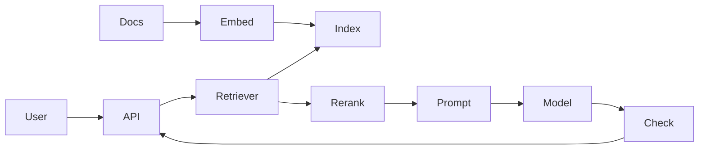

# Retrieval-Augmented Generation (RAG)

> Ground language-model responses in retrieved private or domain-specific context instead of relying only on model parameters.

**Scale:** architectural · **Category:** ai-ml · **Maturity:** emerging

## Description

Retrieval-Augmented Generation combines an LLM with a retrieval system that selects relevant documents, records, or snippets at request time. A robust RAG architecture separates ingestion, chunking, embedding, indexing, retrieval, reranking, prompt assembly, generation, and citation checking. It works best when freshness, provenance, and domain grounding matter more than a single model's memorised knowledge, and it should be treated as a distributed data system with permissions, staleness, evaluation, and observability.

**Problem.** LLMs can hallucinate, lack current private knowledge, and provide answers without traceable evidence, especially when users ask about organisation-specific documents or data.

**Context.** Use when answers should be grounded in a controlled corpus such as documentation, tickets, policies, product data, or code. Avoid RAG when the task is pure reasoning over information already present in the prompt or when the corpus cannot be permission-filtered safely.

## Diagram



## Consequences / Trade-offs

- Improves factual grounding and freshness when retrieval quality and source permissions are strong.
- Adds a data pipeline: chunking, embeddings, indexes, reranking, deletes, and reingestion all need production care.
- Bad retrieval can confidently ground the model in irrelevant text, so citations and evals are essential.
- Latency and cost increase because each answer may call embedding, vector search, rerankers, and the generator.

## Ratings by project size

| Project size | Score | Notes |
| --- | --- | --- |
| Small (<10k LOC) | ●●●○○ 3/5 | Useful for document-heavy prototypes, but overkill for tiny apps with only a few static facts. |
| Medium (≤100k LOC) | ●●●●● 5/5 | Excellent for product knowledge, support, code, and policy assistants once evaluation and ingestion are in place. |
| Large (>100k LOC) | ●●●●● 5/5 | Often essential at scale, but requires permission-aware retrieval, freshness monitoring, and rigorous evals. |

## Examples

### Ground answers with retrieved evidence and citations

**❌ Negative (python)**

```python
def answer(question: str) -> str:
    prompt = f"Answer this from company policy: {question}"
    return llm.complete(prompt)
```

**✅ Positive (python)**

```python
def answer(question: str, user: User) -> Answer:
    hits = retriever.search(question, filters={"tenant": user.tenant_id}, k=20)
    reranked = reranker.top_n(question, hits, n=5)
    context = "\n\n".join(f"[{h.id}] {h.text}" for h in reranked)
    response = llm.complete(
        "Answer only from the sources. Cite source ids for every factual claim.\n"
        f"Sources:\n{context}\nQuestion: {question}"
    )
    return citation_checker.require_supported(response, sources=reranked)
```

*The positive version retrieves permission-filtered evidence, reranks it, asks for cited answers, and validates support instead of hoping the model remembers policy correctly.*

## Relationships

**Synergies**

- [Semantic Caching](../ai-ml/semantic-caching.md) — Semantic caching can reuse answers for similar questions while preserving source and freshness checks.
- [Guardrails & Output Validation](../ai-ml/guardrails-output-validation.md) — Guardrails can require cited claims to map back to retrieved passages before a response is accepted.
- [LLM Evaluation Harness](../ai-ml/evaluation-harness.md) — Retrieval recall, answer faithfulness, and citation accuracy need repeatable regression tests.
- [Repository](../data-persistence/repository.md) — Repositories hide vector-store and document-store details behind a stable retrieval interface.

**Conflicts with:** [Lazy Load](../enterprise-application/lazy-load.md)

**Alternatives:** [Prompt Chaining](../ai-ml/prompt-chaining.md), [Memory & Context-Window Management](../ai-ml/memory-context-window-management.md), [Semantic Caching](../ai-ml/semantic-caching.md)

## Applicability tags

- **Languages:** language-agnostic, python, typescript
- **Frameworks:** langchain, llamaindex, openai, pgvector, pinecone
- **Project types:** ml-system, backend-service, web-api, prototype
- **Tags:** grounding, retrieval, citations

