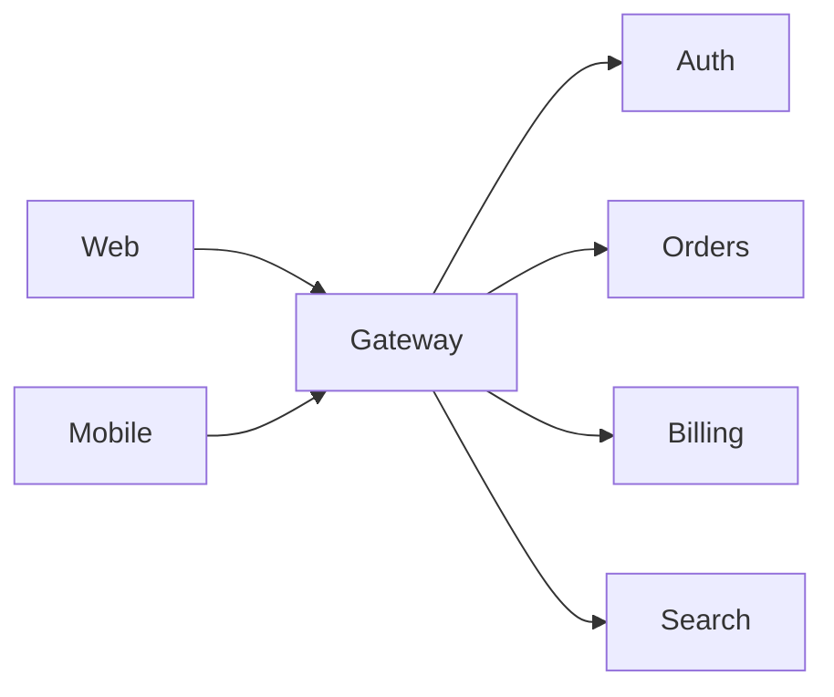

# API Gateway

> Provide a single managed edge for clients, centralising request routing, authentication, throttling, protocol translation, and coarse API composition.

**Scale:** architectural · **Category:** architecture · **Maturity:** established

## Description

An API Gateway is the entry point between external clients and internal services. It terminates public protocols, applies authentication and rate limits, routes requests to backing services, and may perform light aggregation or protocol translation. The gateway protects internal topology from clients and gives platform teams one place to manage edge concerns such as TLS, quotas, request logging, and versioned routes. It should remain thin: business decisions and domain workflows belong in services or BFFs, not in gateway configuration that is hard to test and version.

**Problem.** Exposing every internal service directly forces clients to understand internal topology, duplicates authentication and throttling, and makes service changes externally visible.

**Context.** Use when multiple clients need stable public APIs over a changing service landscape, or when edge security and traffic policy must be enforced uniformly. Keep the gateway stateless and avoid turning it into a hidden monolith.

## Diagram



## Consequences / Trade-offs

- Clients receive a stable public surface while internal services can move or split.
- Edge concerns such as TLS, auth, rate limits, and coarse routing are centralised.
- The gateway can become a bottleneck or single point of failure if not scaled and observed.
- Too much orchestration in the gateway creates hard-to-test business logic outside service ownership.
- Versioning, route ownership, and backward compatibility require explicit governance.

## Ratings by project size

| Project size | Score | Notes |
| --- | --- | --- |
| Small (<10k LOC) | ●●○○○ 2/5 | Rarely necessary for a small single-service app; framework routing and a reverse proxy are usually enough. |
| Medium (≤100k LOC) | ●●●●○ 4/5 | Good fit for several services or client types, especially when consistent auth, throttling, and route versioning matter. |
| Large (>100k LOC) | ●●●●● 5/5 | Essential in large service estates, provided ownership and limits keep it from accumulating domain orchestration. |

## Examples

### Keeping clients away from internal topology

**❌ Negative (typescript)**

```typescript
export async function loadAccount(id: string) {
  const profile = await fetch(`https://profile.internal/users/${id}`).then(r => r.json());
  const orders = await fetch(`https://orders.internal/users/${id}/orders`).then(r => r.json());
  const balance = await fetch(`https://billing.internal/accounts/${id}`).then(r => r.json());
  return { profile, orders, balance };
}
```

**✅ Positive (typescript)**

```typescript
export async function loadAccount(id: string) {
  const response = await fetch(`/api/accounts/${id}`, {
    headers: { Authorization: await currentToken() },
  });
  if (!response.ok) throw new Error("account unavailable");
  return response.json();
}

// The gateway authenticates, routes to owned services, and exposes a stable edge route.
```

*The negative client is coupled to internal service names and protocols. The positive client calls one stable public route while the gateway owns edge policy and internal routing.*

## Relationships

**Synergies**

- [Backend for Frontend (BFF)](../architecture/backend-for-frontend.md) — A gateway can route from broad public edge concerns to client-specific BFF services.
- [Microservices](../architecture/microservices.md) — It hides microservice topology and prevents clients from binding to many internal endpoints.
- [Service Mesh](../architecture/service-mesh.md) — The gateway manages external north-south traffic while the mesh manages internal east-west traffic.
- [Strangler Fig](../architecture/strangler-fig.md) — Gateway routing can incrementally divert endpoints from a legacy system to replacement services.
- [Circuit Breaker](../resilience/circuit-breaker.md) — Edge routes should fail fast or shed load when backing services are unavailable.

**Conflicts with:** [Peer-to-Peer](../architecture/peer-to-peer.md)

**Alternatives:** [Backend for Frontend (BFF)](../architecture/backend-for-frontend.md), [Client-Server](../architecture/client-server.md), [Broker Architecture](../architecture/broker-architecture.md)

## Applicability tags

- **Languages:** language-agnostic, typescript, java, go, csharp
- **Frameworks:** kubernetes, spring-boot, nodejs, express, grpc
- **Project types:** web-api, microservices, distributed-system, backend-service
- **Tags:** edge, routing, authentication, rate-limiting, api-management

## References

- Chris Richardson, Microservices Patterns, (2018)
- Sam Newman, Building Microservices, (2021)

