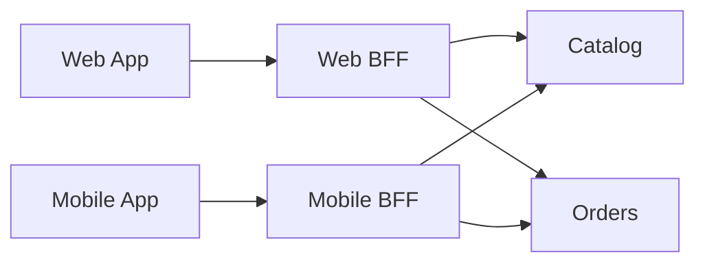

# Backend for Frontend (BFF)

> Create a backend tailored to one frontend or channel so the client receives purpose-built APIs without inheriting generic service topology or contracts.

**Scale:** architectural · **Category:** architecture · **Maturity:** established

**Also known as:** Client-specific backend

## Description

Backend for Frontend places a server-side layer between a particular client experience and the wider service estate. A mobile app, web app, kiosk, or partner channel gets its own backend that shapes responses, composes service calls, handles client-specific authentication flows, and shields the frontend from internal APIs. Unlike a general API gateway, a BFF is product-experience oriented and owned close to the frontend team. The pattern reduces chatty clients and allows different channels to evolve independently, but it can duplicate logic if teams do not keep domain rules in underlying services.

**Problem.** Generic APIs either over-fetch, under-fetch, or expose internal service shapes, forcing each frontend to implement brittle composition and channel-specific workarounds.

**Context.** Use when different clients need materially different payloads, performance profiles, authentication flows, or release cadences. Keep BFFs thin and experience-focused; shared business policy belongs in domain services.

## Diagram



## Consequences / Trade-offs

- Frontends get stable, task-oriented APIs that match their screens and latency needs.
- Client teams can release experience changes without waiting for generic platform APIs.
- Logic can fragment across BFFs unless shared rules remain in services or libraries.
- More deployables and routes require ownership, monitoring, and versioning discipline.
- BFFs can reduce frontend complexity but increase backend estate size.

## Ratings by project size

| Project size | Score | Notes |
| --- | --- | --- |
| Small (<10k LOC) | ●●○○○ 2/5 | Rarely worth a separate deployable for one small frontend and one backend. A controller or route module usually suffices. |
| Medium (≤100k LOC) | ●●●●○ 4/5 | Good fit when web and mobile experiences diverge or when frontend latency is hurt by chatty service calls. |
| Large (>100k LOC) | ●●●●○ 4/5 | Strong fit for large product estates, but governance is needed to prevent duplicated business logic and inconsistent customer experiences. |

## Examples

### Shaping data for a mobile screen

**❌ Negative (typescript)**

```typescript
export async function renderHome(userId: string) {
  const user = await api.get(`/users/${userId}`);
  const orders = await api.get(`/orders?user=${userId}&limit=3`);
  const promos = await api.get(`/promotions?segment=${user.segment}`);
  return drawHome({ name: user.displayName, orders, promos });
}
```

**✅ Positive (typescript)**

```typescript
export async function getMobileHome(userId: string, services: Services) {
  const [user, orders, promos] = await Promise.all([
    services.users.summary(userId),
    services.orders.recent(userId, 3),
    services.promotions.forUser(userId),
  ]);

  return {
    greeting: `Hello ${user.firstName}`,
    cards: orders.map(toOrderCard),
    banners: promos.map(toBanner),
  };
}
```

*The negative version makes the mobile client compose internal APIs and shape view data itself. The positive BFF performs channel-specific composition on the server while leaving domain rules in the underlying services.*

## Relationships

**Synergies**

- [API Gateway](../architecture/api-gateway.md) — A gateway can apply common edge policy before routing to the correct client-specific BFF.
- [Microservices](../architecture/microservices.md) — BFFs compose several microservice APIs into payloads suited to a single client journey.
- [Serverless / FaaS Architecture](../architecture/serverless-architecture.md) — Low-traffic or highly elastic BFF endpoints can be implemented as functions behind an edge route.
- [Anti-Corruption Layer](../cloud-distributed/anti-corruption-layer.md) — A BFF can translate internal domain contracts into client-specific view models without leaking service models.

**Conflicts with:** [Peer-to-Peer](../architecture/peer-to-peer.md)

**Alternatives:** [API Gateway](../architecture/api-gateway.md), [GraphQL Schema](../api-design/graphql.md), [Client-Server](../architecture/client-server.md)

## Applicability tags

- **Languages:** language-agnostic, typescript, javascript, kotlin, swift, csharp
- **Frameworks:** nodejs, express, nestjs, nextjs, graphql
- **Project types:** web-frontend, mobile-app, web-api, microservices
- **Tags:** experience-api, aggregation, frontend, client-specific, composition

## References

- Sam Newman, Pattern Backends For Frontends, (2015)
- Sam Newman, Building Microservices, (2021)

