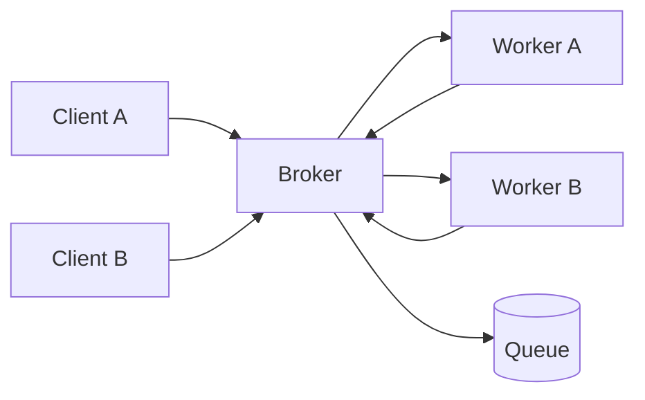

# Broker Architecture

> Decouple participants by routing requests, commands, or events through a broker that mediates discovery, delivery, protocol translation, and sometimes workflow.

**Scale:** architectural · **Altitude:** high · **Category:** architecture · **Maturity:** time-tested

**Also known as:** Hub-and-spoke broker, Message broker architecture

## Description

Broker Architecture introduces an intermediary component between producers and consumers so participants do not need direct knowledge of each other's location, transport, availability, or protocol. Clients submit work to the broker; the broker routes it to suitable servers, workers, or subscribers and may handle correlation, retries, buffering, fan-out, and transformation. The pattern is architectural when the broker becomes a central communication backbone rather than a library detail. It is common in distributed systems where services evolve independently, traffic is bursty, or interactions need to cross process, language, and deployment boundaries.

**Problem.** Direct service-to-service calls create tight coupling, brittle endpoint knowledge, duplicated routing logic, and cascading failures when one participant is unavailable or changes its interface.

**Context.** Use when many independently deployed components must exchange work, events, or requests without each component knowing every other component. It fits systems with asynchronous workflows, protocol heterogeneity, or multiple consumers for the same message, provided the organisation can operate the broker as critical infrastructure.

## Diagram



## Consequences / Trade-offs

- Producers and consumers can evolve independently because the broker owns discovery and routing.
- Buffering smooths traffic spikes and allows consumers to recover after short outages.
- The broker becomes a critical dependency and must be monitored, scaled, secured, and versioned carefully.
- Message contracts, idempotency, ordering, and poison-message handling become first-class design concerns.
- Latency and debugging complexity increase compared with a direct in-process or direct HTTP call.

## Ratings by project size

| Project size | Score | Notes |
| --- | --- | --- |
| Small (<10k LOC) | ●●○○○ 2/5 | Usually too much operational weight for a small application unless there is a clear asynchronous boundary or third-party integration need. |
| Medium (≤100k LOC) | ●●●●○ 4/5 | Good fit once multiple services or workers need decoupled delivery, retries, and buffering. Keep contracts explicit and operational ownership clear. |
| Large (>100k LOC) | ●●●●● 5/5 | Excellent for large distributed systems, but only with mature observability, schema governance, dead-letter handling, and broker capacity planning. |

## Examples

### Routing work through a broker

**❌ Negative (typescript)**

```typescript
type Job = { kind: "invoice" | "email"; payload: unknown };

export async function submit(job: Job) {
  if (job.kind === "invoice") {
    await fetch("https://invoice.internal/jobs", {
      method: "POST",
      body: JSON.stringify(job.payload),
    });
  } else {
    await fetch("https://email.internal/jobs", {
      method: "POST",
      body: JSON.stringify(job.payload),
    });
  }
}
```

**✅ Positive (typescript)**

```typescript
type Job = { kind: "invoice" | "email"; payload: unknown };

export interface Broker {
  publish(topic: string, message: unknown): Promise<void>;
}

export async function submit(job: Job, broker: Broker) {
  await broker.publish(`jobs.${job.kind}`, {
    id: crypto.randomUUID(),
    payload: job.payload,
  });
}

export async function startInvoiceWorker(broker: Broker) {
  // Subscribe to jobs.invoice and process messages idempotently.
}
```

*The negative version embeds endpoint knowledge and routing decisions in the producer. The positive version publishes a typed work item to a broker-owned route, allowing workers to scale, move, or be replaced without changing the submitter.*

## Relationships

**Synergies**

- [Publish-Subscribe Channel](../enterprise-integration/publish-subscribe.md) — The broker can fan events out to many subscribers without producers knowing subscriber count or location.
- [Event-Driven Architecture](../architecture/event-driven-architecture.md) — Brokers provide the durable event transport and routing backbone needed for event-driven collaboration.
- [Circuit Breaker](../resilience/circuit-breaker.md) — Broker clients still need circuit breakers around synchronous broker calls or downstream request-reply paths.
- [Anti-Corruption Layer](../cloud-distributed/anti-corruption-layer.md) — Broker adapters can translate canonical message contracts to legacy or partner formats at the boundary.
- [Microservices](../architecture/microservices.md) — Microservices often use a broker to avoid point-to-point integration meshes and to absorb traffic bursts.

**Conflicts with:** [Client-Server](../architecture/client-server.md)

**Alternatives:** [API Gateway](../architecture/api-gateway.md), [Service Mesh](../architecture/service-mesh.md), [Mediator](../gof-behavioural/mediator.md)

## Applicability tags

- **Languages:** language-agnostic, java, typescript, go, python
- **Frameworks:** kafka, rabbitmq, nats, spring-boot, nodejs
- **Project types:** distributed-system, microservices, backend-service, high-throughput
- **Tags:** messaging, decoupling, routing, asynchronous, integration

## References

- Frank Buschmann et al., Pattern-Oriented Software Architecture Volume 1, (1996)
- Gregor Hohpe and Bobby Woolf, Enterprise Integration Patterns, (2003)

