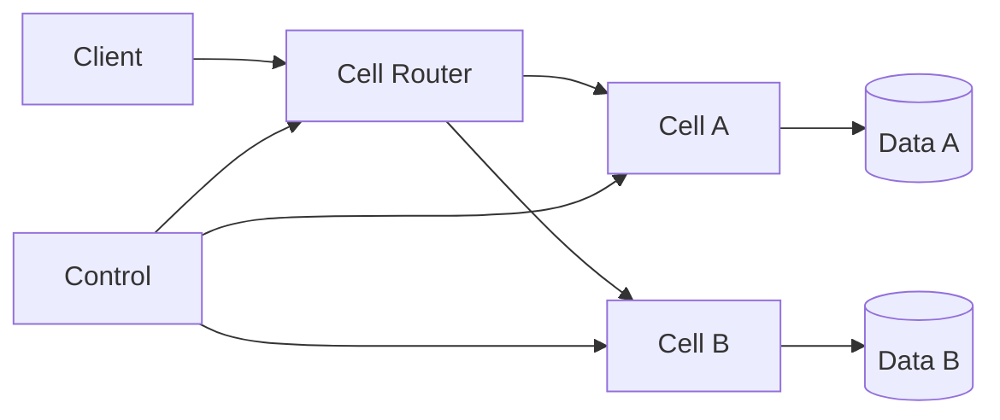

# Cell-Based Architecture

> Partition a platform into self-contained cells so each cell serves a subset of traffic with isolated capacity, data, and blast radius.

**Scale:** architectural · **Category:** architecture · **Maturity:** established

**Also known as:** Cellular architecture, Bulkheaded cells

## Description

Cell-Based Architecture divides a large system into repeatable, mostly self-sufficient cells. Each cell contains the services, data stores, queues, and operational dependencies required to serve an assigned set of tenants, regions, shards, or customers. A routing layer maps incoming traffic to the correct cell, while shared control planes handle provisioning and metadata. The pattern limits blast radius and supports horizontal scaling by adding cells rather than endlessly scaling one global deployment. It requires strong automation because every operational change must be safe across many similar but independently failing units.

**Problem.** A single shared production plane lets one hot tenant, bad deploy, noisy queue, or regional incident degrade the entire customer base.

**Context.** Use for large multi-tenant or high-scale platforms where isolation, regionality, and controlled blast radius matter. Define cell assignment, failover, and data movement policies before introducing cells.

## Diagram



## Consequences / Trade-offs

- Failures are contained to a cell when dependencies and data ownership are truly isolated.
- Scaling becomes repeatable by adding cells with known capacity envelopes.
- Cross-cell queries, tenant moves, global reporting, and operational rollouts become harder.
- Automation, deployment orchestration, and observability must treat cell identity as first-class.
- Underfilled cells can increase cost compared with a fully shared pool.

## Ratings by project size

| Project size | Score | Notes |
| --- | --- | --- |
| Small (<10k LOC) | ●○○○○ 1/5 | Avoid for small systems; cells add routing, duplication, and operational automation needs without enough scale to justify them. |
| Medium (≤100k LOC) | ●●●○○ 3/5 | Situational for regulated tenants or regional isolation, but most medium systems should start with simpler bulkheads and clear service boundaries. |
| Large (>100k LOC) | ●●●●● 5/5 | Excellent for large multi-tenant platforms where blast-radius containment and repeatable capacity units are business requirements. |

## Examples

### Routing tenants to isolated cells

**❌ Negative (typescript)**

```typescript
export async function handleRequest(req: Request, pool: GlobalPool) {
  const tenant = req.headers.get("tenant-id")!;
  return pool.query("select * from orders where tenant_id = ?", [tenant]);
}
```

**✅ Positive (typescript)**

```typescript
export async function handleRequest(req: Request, directory: CellDirectory) {
  const tenant = req.headers.get("tenant-id")!;
  const cell = await directory.cellForTenant(tenant);
  const client = await cell.connect();
  return client.orders.forTenant(tenant);
}
```

*The negative version sends all tenants through one global pool, so hot tenants and failures are shared. The positive version uses a tenant directory to route work to a cell with isolated services and data.*

## Relationships

**Synergies**

- [Bulkhead](../resilience/bulkhead.md) — Cells are an architectural form of bulkhead that isolate capacity and failure domains.
- [API Gateway](../architecture/api-gateway.md) — The gateway can resolve tenant or region metadata and route traffic to the correct cell edge.
- [Database per Service](../data-persistence/database-per-service.md) — Cells depend on data ownership boundaries so cell-local services can fail independently.
- [Service Mesh](../architecture/service-mesh.md) — Mesh policy can enforce that service calls stay within a cell unless explicitly allowed.
- [Circuit Breaker](../resilience/circuit-breaker.md) — Cross-cell or control-plane calls need fast failure to avoid spreading an incident.

**Conflicts with:** [Layered (N-Tier) Architecture](../architecture/layered-architecture.md)

**Alternatives:** [Microservices](../architecture/microservices.md), [Space-Based Architecture](../architecture/space-based-architecture.md), [Client-Server](../architecture/client-server.md)

## Applicability tags

- **Languages:** language-agnostic, java, go, typescript, csharp
- **Frameworks:** kubernetes, terraform, kafka, spring-boot
- **Project types:** distributed-system, microservices, high-throughput, backend-service
- **Tags:** isolation, multi-tenant, blast-radius, sharding, platform

## References

- Amazon Web Services, Reducing the Scope of Impact with Cell-Based Architecture
- Michael Nygard, Release It!, (2018)

