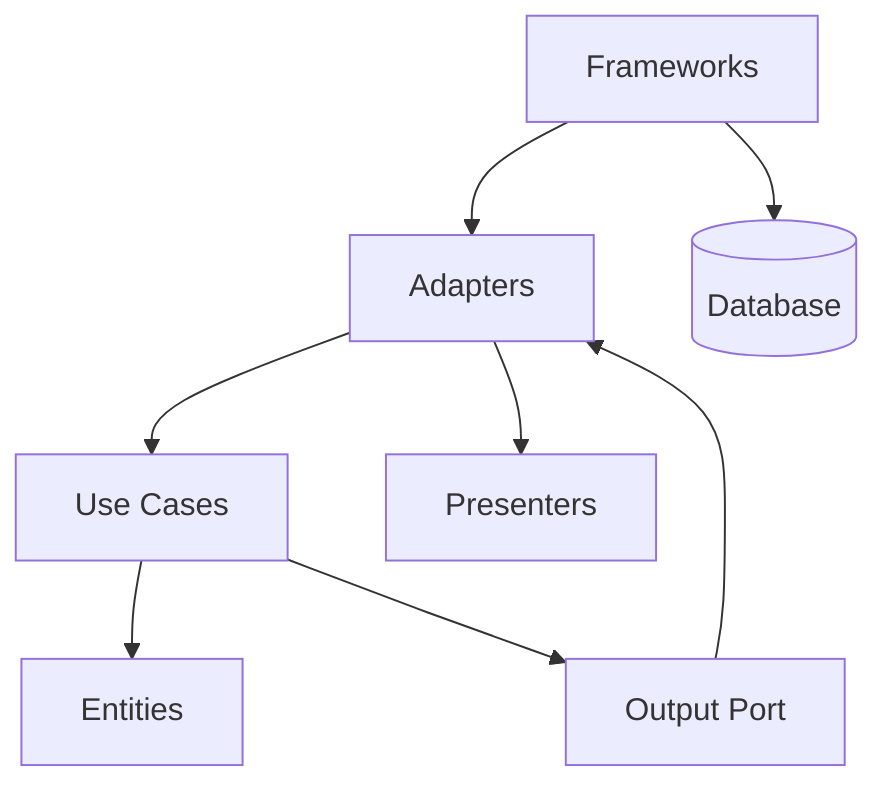

# Clean Architecture

> Place enterprise rules and use cases at the centre of the system and force dependencies inward so frameworks, databases, and delivery mechanisms are replaceable details.

**Scale:** architectural · **Category:** architecture · **Maturity:** established

**Also known as:** The Dependency Rule, Entities and Use Cases

## Description

Clean Architecture arranges code around policy rather than technology. Entities capture enterprise rules, use cases coordinate application-specific decisions, interface adapters translate between external formats and internal models, and frameworks or drivers sit at the outside. The dependency rule is the key: source dependencies point inward, and outer details know about inner policies, never the reverse.

**Problem.** Framework-first systems make business policy depend on HTTP, ORM, or message-broker details, so tests are slow and architecture decisions become expensive to reverse.

**Context.** Long-lived applications with important domain policy, multiple delivery channels, or a need to test use cases without databases and web servers.

## Diagram



## Consequences / Trade-offs

- Keeps high-value policy stable while frameworks and vendors change around it.
- Makes use cases explicit and testable through input and output boundaries.
- Requires disciplined mapping between layers and can feel verbose in CRUD-heavy systems.
- Poorly applied versions create too many abstractions and hide simple behaviour behind ceremonial interfaces.

## Ratings by project size

| Project size | Score | Notes |
| --- | --- | --- |
| Small (<10k LOC) | ●●○○○ 2/5 | Usually unnecessary for small CRUD apps or libraries because the boundary cost is visible before the benefit appears. |
| Medium (≤100k LOC) | ●●●●○ 4/5 | Good fit when business rules are meaningful and fast use-case tests matter. |
| Large (>100k LOC) | ●●●●● 5/5 | Excellent for long-lived systems where policy must survive framework, database, and transport churn. |

## Examples

### Use cases should not import delivery or ORM details

**❌ Negative (typescript)**

```typescript
import { Request, Response } from "express";
import { prisma } from "./prisma";

export async function approveLoan(req: Request, res: Response) {
  const application = await prisma.loanApplication.findUnique({ where: { id: req.params.id } });
  if (!application || application.score < 700) return res.status(409).send("rejected");
  await prisma.loanApplication.update({ where: { id: application.id }, data: { status: "APPROVED" } });
  res.send({ status: "APPROVED" });
}
```

**✅ Positive (typescript)**

```typescript
export interface LoanApplications {
  get(id: string): Promise<LoanApplication | null>;
  save(application: LoanApplication): Promise<void>;
}

export class ApproveLoan {
  constructor(private readonly applications: LoanApplications) {}

  async execute(id: string): Promise<LoanDecision> {
    const application = await this.applications.get(id);
    if (!application) return LoanDecision.notFound();
    application.approveIfEligible();
    await this.applications.save(application);
    return LoanDecision.from(application);
  }
}

// Express and Prisma adapters translate HTTP and records at the outer edge.
```

*The use case is framework-free and persistence-free. Business decisions are tested by calling execute directly, while adapters can change without rewriting the approval policy.*

## Relationships

**Synergies**

- [Hexagonal Architecture (Ports & Adapters)](../architecture/hexagonal-architecture.md) — Both apply dependency inversion at the boundary between core policy and external adapters.
- [Domain Model](../enterprise-application/domain-model.md) — Entities and value objects provide the inner policy model Clean Architecture protects.
- [Repository](../data-persistence/repository.md) — Repositories are common outbound boundaries for persistence details.
- [Dependency Injection](../implementation/dependency-injection.md) — Dependency injection wires outer implementations into inward-facing interfaces without reversing dependencies.

**Conflicts with:** [Active Record](../enterprise-application/active-record.md)

**Alternatives:** [Layered (N-Tier) Architecture](../architecture/layered-architecture.md), [Hexagonal Architecture (Ports & Adapters)](../architecture/hexagonal-architecture.md), [Onion Architecture](../architecture/onion-architecture.md)

## Applicability tags

- **Languages:** language-agnostic, java, csharp, typescript, go, python
- **Frameworks:** spring-boot, dotnet, nestjs, fastapi, nodejs
- **Project types:** backend-service, web-api, modular-monolith, microservices
- **Tags:** dependency-rule, use-cases, testability, policy

## References

- [Robert C. Martin, Clean Architecture, (2017)](https://www.oreilly.com/library/view/clean-architecture-a/9780134494272/)

