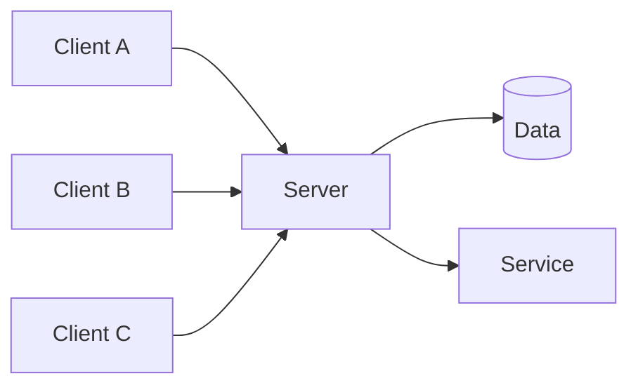

# Client-Server

> Split responsibilities between clients that initiate requests and servers that provide shared capabilities, data, policy, and coordination.

**Scale:** architectural · **Category:** architecture · **Maturity:** time-tested

## Description

Client-Server is the foundational distributed architecture in which client processes request services from server processes over a network. Clients own presentation, interaction, or local workflow; servers own shared state, business capabilities, security policy, and resource coordination. The pattern can be as simple as a browser and web server or as rich as desktop clients synchronising with a backend API. Its clarity comes from asymmetric roles and a well-defined contract, but that same asymmetry creates server bottlenecks, offline limitations, and central availability requirements.

**Problem.** Applications need to share data, enforce central policy, and coordinate work across many users or devices without installing all capabilities and data on every participant.

**Context.** Use when centralised control, shared data consistency, and simple operational topology matter more than fully decentralised operation. Design explicit network contracts and account for latency, partial failure, and client version skew.

## Diagram



## Consequences / Trade-offs

- Central servers make security, data integrity, and capability rollout easier to govern.
- Clients can be simpler and tailored to user interaction while servers handle shared concerns.
- The server is a capacity and availability dependency for clients.
- Network latency, offline behaviour, and API compatibility become product concerns.
- Over time a single server can grow into a monolith unless boundaries are maintained.

## Ratings by project size

| Project size | Score | Notes |
| --- | --- | --- |
| Small (<10k LOC) | ●●●●○ 4/5 | Strong default for small web and mobile applications that need shared data and central policy without distributed-system complexity. |
| Medium (≤100k LOC) | ●●●●○ 4/5 | Still a good fit, especially when paired with clear API contracts and internal modularity on the server. |
| Large (>100k LOC) | ●●●○○ 3/5 | Remains foundational, but large estates often need gateways, BFFs, microservices, or cells to avoid one overloaded central server. |

## Examples

### Enforcing shared policy on the server

**❌ Negative (typescript)**

```typescript
export function canWithdraw(balance: number, amount: number) {
  return balance - amount >= 0;
}

// Each client checks locally, then writes directly to a shared file or database.
```

**✅ Positive (typescript)**

```typescript
export async function withdraw(accountId: string, amount: number, server: BankingApi) {
  const result = await server.post("/withdrawals", { accountId, amount });
  if (result.status === 409) throw new Error("insufficient funds");
  return result.body;
}

// The server performs the authoritative balance check in one transaction.
```

*The negative version trusts every client to enforce the same invariant. The positive version lets clients request an action while the server owns the authoritative policy and shared state transition.*

## Relationships

**Synergies**

- [API Gateway](../architecture/api-gateway.md) — A gateway is a common server-side edge for many clients calling multiple backing services.
- [Backend for Frontend (BFF)](../architecture/backend-for-frontend.md) — Client-server systems with several client types can add BFFs to tailor contracts per channel.
- [Layered (N-Tier) Architecture](../architecture/layered-architecture.md) — Servers commonly use layers internally to separate presentation, application, domain, and persistence code.
- [Circuit Breaker](../resilience/circuit-breaker.md) — Clients and servers need fast-failure controls around remote calls to avoid hanging user journeys.

**Conflicts with:** [Peer-to-Peer](../architecture/peer-to-peer.md)

**Alternatives:** [Peer-to-Peer](../architecture/peer-to-peer.md), [Serverless / FaaS Architecture](../architecture/serverless-architecture.md), [Microservices](../architecture/microservices.md)

## Applicability tags

- **Languages:** language-agnostic, typescript, java, csharp, swift, kotlin
- **Frameworks:** react, spring-boot, aspnet, django, nodejs
- **Project types:** web-api, web-frontend, mobile-app, desktop-app
- **Tags:** distributed, centralised, request-response, shared-state, api

## References

- George Coulouris et al., Distributed Systems Concepts and Design, (2011)

