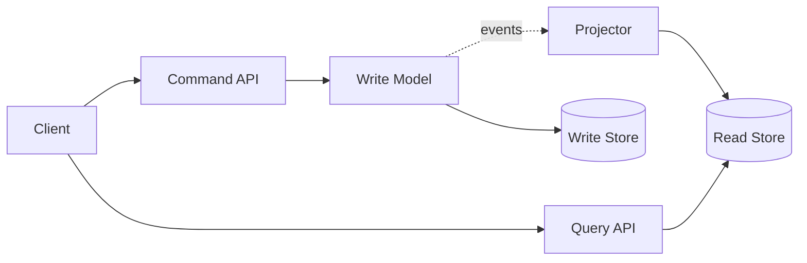

# CQRS (Command Query Responsibility Segregation)

> Separate write models that enforce commands and invariants from read models optimised for queries, allowing each side to evolve for its own workload.

**Scale:** architectural · **Altitude:** medium · **Category:** architecture · **Maturity:** established

**Also known as:** Command Query Responsibility Segregation

## Description

CQRS splits an application into command paths that change state and query paths that read state. The write model validates intent, protects invariants, and emits facts or updates stores; the read model denormalises data for fast, simple queries. CQRS can be implemented inside one application or across services, and it does not require event sourcing, although the two often compose.

**Problem.** A single CRUD model often becomes a poor compromise when writes need rich invariants but reads need denormalised, high-volume, or user-specific projections.

**Context.** Domains with complex write rules, very different read and write workloads, audit or projection needs, or performance pressure on read-heavy screens.

## Diagram



## Consequences / Trade-offs

- Lets command models focus on invariants and query models focus on read performance.
- Enables independent scaling and denormalised read stores.
- Introduces eventual consistency when read models are updated asynchronously.
- Adds conceptual overhead and duplicate models that are wasteful for simple CRUD.

## Ratings by project size

| Project size | Score | Notes |
| --- | --- | --- |
| Small (<10k LOC) | ●●○○○ 2/5 | Rarely justified for simple CRUD because duplicate models and consistency rules add cost. |
| Medium (≤100k LOC) | ●●●●○ 4/5 | Good when read and write needs diverge or a few high-value projections simplify the product. |
| Large (>100k LOC) | ●●●●● 5/5 | Excellent for large systems with heavy reads, complex writes, or independent projection teams, as long as consistency semantics are explicit. |

## Examples

### Do not force reads through the write aggregate

**❌ Negative (csharp)**

```csharp
public async Task<OrderPage> GetOrderPage(Guid id)
{
    var order = await repository.Load(id);
    var customer = await customers.Load(order.CustomerId);
    var payments = await payments.ForOrder(id);
    return OrderPage.From(order, customer, payments);
}
```

**✅ Positive (csharp)**

```csharp
public sealed class ApproveOrderHandler
{
    public async Task Handle(ApproveOrder command)
    {
        var order = await orders.Load(command.OrderId);
        order.Approve(command.ApproverId);
        await orders.Save(order);
        await events.Append(order.PendingEvents);
    }
}

public sealed class OrderPageQueries
{
    public Task<OrderPageDto> Get(Guid id) => readDb.OrderPages.SingleAsync(x => x.Id == id);
}
```

*The positive version separates the command path that enforces approval rules from the query path that returns a pre-shaped page. Neither side compromises the other.*

## Relationships

**Synergies**

- [Event Sourcing](../architecture/event-sourcing.md) — Event sourcing supplies a durable stream of facts that can rebuild CQRS projections.
- [Materialized View](../cloud-distributed/materialized-view.md) — Materialized views are a practical read-side implementation.
- [Domain Model](../enterprise-application/domain-model.md) — The command side benefits from a domain model that enforces invariants.
- [Mediator](../gof-behavioural/mediator.md) — A mediator can route commands and queries to distinct handlers cleanly.

**Conflicts with:** [Active Record](../enterprise-application/active-record.md)

**Alternatives:** [Layered (N-Tier) Architecture](../architecture/layered-architecture.md), [Transaction Script](../enterprise-application/transaction-script.md), [Event Sourcing](../architecture/event-sourcing.md)

## Applicability tags

- **Languages:** language-agnostic, csharp, java, typescript, go, python
- **Frameworks:** dotnet, spring-boot, nestjs, kafka, typeorm
- **Project types:** backend-service, web-api, microservices, high-throughput, distributed-system
- **Tags:** commands, queries, projections, read-models

## References

- [Martin Fowler, CQRS, (2011)](https://martinfowler.com/bliki/CQRS.html)

