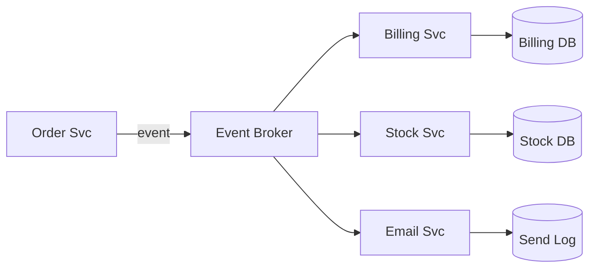

# Event-Driven Architecture

> Let services publish immutable facts about state changes and have other components react asynchronously, reducing temporal coupling between producers and consumers.

**Scale:** architectural · **Altitude:** medium · **Category:** architecture · **Maturity:** established

**Also known as:** EDA

## Description

Event-Driven Architecture models important business changes as events and distributes them through brokers, streams, or channels. Producers announce facts they own; consumers subscribe and react on their own timelines. The architecture improves decoupling and scalability for workflows, integrations, and projections, but it shifts complexity into event contracts, ordering, idempotency, observability, and eventual consistency.

**Problem.** Synchronous point-to-point calls make producers know too much about consumers, create cascading failures, and force unrelated work into one request path.

**Context.** Systems with many consumers of the same business facts, asynchronous workflows, integration needs, audit trails, or spikes that benefit from buffering.

## Diagram



## Consequences / Trade-offs

- Decouples producers from consumers in time, availability, and deployment cadence.
- Supports fan-out, auditability, projections, and reactive workflows.
- Requires idempotent consumers, schema evolution, replay strategy, and clear event ownership.
- Debugging becomes harder because causality spans logs, brokers, retries, and eventually consistent views.

## Ratings by project size

| Project size | Score | Notes |
| --- | --- | --- |
| Small (<10k LOC) | ●●○○○ 2/5 | Usually unnecessary for small apps unless asynchronous integration is the core requirement. |
| Medium (≤100k LOC) | ●●●●○ 4/5 | Good fit when several workflows consume the same facts or request paths need decoupling. |
| Large (>100k LOC) | ●●●●● 5/5 | Excellent for large distributed systems, provided event governance, observability, and replay practices are mature. |

## Examples

### Publish facts instead of calling every downstream concern inline

**❌ Negative (typescript)**

```typescript
export async function placeOrder(command: PlaceOrder) {
  const order = await orders.create(command);
  await billing.charge(order);
  await inventory.reserve(order);
  await email.sendConfirmation(order);
  return order.id;
}
```

**✅ Positive (typescript)**

```typescript
export async function placeOrder(command: PlaceOrder) {
  const order = Order.place(command);
  await orders.save(order);
  await outbox.add(new OrderPlaced(order.id, order.customerId, order.lines));
  return order.id;
}

export async function reserveStock(event: OrderPlaced) {
  if (await processed.has(event.id)) return;
  await inventory.reserve(event.lines);
  await processed.record(event.id);
}
```

*The positive version keeps order creation focused on the fact it owns. Other capabilities react asynchronously and make retries safe through idempotent consumption.*

## Relationships

**Synergies**

- [Publish-Subscribe Channel](../enterprise-integration/publish-subscribe.md) — Publish-subscribe channels distribute events to many independent consumers.
- [Transactional Outbox](../cloud-distributed/outbox.md) — Transactional outbox prevents losing events when state changes and publishes must be atomic.
- [Idempotent Receiver](../enterprise-integration/idempotent-receiver.md) — Idempotent receivers make at-least-once delivery safe.
- [Domain Event](../ddd-tactical/domain-event.md) — Domain events provide business-meaningful facts rather than technical notifications.
- [Saga](../cloud-distributed/saga.md) — Sagas use events to coordinate long-running cross-service workflows.

**Conflicts with:** [Request-Reply](../enterprise-integration/request-reply.md)

**Alternatives:** [Service-Oriented Architecture (SOA)](../architecture/service-oriented-architecture.md), [Microservices](../architecture/microservices.md), [Pipes and Filters](../architecture/pipes-and-filters.md)

## Applicability tags

- **Languages:** language-agnostic, java, go, typescript, python, csharp
- **Frameworks:** kafka, rabbitmq, nats, spring-boot, nodejs
- **Project types:** distributed-system, microservices, backend-service, high-throughput, data-pipeline
- **Tags:** events, async, pub-sub, eventual-consistency

## References

- [Martin Fowler, What do you mean by Event-Driven?, (2017)](https://martinfowler.com/articles/201701-event-driven.html)

