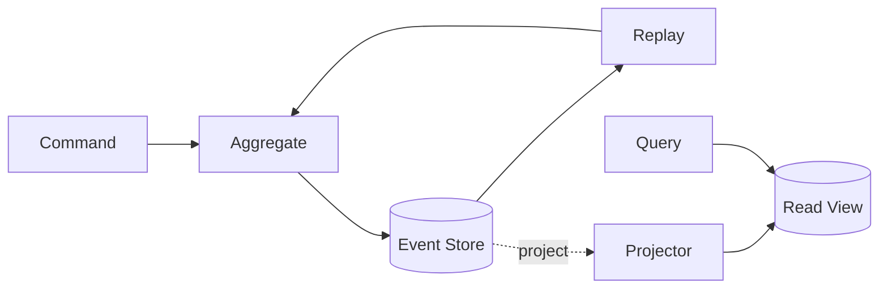

# Event Sourcing

> Persist every state change as an immutable event and derive current state by replaying the event stream, preserving history as the system of record.

**Scale:** architectural · **Category:** architecture · **Maturity:** established

**Also known as:** Event Store as Source of Truth

## Description

Event Sourcing stores a sequence of domain events rather than only the latest row state. Aggregates are rebuilt from their event history, new decisions append new events, and projections provide query-friendly views. It is powerful where auditability, temporal queries, replay, and business history matter, but it demands careful event design, versioning, snapshots, idempotency, and operational discipline around irreversible facts.

**Problem.** Mutable tables often erase why state changed, make audit trails secondary and lossy, and prevent reliable reconstruction of past decisions or new projections.

**Context.** Domains where the history of decisions is as important as current state: finance, fulfilment, compliance, reservations, subscriptions, or collaborative systems.

## Diagram



## Consequences / Trade-offs

- Provides a complete audit trail and enables replay into new projections.
- Makes temporal debugging and business reconstruction possible when events are well designed.
- Requires event versioning, upcasters, snapshot strategy, and disciplined event naming.
- Querying current state requires projections or replay, so simple CRUD becomes more complex.

## Ratings by project size

| Project size | Score | Notes |
| --- | --- | --- |
| Small (<10k LOC) | ●○○○○ 1/5 | Avoid for small CRUD systems; immutable event streams and projections are a large burden. |
| Medium (≤100k LOC) | ●●●○○ 3/5 | Situational when audit and replay requirements are central, not merely nice to have. |
| Large (>100k LOC) | ●●●●● 5/5 | Excellent for high-value domains where auditability, reconstruction, and projection flexibility justify the operational complexity. |

## Examples

### Append facts rather than overwriting business history

**❌ Negative (typescript)**

```typescript
export async function changePlan(accountId: string, plan: string) {
  await db.accounts.update({
    where: { id: accountId },
    data: { plan, updatedAt: new Date() },
  });
}
```

**✅ Positive (typescript)**

```typescript
type AccountEvent =
  | { type: "AccountOpened"; accountId: string; plan: string }
  | { type: "PlanChanged"; accountId: string; plan: string; changedBy: string };

export async function changePlan(command: ChangePlan) {
  const events = await eventStore.load(command.accountId);
  const account = Account.rehydrate(events);
  account.changePlan(command.plan, command.actorId);
  await eventStore.append(command.accountId, account.pendingEvents, events.length);
}

// A projector updates account_current_plan for reads.
```

*The positive version records the business fact and actor, uses optimistic append position for concurrency, and lets projections derive current state without losing history.*

## Relationships

**Synergies**

- [CQRS (Command Query Responsibility Segregation)](../architecture/cqrs.md) — CQRS read models turn event streams into efficient query views.
- [Domain Event](../ddd-tactical/domain-event.md) — Domain events are the durable facts stored in the event stream.
- [Materialized View](../cloud-distributed/materialized-view.md) — Materialized views provide fast current-state projections over event history.
- [Transactional Outbox](../cloud-distributed/outbox.md) — Outbox can publish committed events reliably to external subscribers.

**Conflicts with:** [Active Record](../enterprise-application/active-record.md)

**Alternatives:** [CQRS (Command Query Responsibility Segregation)](../architecture/cqrs.md), [Change Data Capture (CDC)](../data-persistence/change-data-capture.md), [Event-Driven Architecture](../architecture/event-driven-architecture.md)

## Applicability tags

- **Languages:** language-agnostic, csharp, java, typescript, go, python
- **Frameworks:** kafka, spring-boot, dotnet, nestjs, kafka
- **Project types:** backend-service, distributed-system, microservices, high-throughput
- **Tags:** events, audit, replay, temporal

## References

- [Martin Fowler, Event Sourcing, (2005)](https://martinfowler.com/eaaDev/EventSourcing.html)

