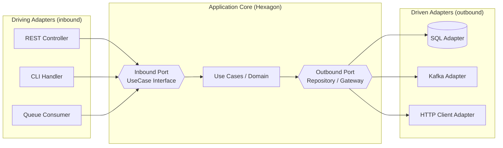

# Hexagonal Architecture (Ports & Adapters)

> Isolate application core logic from external concerns by expressing all interactions through technology-agnostic ports, with adapters that bind those ports to concrete drivers (UI, DB, queues) at the edges.

**Scale:** architectural · **Category:** architecture · **Maturity:** time-tested

**Also known as:** Ports and Adapters, Onion Architecture (close relative)

## Description

Hexagonal Architecture, coined by Alistair Cockburn, structures an application so the domain/use-case core depends on nothing but abstractions ("ports"). Inbound ports describe what the application can do; outbound ports describe what the application needs. Adapters live outside the core and translate between a concrete technology (HTTP, gRPC, SQL, Kafka, CLI) and a port. Because the core defines the interfaces and the infrastructure implements them, the dependency arrow always points inward (dependency inversion), making the core testable in isolation and the I/O technologies replaceable.

**Problem.** Business logic tends to get tangled with frameworks, databases, and transport code, making it hard to test, hard to change persistence/transport, and prone to leaking infrastructure concerns into the domain.

**Context.** Applications that must outlive their frameworks, need strong test isolation, or support multiple delivery mechanisms (REST + CLI + message consumer) over the same logic.

## Diagram



## Consequences / Trade-offs

- Core logic is unit-testable with no infrastructure (drive via test adapters).
- Transport and persistence become swappable without touching business rules.
- Adds indirection and boilerplate (interfaces, mappers) that is overkill for tiny apps.
- Requires discipline to keep domain types from leaking framework annotations.

## Ratings by project size

| Project size | Score | Notes |
| --- | --- | --- |
| Small (<10k LOC) | ●●○○○ 2/5 | Overkill for <10k LOC apps and most libraries; the indirection cost outweighs the benefit when there is one transport and one datastore. A simple layered or transaction-script approach ships faster. |
| Medium (≤100k LOC) | ●●●●○ 4/5 | Strong fit once the domain has real rules and you want fast tests and the option to change persistence/transport. Keep adapters thin. |
| Large (>100k LOC) | ●●●●● 5/5 | Excellent for large/long-lived systems and microservices: enforces boundaries, keeps the core stable as infrastructure churns, and scales across teams. |

## Examples

### Order placement use case

**❌ Negative (typescript)**

```typescript
// Domain logic welded to Express + the ORM. Untestable without HTTP + DB.
app.post("/orders", async (req, res) => {
  const conn = await mysql.createConnection(DB_URL);
  if (!req.body.items?.length) return res.status(400).send("no items");
  const total = req.body.items.reduce((s, i) => s + i.price * i.qty, 0);
  await conn.query("INSERT INTO orders (customer, total) VALUES (?, ?)", [
    req.body.customerId,
    total,
  ]);
  await stripe.charges.create({ amount: total, source: req.body.token });
  res.status(201).send("ok");
});
```

**✅ Positive (typescript)**

```typescript
// --- core (no framework imports) ---
export interface OrderRepository {        // outbound port
  save(order: Order): Promise<void>;
}
export interface PaymentGateway {         // outbound port
  charge(amount: Money, token: string): Promise<void>;
}
export interface PlaceOrder {             // inbound port
  execute(cmd: PlaceOrderCommand): Promise<OrderId>;
}

export class PlaceOrderService implements PlaceOrder {
  constructor(
    private readonly orders: OrderRepository,
    private readonly payments: PaymentGateway,
  ) {}
  async execute(cmd: PlaceOrderCommand): Promise<OrderId> {
    const order = Order.create(cmd.customerId, cmd.items); // invariants enforced here
    await this.payments.charge(order.total, cmd.paymentToken);
    await this.orders.save(order);
    return order.id;
  }
}

// --- adapters (edge) ---
// SqlOrderRepository implements OrderRepository
// StripePaymentGateway implements PaymentGateway
// express route just maps HTTP <-> PlaceOrderCommand and calls placeOrder.execute()
```

*The positive version keeps all rules in PlaceOrderService behind ports, so it can be tested with in-memory fakes and its DB/transport/payment provider can be swapped by replacing an adapter, never the core.*

## Relationships

**Synergies**

- `dependency-injection` — Wiring adapters to ports at the composition root is exactly what DI containers do.
- [Repository](../data-persistence/repository.md) — Repository is the canonical outbound persistence port.
- `domain-model` — A rich domain model lives naturally inside the hexagon's core.
- `anti-corruption-layer` — ACL adapters protect the core from external models at the boundary.

**Conflicts with:** `transaction-script`

**Alternatives:** `layered-architecture`, `clean-architecture`

## Applicability tags

- **Languages:** language-agnostic, java, csharp, typescript, go, python
- **Frameworks:** spring-boot, dotnet, nestjs, nodejs
- **Project types:** backend-service, microservices, modular-monolith, web-api
- **Tags:** dependency-inversion, testability, boundaries, clean-core

## References

- [Alistair Cockburn, Hexagonal Architecture, (2005)](https://alistair.cockburn.us/hexagonal-architecture/)
- Tom Hombergs, Get Your Hands Dirty on Clean Architecture, (2019)

