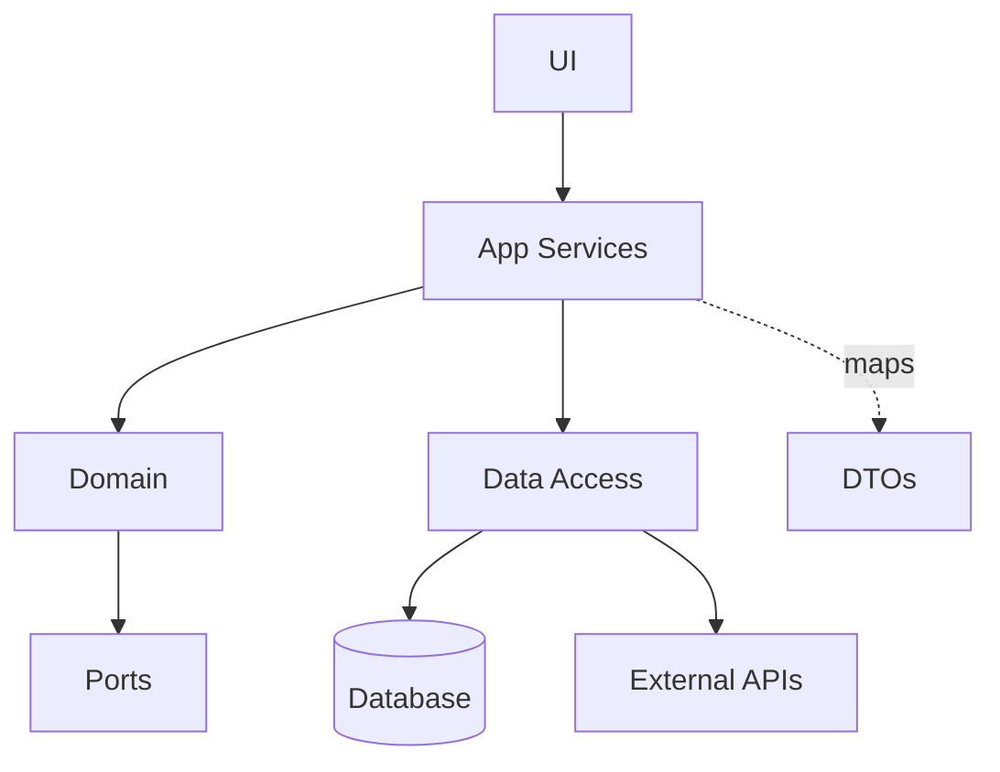

# Layered (N-Tier) Architecture

> Organise a system into horizontal layers such as presentation, application, domain, and infrastructure, with each layer serving the layer above and depending only on lower layers or stable contracts.

**Scale:** architectural · **Category:** architecture · **Maturity:** time-tested

**Also known as:** N-Tier Architecture, Three-Tier Architecture

## Description

Layered Architecture separates responsibilities by technical role. The presentation layer handles delivery concerns, the application layer coordinates use cases, the domain layer owns business rules, and infrastructure provides persistence and external integration. The pattern is easy for teams to understand because requests travel through a familiar stack, but it only remains healthy when dependency direction, mapping boundaries, and layer ownership are enforced rather than treated as folder names.

**Problem.** As a codebase grows, UI, business rules, database code, and integration calls can collapse into large handlers where every change touches unrelated concerns and testing requires the full stack.

**Context.** Best for business applications with clear delivery, orchestration, domain, and persistence concerns, especially when a team wants a conventional structure before adopting stricter domain-centric patterns.

## Diagram



## Consequences / Trade-offs

- Provides a simple mental model and predictable places for controllers, services, domain logic, and data access.
- Supports incremental development because each layer can be introduced without a distributed-system migration.
- Can become an anaemic pass-through stack if every layer merely forwards data to the next.
- Strict top-down dependencies can make cross-cutting features awkward unless boundaries and shared contracts are explicit.

## Ratings by project size

| Project size | Score | Notes |
| --- | --- | --- |
| Small (<10k LOC) | ●●○○○ 2/5 | Usually too much ceremony for tiny utilities or prototypes unless the team already has a framework convention. |
| Medium (≤100k LOC) | ●●●●○ 4/5 | A strong default for medium business systems because it gives structure without forcing distribution. |
| Large (>100k LOC) | ●●●○○ 3/5 | Useful inside services or modules, but large systems often need stronger domain boundaries or independent deployment units. |

## Examples

### Keep delivery, orchestration, rules, and data access separate

**❌ Negative (typescript)**

```typescript
export async function checkout(req: Request) {
  const user = await db.users.find(req.userId);
  const stock = await db.stock.find(req.sku);
  if (stock.qty < req.qty) throw new Error("out of stock");
  await db.orders.insert({ userId: user.id, sku: req.sku, qty: req.qty });
  await email.send(user.email, "confirmed");
  await analytics.track("order.created", req);
}
```

**✅ Positive (typescript)**

```typescript
export class CheckoutController {
  constructor(private readonly checkout: CheckoutService) {}

  async post(req: Request) {
    const command = CheckoutCommand.fromHttp(req);
    const receipt = await this.checkout.placeOrder(command);
    return ReceiptDto.from(receipt);
  }
}

export class CheckoutService {
  constructor(private readonly orders: OrderRepository) {}

  async placeOrder(command: CheckoutCommand): Promise<Receipt> {
    const order = Order.place(command.userId, command.lines);
    await this.orders.save(order);
    return Receipt.from(order);
  }
}

export class SqlOrderRepository implements OrderRepository {
  async save(order: Order): Promise<void> {
    await db.orders.insert(order.toRecord());
  }
}
```

*The positive version gives each layer one reason to change: HTTP mapping, use-case orchestration, domain invariants, and persistence can evolve independently and be tested at the right level.*

## Relationships

**Synergies**

- [Service Layer](../enterprise-application/service-layer.md) — Application services are the natural orchestration layer between controllers and domain objects.
- [Repository](../data-persistence/repository.md) — Repositories keep persistence behind a stable data-access layer instead of leaking ORM calls upward.
- [Domain Model](../enterprise-application/domain-model.md) — A real domain layer prevents the architecture from degenerating into transaction scripts.
- [Model-View-Controller (MVC)](../architecture/model-view-controller.md) — MVC commonly occupies the presentation layer of an N-tier web application.

**Conflicts with:** [Microservices](../architecture/microservices.md)

**Alternatives:** [Hexagonal Architecture (Ports & Adapters)](../architecture/hexagonal-architecture.md), [Clean Architecture](../architecture/clean-architecture.md), [Transaction Script](../enterprise-application/transaction-script.md)

## Applicability tags

- **Languages:** language-agnostic, java, csharp, typescript, python
- **Frameworks:** spring-boot, dotnet, nestjs, django, rails
- **Project types:** web-api, backend-service, monolith, modular-monolith
- **Tags:** layers, separation-of-concerns, n-tier, enterprise

## References

- [Martin Fowler, Patterns of Enterprise Application Architecture, (2002)](https://martinfowler.com/books/eaa.html)

