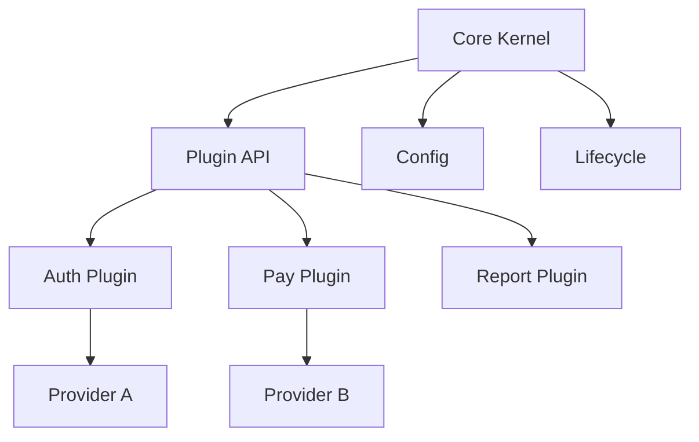

# Microkernel (Plugin) Architecture

> Keep a small stable core that owns lifecycle and shared abstractions, while optional or variable behaviour is supplied by independently developed plugins.

**Scale:** architectural · **Altitude:** high · **Category:** architecture · **Maturity:** time-tested

**Also known as:** Plugin Architecture

## Description

Microkernel Architecture divides a system into a minimal core and a set of plugins. The core provides extension points, shared services, configuration, loading, isolation, and lifecycle management. Plugins implement capabilities through stable contracts. This is common in IDEs, build tools, workflow engines, and product platforms where variability is the product.

**Problem.** Products with many optional capabilities or customer-specific variations become brittle when every feature is compiled into the same core with conditional logic.

**Context.** Extensible platforms, tools, workflow engines, developer products, and applications where third parties or separate teams add behaviour without changing core code.

## Diagram



## Consequences / Trade-offs

- Keeps the core stable while allowing feature variation and independent plugin ownership.
- Supports ecosystems and customer-specific extension without forking the product.
- Requires careful API versioning, plugin isolation, compatibility checks, and failure containment.
- Core abstractions can ossify if extension points are too narrow or too broad.

## Ratings by project size

| Project size | Score | Notes |
| --- | --- | --- |
| Small (<10k LOC) | ●●○○○ 2/5 | Usually unnecessary unless extensibility is the primary feature. |
| Medium (≤100k LOC) | ●●●●○ 4/5 | Good for tools and platforms with several independently owned extension types. |
| Large (>100k LOC) | ●●●●● 5/5 | Excellent for mature product platforms where a stable core and plugin ecosystem reduce coordination cost. |

## Examples

### Replace conditionals with plugin contracts

**❌ Negative (typescript)**

```typescript
export function exportReport(format: string, report: Report): Buffer {
  if (format === "pdf") return renderPdf(report);
  if (format === "csv") return renderCsv(report);
  if (format === "xlsx") return renderXlsx(report);
  throw new Error(`unsupported format ${format}`);
}
```

**✅ Positive (typescript)**

```typescript
export interface ReportExporter {
  readonly format: string;
  export(report: Report): Buffer;
}

export class ExportKernel {
  private readonly exporters = new Map<string, ReportExporter>();

  register(exporter: ReportExporter) {
    this.exporters.set(exporter.format, exporter);
  }

  export(format: string, report: Report): Buffer {
    const exporter = this.exporters.get(format);
    if (!exporter) throw new Error(`unsupported format ${format}`);
    return exporter.export(report);
  }
}
```

*The positive version makes new formats extensions of a stable kernel contract rather than edits to a growing conditional. The core owns discovery and error handling.*

## Relationships

**Synergies**

- [Strategy](../gof-behavioural/strategy.md) — Plugins often provide strategies selected at runtime by the core.
- [Factory Method](../gof-creational/factory-method.md) — Factories create plugin instances behind stable extension contracts.
- [Adapter](../gof-structural/adapter.md) — Adapters let plugins integrate external systems while conforming to core interfaces.
- [Registry](../enterprise-application/registry.md) — A registry discovers and stores plugin implementations for the kernel.

**Conflicts with:** [Monolith](../architecture/monolith.md)

**Alternatives:** [Modular Monolith](../architecture/modular-monolith.md), [Service-Oriented Architecture (SOA)](../architecture/service-oriented-architecture.md), [Layered (N-Tier) Architecture](../architecture/layered-architecture.md)

## Applicability tags

- **Languages:** language-agnostic, java, csharp, typescript, python, go
- **Frameworks:** none, nodejs, spring-boot, dotnet
- **Project types:** desktop-app, cli-tool, sdk, backend-service
- **Tags:** plugins, extension-points, platform, runtime-composition

## References

- Buschmann et al., Pattern-Oriented Software Architecture Volume 1, (1996)

