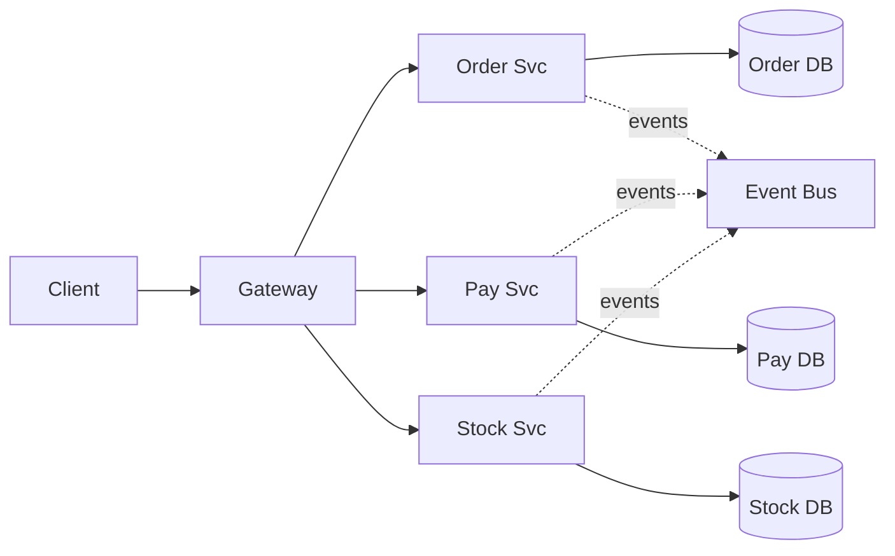

# Microservices

> Decompose a system into independently deployable services aligned to business capabilities, each owning its data and exposing contracts through APIs, events, or messages.

**Scale:** architectural · **Altitude:** high · **Category:** architecture · **Maturity:** established

**Also known as:** Microservice Architecture

## Description

Microservices optimise for independent delivery, team autonomy, and bounded operational blast radius. Each service encapsulates a business capability, owns its persistence, and communicates through explicit contracts. The architecture succeeds only when service boundaries match domain boundaries and the organisation can operate distributed systems: deployment automation, observability, reliability patterns, contract testing, and data consistency strategies are part of the pattern, not optional extras.

**Problem.** A large shared codebase and database can make unrelated teams block each other, deployments risky, and scaling or resilience decisions all-or-nothing.

**Context.** Large products with multiple teams, independently changing business capabilities, strong DevOps maturity, and a real need for independent deployability or scaling.

## Diagram



## Consequences / Trade-offs

- Enables independent deployment, scaling, and ownership by business capability.
- Limits blast radius when failures and data ownership are well isolated.
- Introduces network latency, partial failure, eventual consistency, and operational overhead.
- Poor boundaries produce a distributed monolith that is harder to change than the original monolith.

## Ratings by project size

| Project size | Score | Notes |
| --- | --- | --- |
| Small (<10k LOC) | ●○○○○ 1/5 | Avoid for small projects; operational and consistency costs swamp the benefits. |
| Medium (≤100k LOC) | ●●●○○ 3/5 | Situational when there are clear team and scaling boundaries, but a modular monolith is often safer. |
| Large (>100k LOC) | ●●●●● 5/5 | Excellent for large organisations with mature delivery and observability practices and genuinely independent business capabilities. |

## Examples

### Avoid a shared database between services

**❌ Negative (typescript)**

```typescript
export async function reserveInventory(orderId: string) {
  const order = await sharedDb.orders.findUnique({ where: { id: orderId } });
  await sharedDb.inventory.update({
    where: { sku: order.sku },
    data: { reserved: { increment: order.quantity } },
  });
}
```

**✅ Positive (typescript)**

```typescript
export class InventoryService {
  constructor(private readonly stock: StockRepository, private readonly outbox: Outbox) {}

  async handle(command: ReserveStock): Promise<void> {
    const item = await this.stock.get(command.sku);
    item.reserve(command.quantity, command.orderId);
    await this.stock.save(item);
    await this.outbox.publish(new StockReserved(command.orderId, command.sku));
  }
}

// Order service requests reservation by API or command message and consumes StockReserved.
```

*The positive version preserves service ownership: inventory owns stock data and publishes facts. Order no longer reaches through another service boundary to mutate its tables.*

## Relationships

**Synergies**

- [Bounded Context](../ddd-strategic/bounded-context.md) — Bounded contexts are the best starting point for service boundaries.
- [Database per Service](../data-persistence/database-per-service.md) — Independent persistence prevents hidden coupling through a shared database.
- [API Gateway](../architecture/api-gateway.md) — A gateway can provide a stable client-facing entry point across many services.
- [Saga](../cloud-distributed/saga.md) — Sagas coordinate business transactions that span service boundaries without distributed locks.
- [Transactional Outbox](../cloud-distributed/outbox.md) — Transactional outbox reliably publishes events when a service changes its own state.

**Conflicts with:** [Monolith](../architecture/monolith.md), [Modular Monolith](../architecture/modular-monolith.md)

**Alternatives:** [Modular Monolith](../architecture/modular-monolith.md), [Service-Oriented Architecture (SOA)](../architecture/service-oriented-architecture.md), [Cell-Based Architecture](../architecture/cell-based-architecture.md)

## Applicability tags

- **Languages:** language-agnostic, java, go, typescript, python, csharp
- **Frameworks:** spring-boot, grpc, kafka, kubernetes, nestjs
- **Project types:** microservices, distributed-system, backend-service, high-throughput
- **Tags:** distributed-systems, independent-deployment, bounded-contexts, team-autonomy

## References

- [James Lewis and Martin Fowler, Microservices, (2014)](https://martinfowler.com/articles/microservices.html)

