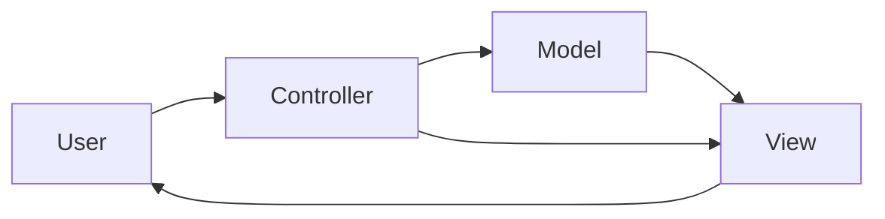

# Model-View-Controller (MVC)

> Separate user interaction into models, views, and controllers so presentation, input handling, and application state can evolve with clearer responsibilities.

**Scale:** architectural · **Altitude:** medium · **Category:** architecture · **Maturity:** time-tested

**Also known as:** MVC

## Description

Model-View-Controller structures an interactive application around three roles. The model represents application state and domain behaviour, the view renders a representation of that state, and the controller interprets user input and coordinates changes. In web frameworks the controller often maps HTTP requests to model operations and selects a view or response; in desktop and mobile systems the same idea separates widgets from state and commands. MVC is most effective when the model contains meaningful behaviour and the controller stays thin. It deteriorates when controllers become transaction scripts or views reach directly into persistence.

**Problem.** User interface code, input handling, domain state, and persistence logic easily collapse into one tangled module that is hard to test, reuse, or change.

**Context.** Use for web, desktop, and mobile applications where presentation and input concerns should be separated from application state. Adapt the details to the framework's interpretation of MVC rather than forcing a historical variant.

## Diagram



## Consequences / Trade-offs

- Views can change without rewriting domain behaviour or request coordination.
- Controllers provide a clear place for input validation, flow coordination, and response selection.
- An anaemic model pushes business rules into controllers and undermines the pattern.
- Strict MVC can be awkward for highly reactive frontend architectures without adaptation.
- Framework conventions help consistency but can hide coupling if models are active records tied to persistence.

## Ratings by project size

| Project size | Score | Notes |
| --- | --- | --- |
| Small (<10k LOC) | ●●●●○ 4/5 | Good fit for small UI-backed applications because the vocabulary is simple and framework support is strong. |
| Medium (≤100k LOC) | ●●●●○ 4/5 | Strong fit when controllers remain thin and models or services hold rules. Watch for controller bloat as features accumulate. |
| Large (>100k LOC) | ●●●○○ 3/5 | Useful as a presentation pattern, but large systems usually need additional architectural boundaries such as hexagonal or layered architecture. |

## Examples

### Keeping controller flow separate from model rules

**❌ Negative (typescript)**

```typescript
app.post("/discount", async (req, res) => {
  const order = await db.orders.find(req.body.orderId);
  const total = order.items.reduce((sum, item) => sum + item.price, 0);
  const discounted = total > 100 ? total * 0.9 : total;
  await db.orders.update(order.id, { total: discounted });
  res.render("order", { order, total: discounted });
});
```

**✅ Positive (typescript)**

```typescript
class OrderModel {
  constructor(private readonly order: Order) {}

  discountedTotal() {
    const total = this.order.items.reduce((sum, item) => sum + item.price, 0);
    return total > 100 ? total * 0.9 : total;
  }
}

app.post("/discount", async (req, res) => {
  const order = await orders.find(req.body.orderId);
  const model = new OrderModel(order);
  await orders.saveTotal(order.id, model.discountedTotal());
  res.render("order", { order, total: model.discountedTotal() });
});
```

*The negative controller mixes persistence, business calculation, and view selection. The positive version leaves the controller coordinating request flow while the model owns the discount rule.*

## Relationships

**Synergies**

- [Repository](../data-persistence/repository.md) — Repositories keep persistence access out of controllers and views when the model should remain clean.
- [Domain Model](../enterprise-application/domain-model.md) — A behavioural model prevents controllers from becoming the only place business rules live.
- [Observer](../gof-behavioural/observer.md) — Views in interactive MVC variants can observe model changes without direct controller refresh logic.
- [Layered (N-Tier) Architecture](../architecture/layered-architecture.md) — MVC often forms the presentation layer above application and persistence layers.

**Conflicts with:** [Peer-to-Peer](../architecture/peer-to-peer.md)

**Alternatives:** [Model-View-ViewModel (MVVM)](../frontend/model-view-viewmodel.md), [Hexagonal Architecture (Ports & Adapters)](../architecture/hexagonal-architecture.md), [Transaction Script](../enterprise-application/transaction-script.md)

## Applicability tags

- **Languages:** language-agnostic, java, csharp, ruby, php, typescript
- **Frameworks:** rails, spring, aspnet, django, laravel
- **Project types:** web-api, web-frontend, monolith, desktop-app
- **Tags:** presentation, separation-of-concerns, controllers, views, user-interface

## References

- Trygve Reenskaug, Applications Programming in Smalltalk-80, (1979)
- Martin Fowler, Patterns of Enterprise Application Architecture, (2002)

