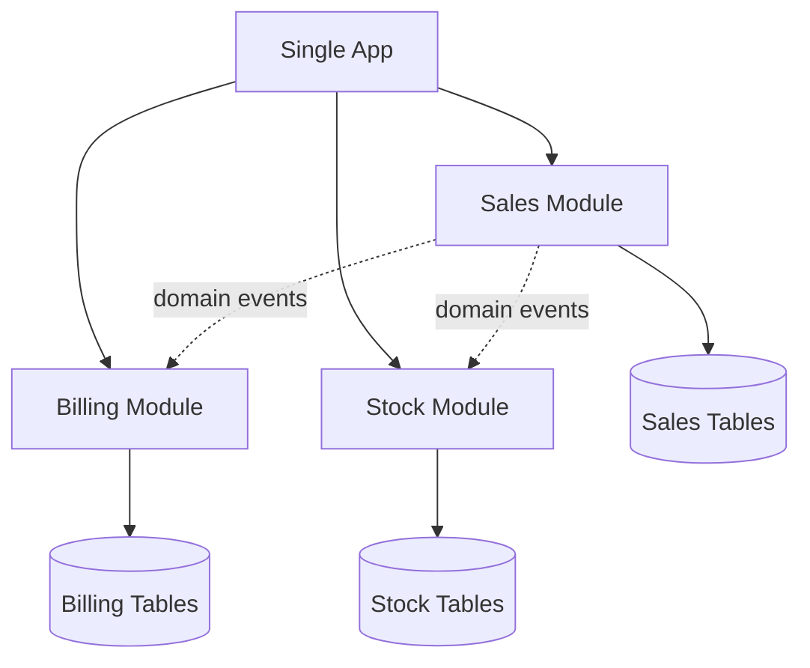

# Modular Monolith

> Keep one deployable application while enforcing strong internal module boundaries around business capabilities, so teams get simpler operations without a tangled codebase.

**Scale:** architectural · **Altitude:** high · **Category:** architecture · **Maturity:** established

**Also known as:** Well-Structured Monolith

## Description

A Modular Monolith deliberately chooses a single runtime and deployment unit but refuses a single ball of mud. Modules encapsulate domain capabilities, own their internal data access, expose narrow APIs or events to other modules, and can often be extracted later if independent deployment becomes necessary. It trades distributed-systems complexity for strict in-process boundary discipline.

**Problem.** Teams often jump to microservices to solve codebase coupling, when the immediate problem is actually weak modularity inside one deployable.

**Context.** Products that need coherent deployment, strong consistency, and fast local development, but have enough domain complexity that a flat monolith is becoming risky.

## Diagram



## Consequences / Trade-offs

- Retains simple deployment, transactions, debugging, and local development.
- Creates extraction seams for future services without paying network costs now.
- Requires architecture tests or dependency rules to stop modules reaching into each other.
- Can become a disguised monolith if shared tables and shared internals are tolerated.

## Ratings by project size

| Project size | Score | Notes |
| --- | --- | --- |
| Small (<10k LOC) | ●●○○○ 2/5 | Too structured for tiny apps, though lightweight modules are still useful. |
| Medium (≤100k LOC) | ●●●●● 5/5 | Excellent default for medium products because it delays distribution while controlling coupling. |
| Large (>100k LOC) | ●●●●○ 4/5 | Strong when domains are cohesive and deployment independence is not yet required; some large organisations will eventually split selected modules into services. |

## Examples

### Use module APIs instead of importing internals

**❌ Negative (typescript)**

```typescript
// billing module reaches into sales persistence internals
import { salesDb } from "../sales/internal/db";

export async function invoice(orderId: string) {
  const order = await salesDb.orders.find(orderId);
  return createInvoice(order.customerId, order.total);
}
```

**✅ Positive (typescript)**

```typescript
// sales/public.ts
export interface SalesQueries {
  orderSummary(orderId: string): Promise<OrderSummary | null>;
}

// billing/invoice.ts
export class InvoiceOrder {
  constructor(private readonly sales: SalesQueries) {}

  async execute(orderId: string) {
    const order = await this.sales.orderSummary(orderId);
    if (!order) throw new Error("order not found");
    return createInvoice(order.customerId, order.total);
  }
}
```

*The positive version lets Billing depend only on Sales public capability, not its internal tables or ORM. That keeps module ownership real and preserves a future extraction path.*

## Relationships

**Synergies**

- [Bounded Context](../ddd-strategic/bounded-context.md) — Bounded contexts provide the business language for module seams.
- [Domain Event](../ddd-tactical/domain-event.md) — In-process domain events decouple modules without forcing network distribution.
- [Repository](../data-persistence/repository.md) — Repositories keep each module data access hidden behind module-owned behaviour.
- [Clean Architecture](../architecture/clean-architecture.md) — Clean inner use cases help each module stay independently comprehensible.

**Conflicts with:** [Microservices](../architecture/microservices.md)

**Alternatives:** [Monolith](../architecture/monolith.md), [Microservices](../architecture/microservices.md), [Layered (N-Tier) Architecture](../architecture/layered-architecture.md)

## Applicability tags

- **Languages:** language-agnostic, java, csharp, typescript, python
- **Frameworks:** spring-boot, dotnet, nestjs, django, rails
- **Project types:** modular-monolith, web-api, backend-service, monolith
- **Tags:** modularity, single-deployable, bounded-contexts, evolutionary-architecture

## References

- [Martin Fowler, Monolith First, (2015)](https://martinfowler.com/bliki/MonolithFirst.html)

