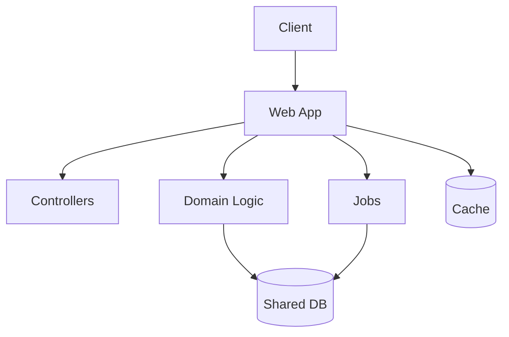

# Monolith

> Build and deploy the application as one process or tightly coupled unit, centralising code, data access, and release management for operational simplicity.

**Scale:** architectural · **Category:** architecture · **Maturity:** time-tested

**Also known as:** Single Deployable Application

## Description

A Monolith is a single deployable application that contains many features behind one runtime boundary. It can be excellent when the product is small, the team is compact, consistency matters, or the domain is still being discovered. The pattern becomes harmful when it is confused with a lack of architecture: a healthy monolith still has internal modules, explicit seams, tests, and disciplined ownership.

**Problem.** Distributed architecture adds failure modes and coordination overhead that many products do not need, especially before service boundaries and operational needs are clear.

**Context.** Early-stage products, small teams, transactional business applications, and domains where one deployment unit and one database simplify delivery and correctness.

## Diagram



## Consequences / Trade-offs

- Fast to build, debug, test locally, and deploy as one unit.
- Simplifies transactions and consistency because most work stays in one process and database.
- Scaling, release cadence, and fault isolation are coupled across the whole application.
- Without modular discipline it can become a big ball of mud that blocks later change.

## Ratings by project size

| Project size | Score | Notes |
| --- | --- | --- |
| Small (<10k LOC) | ●●●●● 5/5 | Excellent for small products and prototypes because operational simplicity accelerates learning. |
| Medium (≤100k LOC) | ●●●●○ 4/5 | Good when team size and domain complexity remain manageable, especially if internal modules are maintained. |
| Large (>100k LOC) | ●●○○○ 2/5 | Rarely a good fit without modularisation because release coupling, build time, and ownership conflicts grow sharply. |

## Examples

### A monolith can still have explicit application boundaries

**❌ Negative (ruby)**

```ruby
post "/refunds" do
  order = Order.find(params[:order_id])
  PaymentGateway.refund(order.payment_id, order.total)
  order.update!(status: "refunded")
  Mailer.refund(order.customer_email).deliver_now
end
```

**✅ Positive (ruby)**

```ruby
class RefundOrder
  def initialize(orders:, payments:, mailer:)
    @orders = orders
    @payments = payments
    @mailer = mailer
  end

  def call(order_id)
    order = @orders.fetch(order_id)
    order.mark_refunded!(@payments.refund(order.payment_id, order.total))
    @orders.save(order)
    @mailer.refund(order.customer_email)
  end
end

post "/refunds" do
  RefundOrder.new(orders: OrdersRepo.new, payments: PaymentGateway, mailer: Mailer).call(params[:order_id])
end
```

*The positive version keeps monolithic deployment but avoids handler sprawl. Business flow is testable and can later move into a module or service if evidence justifies it.*

## Relationships

**Synergies**

- [Layered (N-Tier) Architecture](../architecture/layered-architecture.md) — Layering gives a simple internal structure to a single deployable.
- [Model-View-Controller (MVC)](../architecture/model-view-controller.md) — MVC is a common presentation and web structure inside monoliths.
- [Unit of Work](../enterprise-application/unit-of-work.md) — A single process and database make unit-of-work transactions straightforward.
- [Modular Monolith](../architecture/modular-monolith.md) — Modular monolith is the natural evolution path when a monolith needs stronger internal boundaries.

**Conflicts with:** [Microservices](../architecture/microservices.md)

**Alternatives:** [Modular Monolith](../architecture/modular-monolith.md), [Microservices](../architecture/microservices.md), [Serverless / FaaS Architecture](../architecture/serverless-architecture.md)

## Applicability tags

- **Languages:** language-agnostic, ruby, php, python, java, csharp, typescript
- **Frameworks:** rails, laravel, django, spring-boot, dotnet, nestjs
- **Project types:** monolith, web-api, backend-service, prototype
- **Tags:** single-deployable, simplicity, transactions, startup

## References

- [Martin Fowler, Monolith First, (2015)](https://martinfowler.com/bliki/MonolithFirst.html)

