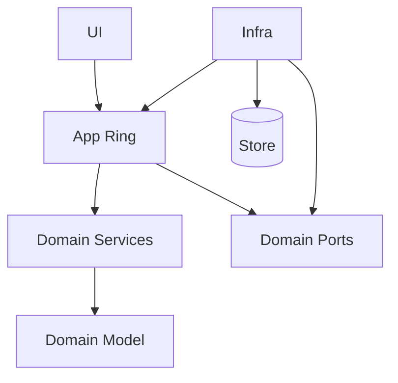

# Onion Architecture

> Structure the application as concentric rings around a domain model, with dependencies pointing inward and infrastructure pushed to the outer shell.

**Scale:** architectural · **Category:** architecture · **Maturity:** established

**Also known as:** Domain-Centred Architecture

## Description

Onion Architecture puts the domain model at the centre, surrounds it with domain services and application services, and keeps infrastructure, UI, and persistence on the outside. Inner rings define contracts; outer rings implement them. It is close to Hexagonal and Clean Architecture, but its language emphasises preserving a rich domain core from outward technical pressure.

**Problem.** Domain concepts get distorted by persistence schemas, controllers, and integration formats when infrastructure is allowed to shape the model directly.

**Context.** Domain-heavy systems where modelling behaviour and invariants is more important than mirroring database tables or web endpoints.

## Diagram



## Consequences / Trade-offs

- Protects domain invariants from framework and database coupling.
- Encourages persistence ignorance and meaningful domain services.
- Needs mapping code at boundaries, especially when ORM entities differ from domain entities.
- Teams can mistake rings for folders and still allow outward dependencies unless imports are checked.

## Ratings by project size

| Project size | Score | Notes |
| --- | --- | --- |
| Small (<10k LOC) | ●●○○○ 2/5 | Rarely worth it unless the small system has unusually complex domain rules. |
| Medium (≤100k LOC) | ●●●●○ 4/5 | Strong fit for domain-heavy medium systems, especially with modular monoliths. |
| Large (>100k LOC) | ●●●●● 5/5 | Excellent when teams need a stable domain core protected from many adapters and persistence choices. |

## Examples

### Keep persistence attributes out of the domain core

**❌ Negative (csharp)**

```csharp
[Table("orders")]
public class OrderRecord
{
    [Key] public Guid Id { get; set; }
    public string Status { get; set; } = "NEW";
    public decimal Total { get; set; }

    public void Ship()
    {
        Status = "SHIPPED";
    }
}
```

**✅ Positive (csharp)**

```csharp
public sealed class Order
{
    public OrderId Id { get; }
    public Money Total { get; }
    public OrderStatus Status { get; private set; }

    public void Ship()
    {
        if (Status != OrderStatus.Paid) throw new InvalidOperationException("Order must be paid");
        Status = OrderStatus.Shipped;
    }
}

public interface Orders
{
    Task Save(Order order);
}

// Entity Framework records and mappings live in the infrastructure ring.
```

*The positive version lets the domain express valid state transitions without ORM annotations or database strings. Persistence is an adapter, not the model owner.*

## Relationships

**Synergies**

- [Domain Model](../enterprise-application/domain-model.md) — The rich domain model is the innermost ring and the main asset being protected.
- [Repository](../data-persistence/repository.md) — Repository interfaces belong inside while persistence implementations remain outside.
- [Hexagonal Architecture (Ports & Adapters)](../architecture/hexagonal-architecture.md) — Ports and adapters provide a practical implementation style for the outer ring.
- [Data Mapper](../enterprise-application/data-mapper.md) — Data Mapper keeps database records separate from domain objects.

**Conflicts with:** [Active Record](../enterprise-application/active-record.md)

**Alternatives:** [Clean Architecture](../architecture/clean-architecture.md), [Hexagonal Architecture (Ports & Adapters)](../architecture/hexagonal-architecture.md), [Layered (N-Tier) Architecture](../architecture/layered-architecture.md)

## Applicability tags

- **Languages:** language-agnostic, csharp, java, typescript, python
- **Frameworks:** dotnet, spring-boot, nestjs, django, hibernate
- **Project types:** backend-service, web-api, modular-monolith, monolith
- **Tags:** domain-centric, dependency-inversion, persistence-ignorance, rings

## References

- [Jeffrey Palermo, The Onion Architecture, (2008)](https://jeffreypalermo.com/2008/07/the-onion-architecture-part-1/)

