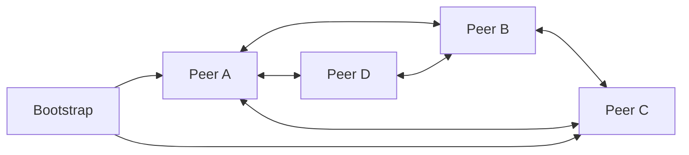

# Peer-to-Peer

> Let nodes act as both clients and servers, sharing resources directly without a permanently central coordinator for every interaction.

**Scale:** architectural · **Altitude:** high · **Category:** architecture · **Maturity:** established

**Also known as:** P2P

## Description

Peer-to-Peer Architecture distributes responsibilities across nodes that can both request and provide data, compute, or coordination. Peers discover each other through trackers, distributed hash tables, gossip, or known bootstrap nodes, then exchange work directly. The pattern reduces dependence on a central server and can scale aggregate bandwidth or resilience with the number of participants. It also makes trust, identity, consistency, NAT traversal, version skew, abuse prevention, and observability much harder than in client-server designs.

**Problem.** A central server can limit scalability, autonomy, cost, or censorship resistance when participants could exchange resources directly.

**Context.** Use when decentralisation, local autonomy, aggregate resource sharing, or resilience to central outages is a core requirement. Avoid it when central policy enforcement, simple auditing, or strong consistency is more important.

## Diagram



## Consequences / Trade-offs

- Capacity can grow with the number of participating peers rather than only with central infrastructure.
- The system can continue operating through some central service outages if discovery and trust are robust.
- Security, moderation, identity, and data integrity are harder because peers are not inherently trusted.
- Network variability, NAT traversal, and churn complicate protocols and testing.
- Observability and incident response are weaker because behaviour occurs across user-controlled nodes.

## Ratings by project size

| Project size | Score | Notes |
| --- | --- | --- |
| Small (<10k LOC) | ●○○○○ 1/5 | Avoid unless decentralisation is the product itself; the protocol and trust costs are high for small applications. |
| Medium (≤100k LOC) | ●●○○○ 2/5 | Rarely appropriate except for collaboration, sync, or media distribution products with a clear P2P requirement. |
| Large (>100k LOC) | ●●●●○ 4/5 | Strong for large decentralised networks or content distribution systems, but demands specialist protocol, security, and operations expertise. |

## Examples

### Discovering peers instead of depending on one server path

**❌ Negative (typescript)**

```typescript
export async function downloadFile(id: string) {
  const response = await fetch(`https://files.example.com/files/${id}`);
  if (!response.ok) throw new Error("download failed");
  return response.arrayBuffer();
}
```

**✅ Positive (typescript)**

```typescript
export async function downloadFile(id: string, network: PeerNetwork) {
  const peers = await network.findPeersWithBlock(id);
  for (const peer of peers) {
    const block = await network.requestBlock(peer, id);
    if (await verifyHash(id, block)) return block;
    network.penalise(peer, "bad block");
  }
  throw new Error("block unavailable");
}
```

*The negative version depends on one central file server. The positive version discovers peers that advertise the content, verifies what they return, and can continue if an individual peer fails or misbehaves.*

## Relationships

**Synergies**

- [Observer](../gof-behavioural/observer.md) — Gossip and subscription mechanisms often use observer-like change propagation between peers.
- [Proxy](../gof-structural/proxy.md) — Relay or super-peer nodes can proxy traffic when direct peer connections are impossible.
- [Circuit Breaker](../resilience/circuit-breaker.md) — Peers need fast failure and peer eviction when remote nodes are slow, malicious, or unavailable.
- [Broker Architecture](../architecture/broker-architecture.md) — Hybrid P2P systems may use a broker for discovery while keeping data transfer peer-to-peer.

**Conflicts with:** [API Gateway](../architecture/api-gateway.md), [Backend for Frontend (BFF)](../architecture/backend-for-frontend.md)

**Alternatives:** [Client-Server](../architecture/client-server.md), [Broker Architecture](../architecture/broker-architecture.md), [API Gateway](../architecture/api-gateway.md)

## Applicability tags

- **Languages:** language-agnostic, go, rust, javascript, erlang, c
- **Frameworks:** none, nodejs, tokio, grpc
- **Project types:** distributed-system, realtime-system, desktop-app, mobile-app
- **Tags:** decentralised, discovery, gossip, resource-sharing, resilience

## References

- Ralf Steinmetz and Klaus Wehrle, Peer-to-Peer Systems and Applications, (2005)
- Martin Kleppmann, Designing Data-Intensive Applications, (2017)

