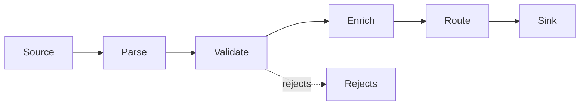

# Pipes and Filters

> Process data through a sequence of independent filters connected by pipes, where each filter transforms, enriches, validates, or routes the stream.

**Scale:** architectural · **Category:** architecture · **Maturity:** time-tested

**Also known as:** Pipeline Architecture

## Description

Pipes and Filters breaks processing into composable stages. Each filter has a narrow contract: consume input, produce output, and avoid hidden coupling to neighbouring stages. Pipes carry data between filters in memory, files, streams, queues, or processes. The pattern is especially strong for compilers, ETL, media processing, data pipelines, and message integration flows.

**Problem.** Data transformation logic becomes hard to test and reuse when parsing, validation, enrichment, business rules, and output formatting are tangled in one long procedure.

**Context.** Streaming or batch workflows where data moves through well-defined transformations and stages can be reordered, reused, scaled, or tested independently.

## Diagram



## Consequences / Trade-offs

- Improves composability because each filter can be developed and tested independently.
- Supports streaming, parallelism, backpressure, and reuse of common stages.
- Shared mutable state across filters breaks the pattern and makes order-dependent bugs likely.
- Error handling, schema evolution, and observability must be designed across stage boundaries.

## Ratings by project size

| Project size | Score | Notes |
| --- | --- | --- |
| Small (<10k LOC) | ●●●○○ 3/5 | Useful even in small scripts when transformations are naturally staged, though full pipeline infrastructure is unnecessary. |
| Medium (≤100k LOC) | ●●●●○ 4/5 | Good for ETL, import, and message-processing systems where stages need reuse and testability. |
| Large (>100k LOC) | ●●●●● 5/5 | Excellent for high-throughput data platforms that need independent scaling, backpressure, and observable processing stages. |

## Examples

### Compose data stages instead of one mutable script

**❌ Negative (python)**

```python
def import_customers(rows):
    imported = []
    for row in rows:
        row["email"] = row["email"].strip().lower()
        if "@" not in row["email"]:
            continue
        row["country"] = lookup_country(row["postcode"])
        db.insert("customers", row)
        imported.append(row)
    return imported
```

**✅ Positive (python)**

```python
def normalise(rows):
    for row in rows:
        yield {**row, "email": row["email"].strip().lower()}

def valid(rows):
    for row in rows:
        if "@" in row["email"]:
            yield row

def enrich(rows, geo):
    for row in rows:
        yield {**row, "country": geo.country(row["postcode"])}

def import_customers(rows, geo, sink):
    for row in enrich(valid(normalise(rows)), geo):
        sink.write(row)
```

*The positive version gives each filter one transformation contract. Stages can be tested with iterables, reused in other pipelines, and instrumented separately.*

## Relationships

**Synergies**

- [Message Channel](../enterprise-integration/message-channel.md) — Message channels are durable or asynchronous pipes between filters.
- [Message Filter](../enterprise-integration/message-filter.md) — Message Filter is a specialised filter that discards unwanted messages.
- [Message Translator](../enterprise-integration/message-translator.md) — Message Translator is a filter that changes representation between stages.
- [Splitter](../enterprise-integration/splitter.md) — Splitter and Aggregator provide common pipeline stages for collection-shaped messages.

**Conflicts with:** [Transaction Script](../enterprise-application/transaction-script.md)

**Alternatives:** [Event-Driven Architecture](../architecture/event-driven-architecture.md), [Chain of Responsibility](../gof-behavioural/chain-of-responsibility.md), [Message Router](../enterprise-integration/message-router.md)

## Applicability tags

- **Languages:** language-agnostic, python, go, java, typescript, shell
- **Frameworks:** kafka, rabbitmq, nats, nodejs, celery
- **Project types:** data-pipeline, etl, backend-service, high-throughput, cli-tool
- **Tags:** pipeline, streaming, transforms, etl

## References

- Buschmann et al., Pattern-Oriented Software Architecture Volume 1, (1996)

