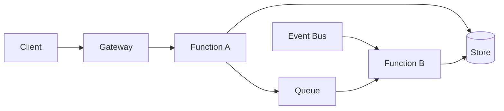

# Serverless / FaaS Architecture

> Compose managed functions, events, and cloud services so teams ship behaviour without managing servers, scaling infrastructure, or idle capacity directly.

**Scale:** architectural · **Altitude:** high · **Category:** architecture · **Maturity:** established

**Also known as:** Function as a Service, Event-driven serverless

## Description

Serverless Architecture decomposes application behaviour into small functions triggered by HTTP requests, queues, streams, schedules, object-store events, or workflow engines. The cloud provider owns capacity management, placement, scaling, patching, and much of the runtime operation; the team owns function code, permissions, event contracts, observability, and service configuration. The architecture works best when workloads are spiky, event-shaped, or integration-heavy and when boundaries are kept explicit. It performs poorly when long-running stateful processes, low cold-start latency, or provider portability are dominant requirements.

**Problem.** Teams often over-provision and operate always-on services for intermittent, event-driven workloads, paying operational and capacity costs that do not match demand.

**Context.** Use when workloads are naturally triggered by events, can run within provider execution limits, and can delegate storage, identity, messaging, and workflow to managed services. Apply strong infrastructure-as-code and least-privilege permissions because architecture is split across code and cloud configuration.

## Diagram



## Consequences / Trade-offs

- Capacity scales rapidly with demand and can approach zero cost when idle.
- Managed services reduce server maintenance but increase reliance on provider-specific contracts.
- Distributed tracing, idempotency, retries, and dead-letter handling are mandatory for debuggability.
- Cold starts, execution limits, and per-invocation pricing can surprise latency-sensitive or sustained workloads.
- Local development and integration testing require realistic emulation or deployed test environments.

## Ratings by project size

| Project size | Score | Notes |
| --- | --- | --- |
| Small (<10k LOC) | ●●●○○ 3/5 | Useful for prototypes, scheduled jobs, and low-traffic APIs, but can become confusing if every trivial operation is split into separate functions. |
| Medium (≤100k LOC) | ●●●●○ 4/5 | Good fit for event-heavy products where managed services reduce operations. Invest early in infrastructure-as-code, observability, and local workflows. |
| Large (>100k LOC) | ●●●●○ 4/5 | Excellent for selected domains at scale, but large estates need governance for permissions, cost, deployment topology, and provider coupling. |

## Examples

### Isolating stateless function work

**❌ Negative (typescript)**

```typescript
let currentBatch: string[] = [];

export async function handler(event: UploadEvent) {
  currentBatch.push(event.key);
  if (currentBatch.length >= 100) {
    await writeReport(currentBatch);
    currentBatch = [];
  }
}
```

**✅ Positive (typescript)**

```typescript
export async function handler(event: UploadEvent, deps: Deps) {
  const record = { id: event.id, key: event.key, receivedAt: Date.now() };
  const inserted = await deps.store.insertIfAbsent(record.id, record);
  if (!inserted) return;

  await deps.queue.send({ type: "BuildReport", key: event.key });
}
```

*The negative version assumes warm in-memory state and loses data when the platform scales or recycles instances. The positive version treats the function as stateless, writes idempotently, and passes follow-up work to a durable queue.*

## Relationships

**Synergies**

- [API Gateway](../architecture/api-gateway.md) — API gateways provide HTTP routing, authentication, throttling, and request shaping in front of functions.
- [Event-Driven Architecture](../architecture/event-driven-architecture.md) — Functions are commonly triggered by events and emit events to continue workflows without direct coupling.
- [Circuit Breaker](../resilience/circuit-breaker.md) — Functions calling external APIs need bounded failure handling to avoid retry storms and cost amplification.
- [Backend for Frontend (BFF)](../architecture/backend-for-frontend.md) — A thin BFF can be implemented as serverless handlers tailored to a specific client experience.

**Conflicts with:** [Space-Based Architecture](../architecture/space-based-architecture.md)

**Alternatives:** [Microservices](../architecture/microservices.md), [Client-Server](../architecture/client-server.md), [Broker Architecture](../architecture/broker-architecture.md)

## Applicability tags

- **Languages:** language-agnostic, typescript, python, java, go, csharp
- **Frameworks:** aws-lambda, azure-functions, nodejs, fastapi, dotnet
- **Project types:** serverless, web-api, backend-service, data-pipeline
- **Tags:** faas, managed-services, event-driven, cloud, scale-to-zero

## References

- Mike Roberts, Serverless Architectures, (2018)
- Amazon Web Services, AWS Lambda Operator Guide

