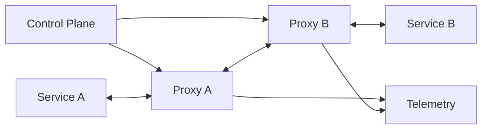

# Service Mesh

> Move cross-service traffic policy, telemetry, security, and resilience controls into a dedicated infrastructure layer managed consistently across services.

**Scale:** architectural · **Altitude:** high · **Category:** architecture · **Maturity:** established

## Description

A Service Mesh provides a data plane, often sidecar or node proxies, and a control plane that configures service-to-service communication. Application services continue to expose ordinary network endpoints, while the mesh handles mutual TLS, traffic splitting, retries, timeouts, load balancing, identity, policy enforcement, and telemetry. The pattern is architectural because it changes where cross-cutting network behaviour lives: out of each service's libraries and into a shared operational substrate. It is valuable when many services need consistent communication policy, but it can be excessive for a small fleet or for teams without platform engineering capacity.

**Problem.** In a large service estate, each team reimplements inconsistent client-side networking, security, retries, metrics, and traffic-management logic, making behaviour hard to govern or audit.

**Context.** Use when many services communicate over the network, require uniform mTLS and observability, and run on an orchestrated platform such as Kubernetes. Avoid adopting a mesh before service boundaries and operational ownership are mature.

## Diagram



## Consequences / Trade-offs

- Security and traffic policy become centrally configurable and consistently enforced.
- Service code can shed duplicated client libraries for telemetry, mTLS, and traffic splitting.
- The mesh adds proxies, control-plane dependencies, latency, resource overhead, and failure modes.
- Platform teams must provide safe defaults, upgrade paths, and clear debugging practices.
- Misconfigured retries or timeouts can amplify failures across the whole service graph.

## Ratings by project size

| Project size | Score | Notes |
| --- | --- | --- |
| Small (<10k LOC) | ●○○○○ 1/5 | Avoid for small systems; sidecars, control planes, and policy debugging add more complexity than they remove. |
| Medium (≤100k LOC) | ●●●○○ 3/5 | Situational when there are enough services and compliance needs to justify a platform layer. Start with a narrow policy set. |
| Large (>100k LOC) | ●●●●● 5/5 | Excellent for large microservice estates that need uniform mTLS, observability, and controlled traffic rollout across many teams. |

## Examples

### Removing bespoke network policy from services

**❌ Negative (typescript)**

```typescript
export async function getCustomer(id: string) {
  const cert = await loadCertificate("customer-client");
  for (let attempt = 0; attempt < 5; attempt++) {
    try {
      return await http.get(`https://customers.internal/${id}`, { cert, timeout: 8000 });
    } catch (error) {
      await sleep(100 * attempt);
    }
  }
  throw new Error("customer service unavailable");
}
```

**✅ Positive (typescript)**

```typescript
export async function getCustomer(id: string, client: HttpClient) {
  return client.get(`/customers/${id}`);
}

// Mesh policy owns mTLS identity, a 500 ms timeout, bounded retries,
// outlier detection, and telemetry for calls to the customer service.
```

*The negative version hides security and retry policy inside every caller. The positive version keeps application code focused on the business call while shared mesh configuration applies consistent network behaviour.*

## Relationships

**Synergies**

- [Sidecar](../cloud-distributed/sidecar.md) — Many meshes implement the data plane as sidecar proxies colocated with each service instance.
- [Microservices](../architecture/microservices.md) — A mesh becomes valuable when microservice count makes consistent service-to-service policy difficult in libraries.
- [Circuit Breaker](../resilience/circuit-breaker.md) — Mesh traffic policies can enforce timeouts, outlier detection, and circuit-breaking consistently.
- [API Gateway](../architecture/api-gateway.md) — Gateways manage north-south edge traffic while the mesh manages east-west service traffic.

**Conflicts with:** [Modular Monolith](../architecture/modular-monolith.md)

**Alternatives:** [API Gateway](../architecture/api-gateway.md), [Broker Architecture](../architecture/broker-architecture.md), [Client-Server](../architecture/client-server.md)

## Applicability tags

- **Languages:** language-agnostic, go, java, typescript
- **Frameworks:** kubernetes, istio, grpc, spring-boot
- **Project types:** microservices, distributed-system, backend-service, high-throughput
- **Tags:** platform, mtls, observability, traffic-policy, east-west

## References

- Istio Authors, Istio Documentation
- Lee Calcote and Nic Jackson, Service Mesh Patterns, (2019)

