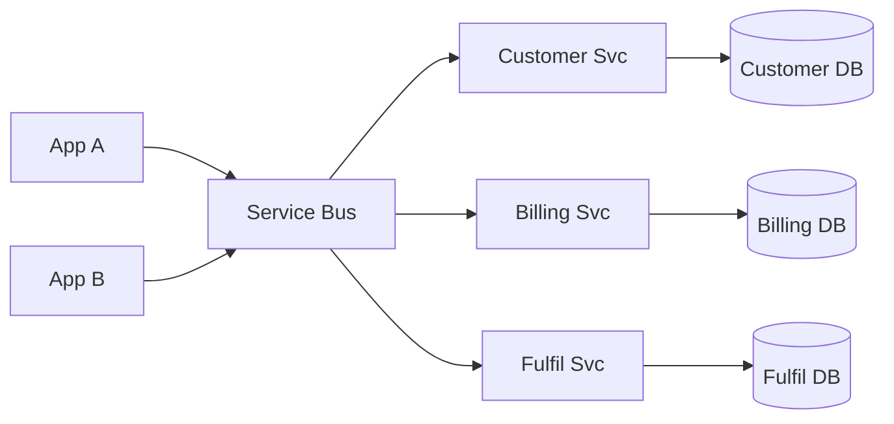

# Service-Oriented Architecture (SOA)

> Expose coarse-grained business capabilities as reusable services coordinated through stable contracts, often with shared integration infrastructure and enterprise governance.

**Scale:** architectural · **Altitude:** high · **Category:** architecture · **Maturity:** time-tested

**Also known as:** SOA

## Description

Service-Oriented Architecture decomposes an enterprise into services that represent reusable business capabilities. Compared with microservices, SOA usually accepts coarser services, stronger central governance, shared schemas, and integration middleware such as a message bus or service broker. It is most useful when many applications need to integrate around canonical business processes rather than when small teams need rapid independent deployment.

**Problem.** Large organisations accumulate point-to-point integrations and duplicated business capabilities across applications, making change expensive and data semantics inconsistent.

**Context.** Enterprise estates with multiple systems, long-lived integration contracts, governance requirements, and a need to reuse capabilities such as customer, billing, identity, or fulfilment services.

## Diagram



## Consequences / Trade-offs

- Promotes reuse of coarse-grained business capabilities across many applications.
- Can standardise contracts, security, monitoring, and transformation at enterprise scale.
- Central governance and shared middleware can slow product teams and create bottlenecks.
- Overuse of canonical models can couple services through a shared enterprise schema.

## Ratings by project size

| Project size | Score | Notes |
| --- | --- | --- |
| Small (<10k LOC) | ●○○○○ 1/5 | Avoid for small products; governance and integration infrastructure are disproportionate. |
| Medium (≤100k LOC) | ●●●○○ 3/5 | Situational for organisations integrating several applications, but can be heavy compared with modular monoliths or simple APIs. |
| Large (>100k LOC) | ●●●●○ 4/5 | Good for large enterprise estates where reusable services and standard contracts matter more than team-level deployment autonomy. |

## Examples

### Prefer coarse service contracts over point-to-point database access

**❌ Negative (java)**

```java
public CustomerCredit loadCredit(UUID customerId) {
    CustomerRow customer = legacyCrm.queryCustomer(customerId);
    List<InvoiceRow> invoices = billingDb.queryInvoices(customerId);
    return calculate(customer, invoices);
}
```

**✅ Positive (java)**

```java
public final class CreditApplicationService {
    private final CustomerService customers;
    private final BillingService billing;

    public CustomerCredit loadCredit(CustomerId customerId) {
        CustomerProfile profile = customers.profile(customerId);
        AccountBalance balance = billing.balanceFor(customerId);
        return CustomerCredit.from(profile, balance);
    }
}

interface CustomerService { CustomerProfile profile(CustomerId id); }
interface BillingService { AccountBalance balanceFor(CustomerId id); }
```

*The positive version depends on service contracts rather than each system's storage model. That improves reuse and lets service owners evolve internals behind stable enterprise APIs.*

## Relationships

**Synergies**

- [Message Bus](../enterprise-integration/message-bus.md) — A message bus is a common SOA integration backbone for routing and mediation.
- [Canonical Data Model](../enterprise-integration/canonical-data-model.md) — Canonical models reduce translation work when many enterprise systems exchange the same concepts.
- [Gateway](../enterprise-application/gateway.md) — Gateways wrap legacy systems behind service contracts.
- [Request-Reply](../enterprise-integration/request-reply.md) — Request-reply supports synchronous service operations where callers require immediate results.

**Conflicts with:** [Microservices](../architecture/microservices.md)

**Alternatives:** [Microservices](../architecture/microservices.md), [Event-Driven Architecture](../architecture/event-driven-architecture.md), [Broker Architecture](../architecture/broker-architecture.md)

## Applicability tags

- **Languages:** language-agnostic, java, csharp, go, typescript
- **Frameworks:** spring-boot, dotnet, grpc, kafka, rabbitmq
- **Project types:** distributed-system, backend-service, microservices, web-api
- **Tags:** enterprise-integration, services, governance, contracts

## References

- [Gregor Hohpe and Bobby Woolf, Enterprise Integration Patterns, (2003)](https://www.enterpriseintegrationpatterns.com/)

