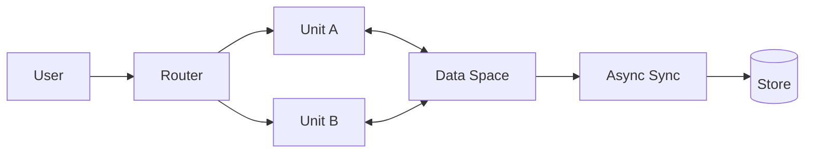

# Space-Based Architecture

> Scale high-volume workloads by colocating processing with an in-memory data grid, reducing database contention and coordinating state through a shared space.

**Scale:** architectural · **Category:** architecture · **Maturity:** established

**Also known as:** Tuple space architecture, Shared space architecture

## Description

Space-Based Architecture organises an application around processing units that hold both behaviour and hot state in a distributed in-memory space. Requests are routed to any available processing unit; each unit reads and writes to the space, while asynchronous replication or write-behind synchronises durable storage. The design targets extreme load and burst tolerance by removing the central relational database from the synchronous request path. It is most useful when the workload can tolerate eventual consistency for some data, when hot data can be partitioned or replicated safely, and when operational teams can manage data grid consistency, failover, and recovery semantics.

**Problem.** A central database can become the bottleneck and single scaling limit for workloads with very high write rates, volatile demand, and many stateless application instances competing for the same rows.

**Context.** Use for high-throughput, low-latency systems where hot state is read and written frequently, synchronous durability is not required for every interaction, and partitioning rules are well understood. It is unsuitable when strong global transactions and immediate consistency dominate the requirements.

## Diagram



## Consequences / Trade-offs

- Throughput improves because hot reads and writes stay close to processing units.
- The system can absorb bursts by adding processing units rather than scaling only the database.
- Eventual consistency, split-brain protection, and recovery procedures become central design concerns.
- Debugging is harder because the source of truth is distributed across memory, replication logs, and durable stores.
- Data models must be designed for partitioning, affinity, and idempotent replay.

## Ratings by project size

| Project size | Score | Notes |
| --- | --- | --- |
| Small (<10k LOC) | ●○○○○ 1/5 | Avoid for small systems; the consistency and operational complexity is far greater than the value gained. |
| Medium (≤100k LOC) | ●●●○○ 3/5 | Situational for a specific hot path with clear partitioning and replay semantics. Most medium systems are better served by caching and queues. |
| Large (>100k LOC) | ●●●●○ 4/5 | Strong fit for very high-throughput platforms that can invest in data-grid operations, consistency testing, and failure-mode drills. |

## Examples

### Keeping hot state out of the request database path

**❌ Negative (typescript)**

```typescript
export async function reserveSeat(db: Db, showId: string, seatId: string) {
  await db.transaction(async tx => {
    const seat = await tx.query("select status from seats where id = ? for update", [seatId]);
    if (seat.status !== "free") throw new Error("seat unavailable");
    await tx.query("update seats set status = 'held' where id = ?", [seatId]);
  });
}
```

**✅ Positive (typescript)**

```typescript
export interface Space {
  compareAndSet(key: string, expected: string, next: string): Promise<boolean>;
  publishChange(event: SeatHeld): Promise<void>;
}

export async function reserveSeat(space: Space, showId: string, seatId: string) {
  const key = `show:${showId}:seat:${seatId}`;
  const held = await space.compareAndSet(key, "free", "held");
  if (!held) throw new Error("seat unavailable");
  await space.publishChange({ showId, seatId, status: "held" });
}
```

*The negative version serialises every reservation through the database. The positive version performs an atomic operation in the hot data space and emits a change for durable projection, reducing lock contention during peaks.*

## Relationships

**Synergies**

- [Bulkhead](../resilience/bulkhead.md) — Processing units can be partitioned by tenant or workload so a hot partition does not starve the entire grid.
- [Event-Driven Architecture](../architecture/event-driven-architecture.md) — Durable events or change streams are often used to replicate from the space to downstream systems.
- [Database per Service](../data-persistence/database-per-service.md) — Each bounded service can own its durable store while using an in-memory space for hot operational state.
- [Retry with Backoff](../resilience/retry.md) — Clients and write-behind consumers need bounded retries because partitions and replicas can move during rebalancing.

**Conflicts with:** [Layered (N-Tier) Architecture](../architecture/layered-architecture.md)

**Alternatives:** [Client-Server](../architecture/client-server.md), [Microservices](../architecture/microservices.md), [Broker Architecture](../architecture/broker-architecture.md)

## Applicability tags

- **Languages:** language-agnostic, java, csharp, go, python
- **Frameworks:** redis, kafka, spring-boot, dotnet, kubernetes
- **Project types:** high-throughput, low-latency, distributed-system, realtime-system
- **Tags:** in-memory-data-grid, partitioning, eventual-consistency, burst-tolerance, scaling

## References

- Martin Fowler, Patterns of Enterprise Application Architecture, (2002)
- Mark Richards, Space-Based Architecture, (2015)

