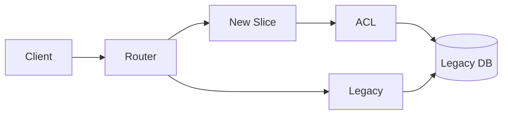

# Strangler Fig

> Replace a legacy system incrementally by routing selected capabilities to new components until the old system is safely surrounded and retired.

**Scale:** architectural · **Category:** architecture · **Maturity:** established

**Also known as:** Strangler application, Incremental replacement

## Description

The Strangler Fig pattern modernises a system by placing a routing or facade layer in front of the legacy application and gradually diverting individual flows to new implementations. Each slice is selected, built, verified, and switched over while the remaining behaviour continues to run in the old system. The pattern reduces big-bang migration risk and allows teams to learn from real traffic, but it requires disciplined boundary discovery, data ownership, reconciliation, and rollback planning. The legacy and replacement systems often coexist for a long time, so operational transparency and clear retirement criteria are essential.

**Problem.** Large legacy replacements frequently fail because teams attempt a single cut-over after reimplementing years of behaviour without enough production feedback.

**Context.** Use when a valuable but hard-to-change system must be modernised without stopping business operations. It works best when capabilities can be sliced by route, domain, tenant, workflow, or data ownership boundary.

## Diagram



## Consequences / Trade-offs

- Migration risk is reduced because each capability can be released, observed, and rolled back independently.
- Teams can prioritise high-value or high-change areas instead of rewriting everything first.
- Coexistence creates duplicate integrations, data synchronisation challenges, and temporary complexity.
- Legacy behaviour must be characterised with tests, logs, or production traces before replacement.
- The strangling layer needs clear ownership so it does not become the next permanent monolith.

## Ratings by project size

| Project size | Score | Notes |
| --- | --- | --- |
| Small (<10k LOC) | ●●○○○ 2/5 | Usually unnecessary for small systems unless the legacy code is business critical and cannot be paused for replacement. |
| Medium (≤100k LOC) | ●●●●○ 4/5 | Good fit for meaningful modernisation where capability slices and rollback paths can be defined. |
| Large (>100k LOC) | ●●●●● 5/5 | Excellent for large legacy estates because it turns risky replacement into measurable migration increments with production feedback. |

## Examples

### Routing one capability away from a legacy app

**❌ Negative (typescript)**

```typescript
export async function replaceLegacy() {
  await deployNewSystem();
  await migrateAllData();
  await switchDnsToNewSystem();
  await shutDownLegacy();
}
```

**✅ Positive (typescript)**

```typescript
export async function routeRequest(req: Request, legacy: App, modern: App) {
  if (req.path.startsWith("/checkout")) {
    return modern.handle(req);
  }
  return legacy.handle(req);
}

export async function modernCheckout(cmd: CheckoutCommand, legacy: LegacyClient) {
  const customer = await legacy.lookupCustomer(cmd.customerId);
  return placeOrder(toModernCustomer(customer), cmd.items);
}
```

*The negative version assumes a risky all-at-once cut-over. The positive version diverts one capability and uses a translation boundary while the rest of the system continues to run.*

## Relationships

**Synergies**

- [API Gateway](../architecture/api-gateway.md) — Gateway route rules are a practical mechanism for diverting endpoints from legacy to new services.
- [Anti-Corruption Layer](../cloud-distributed/anti-corruption-layer.md) — New components need ACLs to avoid inheriting legacy data shapes and semantics.
- [Microservices](../architecture/microservices.md) — Replacement slices are often extracted as independently deployable services around business capabilities.
- [Circuit Breaker](../resilience/circuit-breaker.md) — During coexistence, calls between old and new systems need fast failure and rollback protection.

**Conflicts with:** [Layered (N-Tier) Architecture](../architecture/layered-architecture.md)

**Alternatives:** [Modular Monolith](../architecture/modular-monolith.md), [Layered (N-Tier) Architecture](../architecture/layered-architecture.md), [Clean Architecture](../architecture/clean-architecture.md)

## Applicability tags

- **Languages:** language-agnostic, java, csharp, typescript, python
- **Frameworks:** spring-boot, dotnet, nodejs, express, kubernetes
- **Project types:** backend-service, web-api, modular-monolith, microservices
- **Tags:** migration, legacy-modernisation, incremental-delivery, routing, coexistence

## References

- Martin Fowler, Strangler Fig Application, (2004)
- Michael Feathers, Working Effectively with Legacy Code, (2004)

