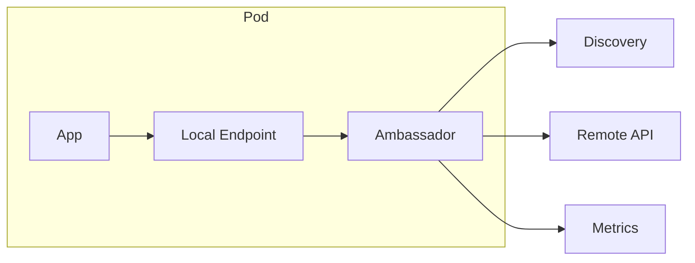

# Ambassador

> Put a local proxy in front of remote services so an application delegates outbound connectivity concerns such as discovery, protocol adaptation, retries, and observability to a companion component.

**Scale:** architectural · **Category:** cloud-distributed · **Maturity:** established

## Description

Ambassador is a specialised sidecar focused on outbound communication. The application calls a stable local endpoint, while the ambassador locates the target service, transforms protocols or credentials if necessary, applies resilience policy, and emits telemetry. This keeps clients simple when remote dependencies move, require complicated authentication, or need consistent connection management. It is especially valuable when legacy or off-the-shelf applications cannot be changed to use modern discovery and resilience libraries.

**Problem.** Client applications accumulate brittle networking code: service discovery, certificates, retry rules, endpoint failover, and protocol quirks for each dependency.

**Context.** Use when outbound connectivity is complex, repeated across clients, or must be changed independently from application releases. It fits container platforms, edge appliances, and migrations from legacy protocols to modern service APIs.

## Diagram



## Consequences / Trade-offs

- Simplifies application code by presenting local, stable dependency endpoints.
- Allows networking policy and protocol adaptation to change without rebuilding the app.
- Adds latency and an extra hop on every protected call.
- Misconfigured ambassadors can hide dependency semantics or create unexpected retry storms.

## Ratings by project size

| Project size | Score | Notes |
| --- | --- | --- |
| Small (<10k LOC) | ●●○○○ 2/5 | Rarely needed when a single client can call a dependency directly with a normal SDK. |
| Medium (≤100k LOC) | ●●●○○ 3/5 | Useful for legacy clients or shared outbound policy, but simpler libraries may be enough. |
| Large (>100k LOC) | ●●●●○ 4/5 | Strong fit where many clients need consistent dependency access, especially during migrations. |

## Examples

### Hiding service discovery and credentials

**❌ Negative (go)**

```go
func LoadCustomer(ctx context.Context, id string) (*Customer, error) {
    endpoint, err := registry.Resolve(ctx, "customer-v2")
    if err != nil {
        return nil, err
    }
    token, err := oauth.Token(ctx, "customer.read")
    if err != nil {
        return nil, err
    }
    req, _ := http.NewRequestWithContext(ctx, "GET", endpoint+"/customers/"+id, nil)
    req.Header.Set("Authorization", "Bearer "+token)
    return decodeCustomer(http.DefaultClient.Do(req))
}
```

**✅ Positive (go)**

```go
func LoadCustomer(ctx context.Context, id string) (*Customer, error) {
    req, _ := http.NewRequestWithContext(ctx, "GET", "http://127.0.0.1:8181/customers/"+id, nil)
    return decodeCustomer(http.DefaultClient.Do(req))
}
```

*The positive version lets the ambassador own discovery, credentials, and failover policy. Application code depends on a stable local contract rather than every remote platform detail.*

## Relationships

**Synergies**

- [Sidecar](../cloud-distributed/sidecar.md) — Ambassador is commonly deployed as a sidecar with a narrower outbound-proxy responsibility.
- [Retry with Backoff](../resilience/retry.md) — The ambassador can apply standard retry budgets close to the caller, hiding transient network errors from simple clients.
- [Circuit Breaker](../resilience/circuit-breaker.md) — A local proxy can fail fast when a remote dependency is unhealthy rather than letting many clients block.
- [Service Mesh](../architecture/service-mesh.md) — Mesh data planes generalise ambassadors across inbound and outbound service traffic.

**Alternatives:** [API Gateway](../architecture/api-gateway.md), [Gateway Offloading](../cloud-distributed/gateway-offloading.md), [Adapter](../gof-structural/adapter.md)

## Applicability tags

- **Languages:** language-agnostic, java, csharp, go, typescript
- **Frameworks:** kubernetes, istio, grpc, spring-boot, dotnet
- **Project types:** microservices, distributed-system, backend-service, web-api
- **Tags:** outbound-proxy, protocol-adapter, resilience

## References

- [Microsoft Azure Architecture Center; Ambassador pattern](https://learn.microsoft.com/azure/architecture/patterns/ambassador)

