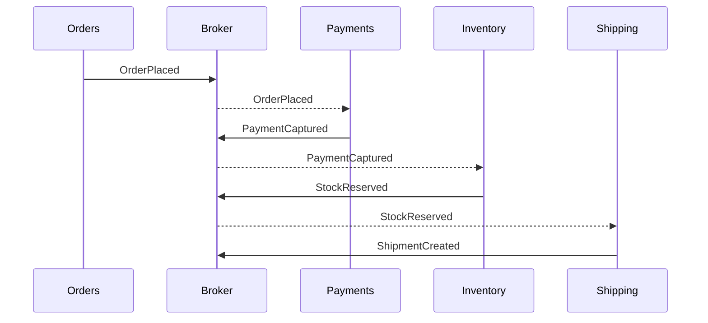

# Choreography

> Coordinate a distributed workflow through events, where each participant reacts to facts it owns instead of being commanded by a central orchestrator.

**Scale:** integration · **Altitude:** high · **Category:** cloud-distributed · **Maturity:** established

## Description

Choreography lets services collaborate by publishing and subscribing to domain events. Each participant owns its local transaction and emits the next fact when its work completes; other services decide independently whether and how to react. This reduces central coupling and fits event-driven domains, but the overall process is implicit in event contracts and observability rather than one executable workflow. Teams need correlation identifiers, versioned events, idempotent receivers, and process-level monitoring to avoid invisible failure.

**Problem.** A central coordinator can become a coupling point and availability bottleneck for workflows where services can naturally react to each other's completed facts.

**Context.** Event-driven microservices, domain events, and business processes whose steps are locally owned and can proceed asynchronously.

## Diagram



## Consequences / Trade-offs

- Lowers direct service coupling and allows participants to evolve independently.
- Preserves local autonomy because each service owns its transaction and reaction rules.
- Makes end-to-end workflow state harder to see and reason about.
- Event contract drift or missed messages can break the process without one obvious owner.

## Ratings by project size

| Project size | Score | Notes |
| --- | --- | --- |
| Small (<10k LOC) | ●●○○○ 2/5 | Usually harder to understand than direct calls in small systems. |
| Medium (≤100k LOC) | ●●●●○ 4/5 | Good fit when several services already publish domain events and can tolerate eventual consistency. |
| Large (>100k LOC) | ●●●●○ 4/5 | Powerful at scale, but needs strong observability and ownership of the emergent process. |

## Examples

### Reacting to order events

**❌ Negative (typescript)**

```typescript
// Order service knows every downstream step and blocks on all of them.
await payments.capture(order.id);
await inventory.reserve(order.id);
await shipping.createShipment(order.id);
await orders.markReady(order.id);
```

**✅ Positive (typescript)**

```typescript
await orders.create(order);
await events.publish("OrderPlaced", { orderId: order.id, customerId: order.customerId });

events.on("OrderPlaced", async event => payments.capture(event.orderId));
events.on("PaymentCaptured", async event => inventory.reserve(event.orderId));
events.on("StockReserved", async event => shipping.createShipment(event.orderId));
```

*The positive version lets each service react to business facts it understands, removing direct workflow calls from the order service and supporting asynchronous progress.*

## Relationships

**Synergies**

- [Event-Driven Architecture](../architecture/event-driven-architecture.md) — Choreography is a workflow style built on event publication and subscription.
- [Publish-Subscribe Channel](../enterprise-integration/publish-subscribe.md) — Pub-sub channels distribute domain events to interested participants without direct addressing.
- [Idempotent Receiver](../enterprise-integration/idempotent-receiver.md) — Subscribers must handle duplicate events safely under at-least-once delivery.
- [Correlation Identifier](../enterprise-integration/correlation-identifier.md) — End-to-end tracing of an implicit workflow requires a shared correlation id.

**Conflicts with:** [Request-Reply](../enterprise-integration/request-reply.md)

**Alternatives:** [Saga](../cloud-distributed/saga.md), [Process Manager](../enterprise-integration/process-manager.md), [Routing Slip](../enterprise-integration/routing-slip.md)

## Applicability tags

- **Languages:** language-agnostic, typescript, java, csharp, go, python
- **Frameworks:** kafka, rabbitmq, nats, spring-boot, dotnet
- **Project types:** microservices, distributed-system, backend-service, high-throughput, realtime-system
- **Tags:** event-driven, workflow, decentralised, async

## References

- Chris Richardson, Microservices Patterns, (2018)

