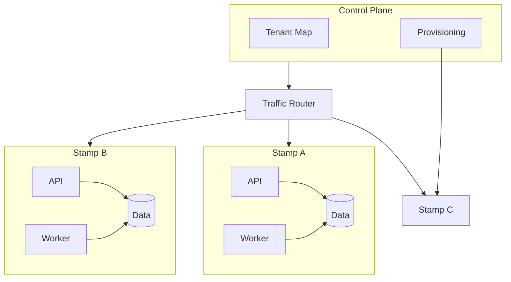

# Deployment Stamp (Cells)

> Replicate a complete slice of application infrastructure as many isolated stamps, each serving a subset of tenants, regions, or traffic.

**Scale:** architectural · **Category:** cloud-distributed · **Maturity:** established

**Also known as:** Cell, Stamp, Scale Unit

## Description

A Deployment Stamp packages compute, data stores, queues, configuration, and observability into a repeatable unit that can be provisioned many times. Traffic is assigned to a stamp by tenant, region, shard, or capacity pool. This scales capacity by adding units rather than enlarging one shared deployment, and it limits blast radius because a faulty release or noisy tenant affects only its assigned stamp. Stamps require strong automation: manual snowflake differences defeat the pattern.

**Problem.** One shared deployment becomes too large to operate safely; capacity, tenant isolation, and failure containment need a repeatable unit of scale.

**Context.** SaaS platforms, regulated workloads, regional systems, or high-growth services where tenants or traffic cohorts can be assigned to independent infrastructure units.

## Diagram



## Consequences / Trade-offs

- Improves blast-radius control and allows capacity to grow by adding stamps.
- Enables canarying and tenant isolation at infrastructure granularity.
- Requires automated provisioning, routing, monitoring, and tenant placement.
- Cross-stamp operations and global reporting become explicit integration problems.

## Ratings by project size

| Project size | Score | Notes |
| --- | --- | --- |
| Small (<10k LOC) | ●○○○○ 1/5 | Avoid for small systems; one well-run deployment is simpler. |
| Medium (≤100k LOC) | ●●●○○ 3/5 | Situational for SaaS platforms with tenant isolation or regional growth pressures. |
| Large (>100k LOC) | ●●●●● 5/5 | Excellent for large platforms that need blast-radius control and repeatable scale units. |

## Examples

### Routing tenants to stamps

**❌ Negative (typescript)**

```typescript
// All tenants share one deployment and one data plane.
app.use((req, _res, next) => {
  req.baseUrl = process.env.PRIMARY_CLUSTER_URL;
  next();
});
```

**✅ Positive (typescript)**

```typescript
interface TenantPlacement {
  stampFor(tenantId: string): Promise<StampEndpoint>;
}

app.use(async (req, _res, next) => {
  const tenantId = requireTenant(req);
  req.stamp = await placement.stampFor(tenantId);
  next();
});
```

*The positive version makes tenant placement a routing decision, enabling capacity growth and isolation by moving cohorts between repeatable stamps.*

## Relationships

**Synergies**

- [Sharding](../cloud-distributed/sharding.md) — Tenant or account shards map naturally onto stamp placement and migration.
- [Geode (Geo-Distributed)](../cloud-distributed/geode.md) — Each geography can contain multiple stamps that follow the same deployment blueprint.
- [Health Endpoint Monitoring](../cloud-distributed/health-endpoint-monitoring.md) — Routers need stamp-level health to remove unhealthy units from traffic.
- [Cell-Based Architecture](../architecture/cell-based-architecture.md) — Cells provide the architectural isolation model that deployment stamps implement operationally.

**Conflicts with:** [Monolith](../architecture/monolith.md)

**Alternatives:** [Microservices](../architecture/microservices.md), [Geode (Geo-Distributed)](../cloud-distributed/geode.md), [Modular Monolith](../architecture/modular-monolith.md)

## Applicability tags

- **Languages:** language-agnostic, typescript, go, csharp, java
- **Frameworks:** kubernetes, terraform, istio, dotnet, spring-boot
- **Project types:** microservices, distributed-system, backend-service, web-api, high-throughput
- **Tags:** cell, scale-unit, blast-radius, multi-tenancy

## References

- [Microsoft Azure Architecture Center; Deployment Stamps pattern](https://learn.microsoft.com/azure/architecture/patterns/deployment-stamp)

