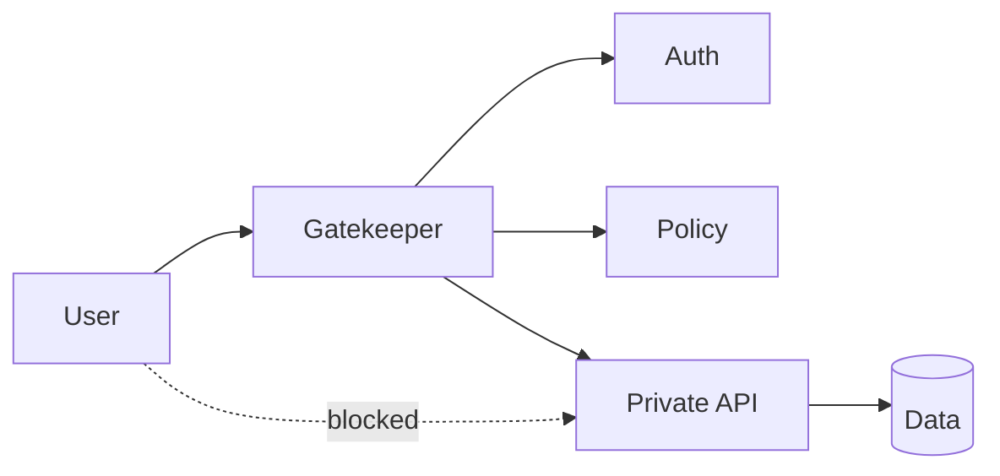

# Gatekeeper

> Route external requests through a hardened entry component that validates, authenticates, filters, and forwards only safe traffic to protected backend services.

**Scale:** architectural · **Category:** cloud-distributed · **Maturity:** established

## Description

Gatekeeper splits exposed edge responsibilities from protected application processing. The gatekeeper terminates public traffic, verifies identity and request shape, applies coarse policy, strips dangerous input, and forwards a narrow trusted request to internal services that are not directly reachable from the internet. Unlike a general API Gateway, the emphasis is security isolation: minimise the public attack surface and keep high-risk parsing, authentication, and request rejection out of sensitive backend components.

**Problem.** Backend services often become internet-facing by accident, each reimplementing authentication, input filtering, rate limits, and TLS handling with inconsistent quality.

**Context.** Use for internet-exposed systems, zero-trust service boundaries, administrative APIs, and workloads where request validation and authentication should be enforced before traffic reaches private compute or data services.

## Diagram



## Consequences / Trade-offs

- Reduces attack surface by making protected services private by default.
- Provides a single place for coarse security policy, request rejection, and edge telemetry.
- Becomes a critical dependency and must be highly available and carefully hardened.
- Can create a false sense of safety if backend services stop enforcing their own invariants.

## Ratings by project size

| Project size | Score | Notes |
| --- | --- | --- |
| Small (<10k LOC) | ●●○○○ 2/5 | A simple framework middleware stack is often enough for a small private app. |
| Medium (≤100k LOC) | ●●●○○ 3/5 | Useful for exposed APIs with several backend services, provided it does not replace service-level checks. |
| Large (>100k LOC) | ●●●●● 5/5 | Excellent for large distributed systems where public edge hardening and private backends are mandatory. |

## Examples

### Rejecting unsafe traffic at the edge

**❌ Negative (typescript)**

```typescript
// The backend is public and every handler must remember all security checks.
app.post("/admin/reindex", async (req, res) => {
  if (!req.headers.authorization) return res.sendStatus(401);
  if (req.body.scope === "all" && !req.user?.roles.includes("admin")) return res.sendStatus(403);
  await search.reindex(req.body.scope);
  res.sendStatus(202);
});
```

**✅ Positive (typescript)**

```typescript
// Public edge: validate identity, schema, and coarse authorisation before forwarding.
edge.post("/admin/reindex", requireToken, requireRole("admin"), validate(ReindexRequest), proxyTo("admin-api"));

// Private service: still checks business invariants, but is not internet reachable.
adminApi.post("/admin/reindex", async (req, res) => {
  await search.reindex(req.body.scope);
  res.sendStatus(202);
});
```

*The positive version removes direct public access to the sensitive service and rejects unauthenticated or malformed requests before they reach private code.*

## Relationships

**Synergies**

- [API Gateway](../architecture/api-gateway.md) — A gatekeeper may be implemented as a security-focused gateway at the system edge.
- [Token-Based Authentication](../security/token-based-auth.md) — The gatekeeper validates tokens before forwarding identity claims to private services.
- [Rate Limiting](../resilience/rate-limiting.md) — Edge rate limits protect downstream services before expensive work begins.
- [Principle of Least Privilege](../security/least-privilege.md) — Protected services can accept traffic only from the gatekeeper and run with narrower network exposure.

**Alternatives:** [Gateway Offloading](../cloud-distributed/gateway-offloading.md), [Backend for Frontend (BFF)](../architecture/backend-for-frontend.md), [Defense in Depth](../security/defense-in-depth.md)

## Applicability tags

- **Languages:** language-agnostic, go, java, csharp, typescript
- **Frameworks:** kubernetes, istio, aspnet, nodejs, spring-boot
- **Project types:** web-api, backend-service, microservices, distributed-system
- **Tags:** edge-security, validation, zero-trust

## References

- [Microsoft Azure Architecture Center; Gatekeeper pattern](https://learn.microsoft.com/azure/architecture/patterns/gatekeeper)

