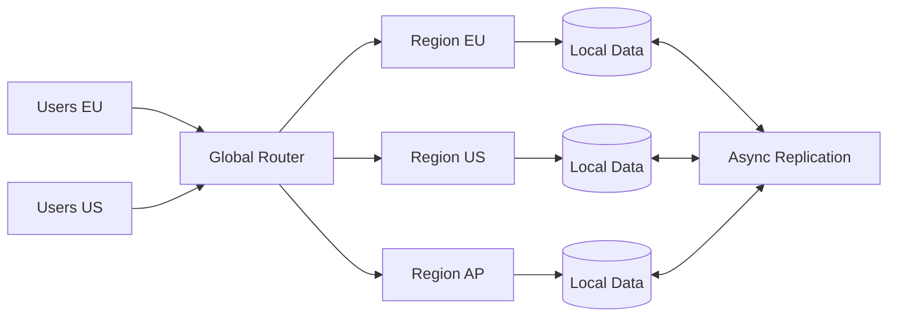

# Geode (Geo-Distributed)

> Deploy a service in multiple geographic regions as cooperating active units so users are served near their location and the system can survive regional failure.

**Scale:** architectural · **Category:** cloud-distributed · **Maturity:** established

**Also known as:** Geo-Distributed Deployment, Active-Active Regions

## Description

A geode architecture runs the same capability in several geographically separated locations, with traffic routed to the nearest healthy region and data replicated or partitioned according to consistency needs. Each geode should be able to serve local traffic independently, while replication, conflict resolution, and failover policies make the whole system behave as one product. It is not just disaster recovery: users actively use multiple regions during normal operation, so latency, sovereignty, and regional blast radius are first-class design constraints.

**Problem.** A single-region deployment creates unacceptable latency for distant users and can turn a regional cloud outage into a global service outage.

**Context.** Global products, regulated workloads with data-residency requirements, and services whose availability target exceeds what one region can provide.

## Diagram



## Consequences / Trade-offs

- Improves user latency by keeping request handling and reads close to users.
- Survives many regional failures if routing and dependencies are also regionalised.
- Forces explicit choices about strong consistency, conflict resolution, and data residency.
- Substantially increases cost, observability, release, and operational complexity.

## Ratings by project size

| Project size | Score | Notes |
| --- | --- | --- |
| Small (<10k LOC) | ●○○○○ 1/5 | Avoid for small systems; backup and restore or a warm standby is usually enough. |
| Medium (≤100k LOC) | ●●●○○ 3/5 | Useful only when latency, residency, or availability targets already justify multi-region operations. |
| Large (>100k LOC) | ●●●●● 5/5 | Excellent for global platforms, but only with mature observability, release, data, and incident practices. |

## Examples

### Region-aware writes

**❌ Negative (typescript)**

```typescript
// Every request crosses the ocean to the primary region.
async function updateProfile(user: UserProfile) {
  await primaryRegionClient.put(`/profiles/${user.id}`, user);
}
```

**✅ Positive (typescript)**

```typescript
interface RegionDirectory {
  homeRegionFor(userId: string): RegionClient;
}

async function updateProfile(user: UserProfile) {
  const region = regionDirectory.homeRegionFor(user.id);
  await region.put(`/profiles/${user.id}`, user);
  await eventBus.publish("ProfileUpdated", { userId: user.id, region: region.name });
}
```

*The positive version writes to the user's home region and emits a fact for replication, avoiding routine cross-region writes while retaining global visibility.*

## Relationships

**Synergies**

- [Deployment Stamp (Cells)](../cloud-distributed/deployment-stamp.md) — Each region can contain one or more repeatable stamps with identical infrastructure and release shape.
- [Health Endpoint Monitoring](../cloud-distributed/health-endpoint-monitoring.md) — Global traffic managers need region-level health signals before shifting users.
- [Sharding](../cloud-distributed/sharding.md) — Sharding by geography or tenant keeps most writes local and limits replication fan-out.
- [Event-Driven Architecture](../architecture/event-driven-architecture.md) — Asynchronous events replicate facts between regions without forcing every request into a global transaction.

**Alternatives:** [Read Replica](../data-persistence/read-replica.md), [Deployment Stamp (Cells)](../cloud-distributed/deployment-stamp.md), [Cell-Based Architecture](../architecture/cell-based-architecture.md)

## Applicability tags

- **Languages:** language-agnostic, java, csharp, go, typescript
- **Frameworks:** kubernetes, istio, terraform, spring-boot, dotnet
- **Project types:** microservices, distributed-system, web-api, backend-service, high-throughput
- **Tags:** multi-region, active-active, latency, disaster-recovery

## References

- [Microsoft Azure Architecture Center; Geodes pattern](https://learn.microsoft.com/azure/architecture/patterns/geodes)

