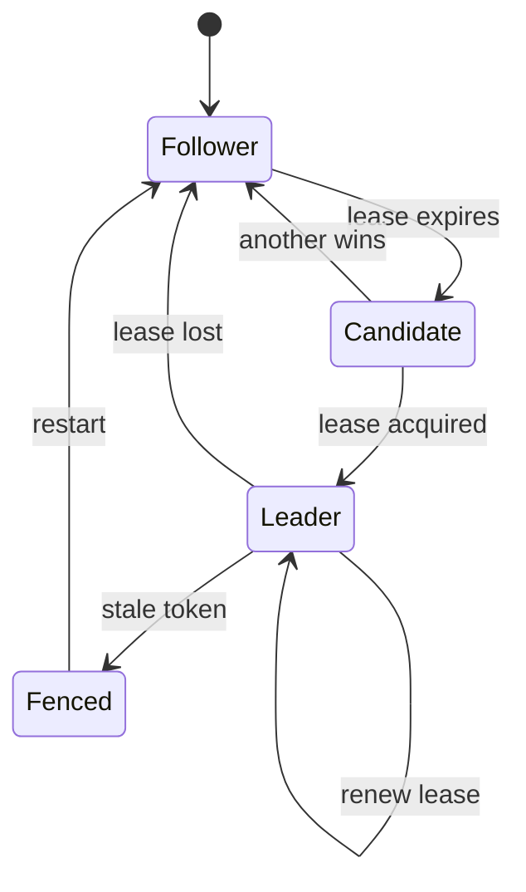

# Leader Election

> Coordinate a cluster so exactly one healthy instance owns singleton work at a time, with automatic handover when the leader fails or loses its lease.

**Scale:** architectural · **Category:** cloud-distributed · **Maturity:** time-tested

## Description

Leader Election lets a set of equivalent processes choose one temporary coordinator for tasks that must not run concurrently, such as scheduling, shard ownership, schema migration, or compaction. Production implementations use a consensus-backed lock, lease, or membership service rather than local clocks or ad hoc database flags. The leader must renew ownership, fence stale leaders, and make every operation safe to retry because failover can happen at inconvenient boundaries.

**Problem.** Multiple replicas are needed for availability, but some responsibilities are unsafe when every replica performs them independently.

**Context.** Replicated services, controllers, workers, and schedulers where one active owner is required for a partition or global responsibility.

## Diagram



## Consequences / Trade-offs

- Enables highly available singleton control loops without pinning work to one host.
- Simplifies coordination for scheduled jobs, shard assignment, and cluster controllers.
- Requires a reliable lease store and fencing to avoid split-brain side effects.
- Leader changes create duplicate attempts; downstream operations must be idempotent.

## Ratings by project size

| Project size | Score | Notes |
| --- | --- | --- |
| Small (<10k LOC) | ●●○○○ 2/5 | Rarely needed unless even a small app runs multiple replicas with singleton jobs. |
| Medium (≤100k LOC) | ●●●●○ 4/5 | Good fit for clustered schedulers and controllers; prefer proven platform primitives. |
| Large (>100k LOC) | ●●●●● 5/5 | Essential for large distributed control planes, but fencing and observability are non-negotiable. |

## Examples

### Running one scheduler in a replica set

**❌ Negative (go)**

```go
// Every replica schedules the same invoice run.
func tick() {
  for _, account := range accountsDueToday() {
    enqueueInvoiceJob(account.ID)
  }
}
```

**✅ Positive (go)**

```go
func tick(nodeID string, leases LeaseStore) error {
  lease, ok := leases.TryAcquire("invoice-scheduler", nodeID, 30*time.Second)
  if !ok {
    return nil
  }
  defer lease.RenewUntilDone()

  for _, account := range accountsDueToday() {
    enqueueInvoiceJob(IdempotencyKey("invoice:" + account.ID + ":" + today()))
  }
  return nil
}
```

*The positive version gates singleton scheduling behind a renewable lease and uses idempotent job keys so a failover cannot safely double-charge customers.*

## Relationships

**Synergies**

- [Scheduler-Agent-Supervisor](../cloud-distributed/scheduler-agent-supervisor.md) — The scheduler role often uses leader election so only one scheduler assigns work.
- [Idempotency](../resilience/idempotency.md) — New leaders may repeat partially completed work after a failover.
- [Health Endpoint Monitoring](../cloud-distributed/health-endpoint-monitoring.md) — Health and readiness checks should reflect whether an instance is leader, follower, or unable to renew leases.
- [State](../gof-behavioural/state.md) — Candidate, leader, follower, and fenced modes are cleanly modelled as explicit states.

**Conflicts with:** [Singleton](../gof-creational/singleton.md)

**Alternatives:** [Competing Consumers](../cloud-distributed/competing-consumers.md), [Queue-Based Load Leveling](../cloud-distributed/queue-based-load-leveling.md), [Actor Model](../concurrency/actor-model.md)

## Applicability tags

- **Languages:** language-agnostic, go, java, csharp, typescript, python
- **Frameworks:** kubernetes, akka, spring-boot, dotnet, redis
- **Project types:** distributed-system, backend-service, microservices, high-throughput, realtime-system
- **Tags:** coordination, consensus, lease, split-brain

## References

- [Microsoft Azure Architecture Center; Leader Election pattern](https://learn.microsoft.com/azure/architecture/patterns/leader-election)

