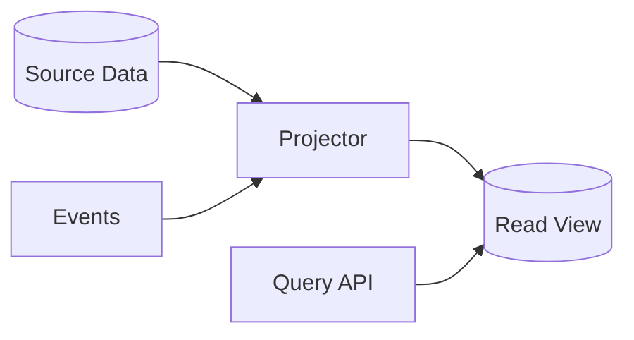

# Materialized View

> Precompute and store a read-optimised projection of source data so expensive or cross-service queries can be served quickly from a purpose-built view.

**Scale:** data · **Category:** cloud-distributed · **Maturity:** time-tested

## Description

A Materialized View stores derived data rather than calculating it on every request. The view may be refreshed synchronously, on a schedule, or from events and change streams. In distributed systems it is often a denormalised projection owned by a read model, search index, dashboard table, or cache-like store. The pattern trades freshness and write complexity for predictable read latency and query shapes that do not require joining across service boundaries.

**Problem.** User-facing reads often need aggregates, joins, filters, or cross-service data that are too slow, too expensive, or impossible to compute from normalised sources at request time.

**Context.** Use for dashboards, search pages, reporting, CQRS read models, and high-traffic endpoints where read shape is stable and bounded staleness is acceptable.

## Diagram



## Consequences / Trade-offs

- Provides fast, simple reads tailored to a specific query or UI.
- Avoids runtime joins across service or database boundaries.
- Introduces eventual consistency and refresh failure modes.
- Requires rebuild, backfill, and reconciliation procedures when projection logic changes.

## Ratings by project size

| Project size | Score | Notes |
| --- | --- | --- |
| Small (<10k LOC) | ●●○○○ 2/5 | Usually premature unless a specific query is already too slow to index normally. |
| Medium (≤100k LOC) | ●●●●○ 4/5 | Good fit for dashboards and read-heavy endpoints with acceptable staleness. |
| Large (>100k LOC) | ●●●●● 5/5 | Essential for large distributed systems where read models must avoid cross-service joins. |

## Examples

### Precomputing customer order totals

**❌ Negative (sql)**

```sql
SELECT c.id, c.name, COUNT(o.id) AS order_count, SUM(o.total) AS lifetime_value
FROM customers c
LEFT JOIN orders o ON o.customer_id = c.id
WHERE c.tenant_id = $1
GROUP BY c.id, c.name
ORDER BY lifetime_value DESC
LIMIT 50;
```

**✅ Positive (sql)**

```sql
CREATE TABLE customer_order_summary (
  tenant_id text NOT NULL,
  customer_id text NOT NULL,
  customer_name text NOT NULL,
  order_count integer NOT NULL,
  lifetime_value numeric NOT NULL,
  refreshed_at timestamptz NOT NULL,
  PRIMARY KEY (tenant_id, customer_id)
);

SELECT customer_id, customer_name, order_count, lifetime_value
FROM customer_order_summary
WHERE tenant_id = $1
ORDER BY lifetime_value DESC
LIMIT 50;
```

*The positive version reads from a projection shaped for the screen, avoiding repeated aggregate joins on every request at the cost of managed freshness.*

## Relationships

**Synergies**

- [CQRS (Command Query Responsibility Segregation)](../architecture/cqrs.md) — Materialized views are the usual read side of a CQRS model.
- [Event Sourcing](../architecture/event-sourcing.md) — Event streams can rebuild or update projections deterministically.
- [Change Data Capture (CDC)](../data-persistence/change-data-capture.md) — CDC feeds keep views up to date without coupling writes to projection storage.
- [Cache-Aside](../cloud-distributed/cache-aside.md) — Hot projection rows can still be cached while the materialized view remains the query source.

**Alternatives:** [Read Replica](../data-persistence/read-replica.md), [Query Object](../enterprise-application/query-object.md), [Cache-Aside](../cloud-distributed/cache-aside.md)

## Applicability tags

- **Languages:** language-agnostic, sql, typescript, java, csharp, python
- **Frameworks:** kafka, redis, spring-boot, dotnet, nodejs
- **Project types:** backend-service, web-api, data-pipeline, distributed-system, high-throughput
- **Tags:** projection, read-model, denormalisation

## References

- [Microsoft Azure Architecture Center; Materialized View pattern](https://learn.microsoft.com/azure/architecture/patterns/materialized-view)

