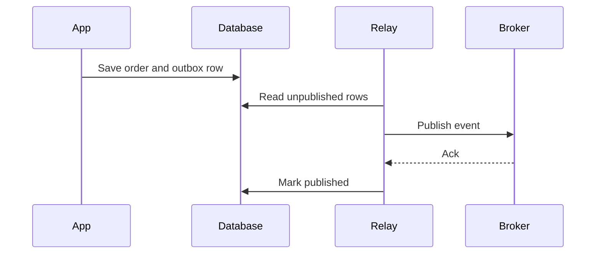

# Transactional Outbox

> Store messages in the same transaction as domain state, then publish them asynchronously so state changes and integration events cannot be lost independently.

**Scale:** data · **Altitude:** medium · **Category:** cloud-distributed · **Maturity:** established

**Also known as:** Outbox Pattern

## Description

Transactional Outbox writes outbound messages to an outbox table or collection in the same local transaction that changes business state. A relay process later reads unpublished rows and delivers them to a broker, marking or deleting them only after successful publication. This avoids the dual-write bug where the database commit succeeds but event publication fails, or the event publishes while the database rolls back. Consumers must still be idempotent because relay crashes can publish a message more than once.

**Problem.** Updating a database and publishing a message are two separate side effects; without atomicity, failures create missing events or events for state that did not commit.

**Context.** Event-driven services, sagas, CQRS projections, and microservices that publish facts derived from local transactional state.

## Diagram



## Consequences / Trade-offs

- Eliminates lost events caused by the database and broker being updated separately.
- Keeps the service autonomous because it only relies on its local transaction.
- Adds relay lag, outbox storage growth, and ordering decisions to operate.
- At-least-once publication means consumers and downstream commands must be idempotent.

## Ratings by project size

| Project size | Score | Notes |
| --- | --- | --- |
| Small (<10k LOC) | ●●○○○ 2/5 | Usually unnecessary without a broker or integration events. |
| Medium (≤100k LOC) | ●●●●● 5/5 | Excellent default for services that publish events from transactional state. |
| Large (>100k LOC) | ●●●●● 5/5 | Essential for reliable event-driven systems; pair with idempotent consumers and relay monitoring. |

## Examples

### Publishing an order event safely

**❌ Negative (typescript)**

```typescript
await db.query("INSERT INTO orders(id, status) VALUES($1, 'placed')", [order.id]);
await broker.publish("OrderPlaced", { orderId: order.id }); // may fail after commit
```

**✅ Positive (typescript)**

```typescript
await db.transaction(async tx => {
  await tx.query("INSERT INTO orders(id, status) VALUES($1, 'placed')", [order.id]);
  await tx.query(
    "INSERT INTO outbox(id, topic, payload) VALUES($1, $2, $3)",
    [messageId, "OrderPlaced", JSON.stringify({ orderId: order.id })],
  );
});

// A relay publishes unpublished outbox rows and marks them sent after broker ack.
```

*The positive version commits state and event intent atomically in one database transaction, so a relay can safely retry publication without losing the event.*

## Relationships

**Synergies**

- [Event-Driven Consumer](../enterprise-integration/event-driven-consumer.md) — Consumers receive outbox-published messages reliably and should process them asynchronously.
- [Idempotent Receiver](../enterprise-integration/idempotent-receiver.md) — Outbox relays can republish after crashes, so receivers must deduplicate by message id.
- [Saga](../cloud-distributed/saga.md) — Saga state transitions and commands should be committed atomically with outgoing messages.
- [Change Data Capture (CDC)](../data-persistence/change-data-capture.md) — CDC can implement the relay by streaming committed outbox rows from the database log.

**Conflicts with:** [Request-Reply](../enterprise-integration/request-reply.md)

**Alternatives:** [Change Data Capture (CDC)](../data-persistence/change-data-capture.md), [Guaranteed Delivery](../enterprise-integration/guaranteed-delivery.md)

## Applicability tags

- **Languages:** language-agnostic, sql, typescript, java, csharp, go
- **Frameworks:** kafka, rabbitmq, nats, spring-boot, dotnet, sqlalchemy
- **Project types:** microservices, distributed-system, backend-service, data-pipeline, high-throughput
- **Tags:** dual-write, reliable-messaging, events, eventual-consistency

## References

- [Chris Richardson, Microservices Patterns; Transactional Outbox, (2018)](https://microservices.io/patterns/data/transactional-outbox.html)

