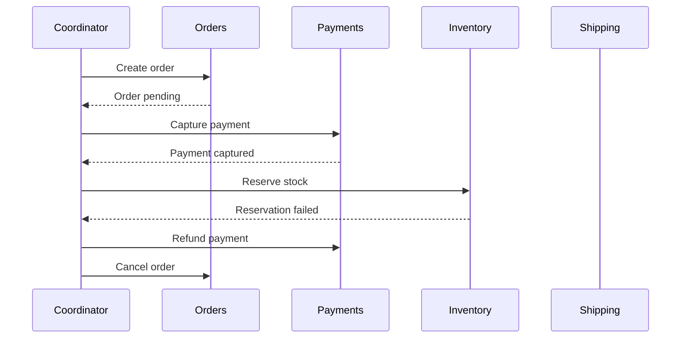

# Saga

> Manage a long-running distributed transaction as a sequence of local transactions, with compensating actions that restore business consistency after failure.

**Scale:** integration · **Category:** cloud-distributed · **Maturity:** time-tested

## Description

A Saga decomposes one business transaction into ordered local transactions owned by separate services. Each step commits locally and either triggers the next step or, on failure, runs compensating actions for previously completed steps. Sagas can be orchestrated by a process manager or choreographed through events. They trade atomic isolation for availability and autonomy, so invariants must be expressed as state machines, reservations, idempotent commands, and visible recovery policies rather than database locks across services.

**Problem.** Business workflows span multiple services and data stores, but two-phase commit is unavailable, too slow, or too coupling-heavy for the operational environment.

**Context.** Order fulfilment, travel booking, onboarding, provisioning, and payment flows where each participant owns its data and can expose compensating operations.

## Diagram



## Consequences / Trade-offs

- Avoids global locks and lets each service keep local transactional ownership.
- Makes failure handling explicit through compensations and durable saga state.
- Exposes intermediate states to users and other services; isolation is not automatic.
- Requires idempotent participants, correlation, timeouts, and operational tooling for stuck sagas.

## Ratings by project size

| Project size | Score | Notes |
| --- | --- | --- |
| Small (<10k LOC) | ●●○○○ 2/5 | Overhead is high unless a small service already coordinates real external side effects. |
| Medium (≤100k LOC) | ●●●●○ 4/5 | Good fit for multi-service business workflows with clear compensations. |
| Large (>100k LOC) | ●●●●● 5/5 | Essential for large microservice estates that need consistency without distributed locking. |

## Examples

### Durable order saga

**❌ Negative (typescript)**

```typescript
// Pretends remote calls are one atomic transaction; partial commits leak on failure.
await db.transaction(async tx => {
  await orders.create(tx, order);
  await payments.capture(order.id, card);
  await inventory.reserve(order.id, sku);
  await shipping.create(order.id);
});
```

**✅ Positive (typescript)**

```typescript
await sagaStore.save({ id: order.id, state: "Started" });
await orders.createPending(order);

await saga.step(order.id, "CapturePayment", () => payments.capture(order.id, card),
  () => payments.refund(order.id));
await saga.step(order.id, "ReserveStock", () => inventory.reserve(order.id, sku),
  () => inventory.release(order.id, sku));
await saga.step(order.id, "CreateShipment", () => shipping.create(order.id),
  () => shipping.cancel(order.id));

await orders.markConfirmed(order.id);
```

*The positive version persists saga progress and pairs each local transaction with a compensation, so recovery can continue after partial failure instead of relying on impossible atomicity.*

## Relationships

**Synergies**

- [Choreography](../cloud-distributed/choreography.md) — Choreographed sagas use events instead of a central coordinator for step progression.
- [Process Manager](../enterprise-integration/process-manager.md) — Orchestrated sagas use a process manager to persist state and command participants.
- [Compensating Transaction](../cloud-distributed/compensating-transaction.md) — Each completed saga step needs a business-specific compensation when a later step fails.
- [Transactional Outbox](../cloud-distributed/outbox.md) — Saga commands and events should be published atomically with local state changes.
- [Event-Driven Architecture](../architecture/event-driven-architecture.md) — Saga progress is often represented as domain events and asynchronous commands.

**Conflicts with:** [Pessimistic Offline Lock](../enterprise-application/pessimistic-offline-lock.md)

**Alternatives:** [Process Manager](../enterprise-integration/process-manager.md), [Routing Slip](../enterprise-integration/routing-slip.md), [Choreography](../cloud-distributed/choreography.md)

## Applicability tags

- **Languages:** language-agnostic, typescript, java, csharp, go, python
- **Frameworks:** kafka, rabbitmq, nats, spring-boot, dotnet
- **Project types:** microservices, distributed-system, backend-service, web-api, high-throughput
- **Tags:** distributed-transaction, workflow, compensation, eventual-consistency

## References

- Hector Garcia-Molina and Kenneth Salem, Sagas, (1987)
- Chris Richardson, Microservices Patterns, (2018)

