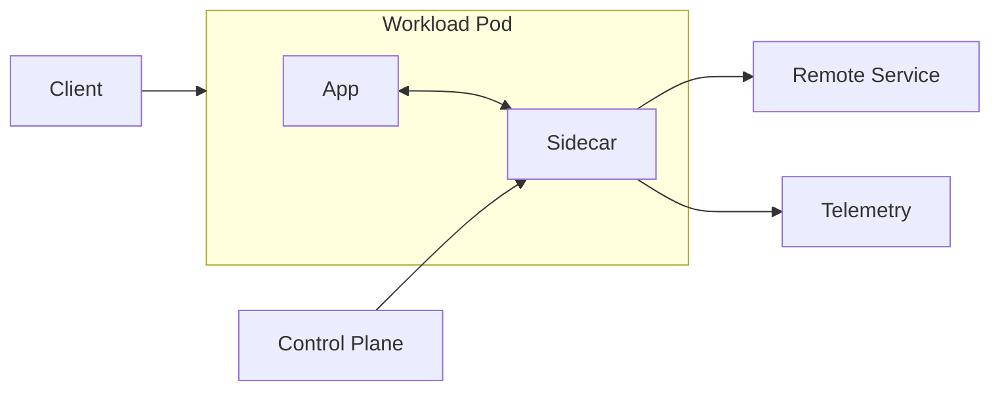

# Sidecar

> Attach a helper process or container to an application instance so cross-cutting capabilities such as proxying, telemetry, configuration, or secret refresh can be added without changing the application code.

**Scale:** architectural · **Category:** cloud-distributed · **Maturity:** established

## Description

Sidecar places an auxiliary runtime next to each service instance, usually in the same pod, task, or VM boundary. The application talks to localhost or a shared volume/socket while the sidecar handles concerns that should be uniform across many services: mTLS, service discovery, log shipping, policy checks, dynamic configuration, or protocol translation. Because the sidecar shares the deployment lifecycle and failure domain of the primary workload, it can be managed as infrastructure while still observing and influencing per-instance traffic and state.

**Problem.** Cross-cutting distributed-system behaviour is often duplicated in every service. That creates inconsistent retries, telemetry, policy enforcement, and upgrade cadence, especially in polyglot fleets.

**Context.** Use when many independently deployed services need the same operational capabilities and the platform can reliably co-schedule a helper beside each workload, such as Kubernetes pods or service-mesh data planes.

## Diagram



## Consequences / Trade-offs

- Centralises operational behaviour without forcing every service to import the same libraries.
- Keeps language runtimes lean and lets platform teams upgrade sidecar capabilities independently.
- Adds another process to every instance, increasing resource use and local failure modes.
- Debugging must include app, sidecar, and control-plane configuration, not just application code.

## Ratings by project size

| Project size | Score | Notes |
| --- | --- | --- |
| Small (<10k LOC) | ●●○○○ 2/5 | Usually too much operational overhead for a small service or single application. |
| Medium (≤100k LOC) | ●●●○○ 3/5 | Useful when several services need common proxying or telemetry, but watch resource cost. |
| Large (>100k LOC) | ●●●●● 5/5 | Excellent for large polyglot fleets where consistent policy and observability outweigh added runtime complexity. |

## Examples

### Keeping mesh concerns out of handlers

**❌ Negative (typescript)**

```typescript
// Every service repeats proxy concerns and must be redeployed for policy changes.
app.get("/orders/:id", async (req, res) => {
  const token = await mintServiceToken("orders-api");
  const response = await fetch(`https://inventory.internal/${req.params.id}`, {
    headers: {
      Authorization: `Bearer ${token}`,
      "x-trace-id": req.header("x-trace-id") ?? crypto.randomUUID(),
    },
  });
  if (!response.ok) throw new Error("inventory unavailable");
  res.json(await response.json());
});
```

**✅ Positive (typescript)**

```typescript
// The app talks to localhost; the sidecar owns mTLS, tracing, retries, and routing.
app.get("/orders/:id", async (req, res) => {
  const response = await fetch(`http://127.0.0.1:15001/inventory/${req.params.id}`);
  if (!response.ok) throw new Error("inventory unavailable");
  res.json(await response.json());
});
```

*The positive version removes security and routing policy from business code, allowing the platform sidecar to enforce those behaviours consistently across all services and languages.*

## Relationships

**Synergies**

- [Service Mesh](../architecture/service-mesh.md) — A service mesh commonly implements its data plane as sidecars that enforce mTLS, routing, and telemetry per workload.
- [Circuit Breaker](../resilience/circuit-breaker.md) — Sidecar proxies can apply circuit breaking consistently at each instance boundary without application-specific libraries.
- [Bulkhead](../resilience/bulkhead.md) — Resource limits for the sidecar and app keep proxy failures from exhausting the primary workload.
- [Health Endpoint Monitoring](../cloud-distributed/health-endpoint-monitoring.md) — Separate health checks for app and sidecar prevent routing traffic to half-initialised or degraded pods.

**Conflicts with:** [Monolith](../architecture/monolith.md)

**Alternatives:** [API Gateway](../architecture/api-gateway.md), [Gateway Offloading](../cloud-distributed/gateway-offloading.md), [Middleware Pipeline](../implementation/middleware-pipeline.md)

## Applicability tags

- **Languages:** language-agnostic, go, java, typescript, python
- **Frameworks:** kubernetes, istio, grpc, nodejs, spring-boot
- **Project types:** microservices, distributed-system, backend-service, web-api
- **Tags:** platform, proxy, observability, zero-trust

## References

- [Microsoft Azure Architecture Center; Sidecar pattern](https://learn.microsoft.com/azure/architecture/patterns/sidecar)

