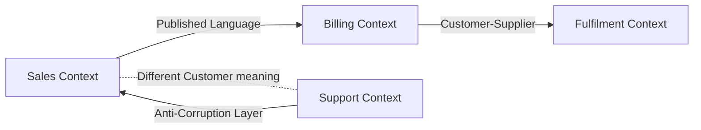

# Bounded Context

> Draw an explicit boundary around a model, language, codebase, and team ownership so terms and rules are consistent inside and deliberately translated outside.

**Scale:** architectural · **Altitude:** high · **Category:** ddd-strategic · **Maturity:** time-tested

## Description

A Bounded Context is the strategic DDD boundary within which a domain model is defined and consistent. The same word may mean different things in different contexts: Customer in Sales, Support, and Billing often has different lifecycle, identifiers, and rules. A bounded context owns its ubiquitous language, code, data model, APIs, and team decisions. Integration between contexts is explicit through relationships such as customer-supplier, conformist, shared kernel, anti-corruption layer, open host service, or published language. Bounded contexts are not automatically microservices, but good service boundaries frequently align with them.

**Problem.** Enterprise systems often force one canonical model across departments that use the same words differently. The result is ambiguous terminology, bloated shared schemas, and teams changing each other's rules accidentally.

**Context.** Use bounded contexts when multiple teams, capabilities, or subdomains need autonomy and when the language or invariants differ across parts of the business. They are most valuable in complex domains with organisational boundaries.

## Diagram



## Consequences / Trade-offs

- Preserves model integrity by keeping meanings consistent inside the boundary.
- Enables team autonomy and independent evolution when ownership is clear.
- Forces integration contracts and translations to be explicit.
- Adds coordination cost; splitting too early creates distributed complexity and duplicate concepts.

## Ratings by project size

| Project size | Score | Notes |
| --- | --- | --- |
| Small (<10k LOC) | ●●○○○ 2/5 | Usually overkill for tiny apps with one team and one model; modules or packages may be enough. |
| Medium (≤100k LOC) | ●●●●○ 4/5 | Useful for modular monoliths and growing products where capabilities and vocabulary begin to diverge. |
| Large (>100k LOC) | ●●●●● 5/5 | Excellent for large organisations: it anchors ownership, language, data boundaries, and service decomposition. |

## Examples

### Separate customer meanings by context

**❌ Negative (typescript)**

```typescript
export interface Customer {
  id: string;
  email: string;
  creditLimit: number;
  supportTier: string;
  salesStage: string;
  invoiceAccountId: string;
}

// Sales, Billing, and Support all import this shared type and add nullable fields.
```

**✅ Positive (typescript)**

```typescript
// sales/customer.ts
export class SalesCustomer {
  constructor(readonly id: SalesCustomerId, readonly email: Email, readonly stage: SalesStage) {}
  qualify(opportunityValue: Money): QualifiedLead { /* sales language */ throw new Error("not implemented"); }
}

// billing/customer.ts
export class BillingAccount {
  constructor(readonly id: BillingAccountId, readonly payer: Email, readonly creditLimit: Money) {}
  placeOnHold(reason: HoldReason): void { /* billing language */ }
}

// integration/customer-translator.ts maps published sales events into billing commands.
```

*The positive version allows Sales and Billing to use different models and terms. Translation is explicit at the boundary rather than hidden in a bloated shared Customer type.*

## Relationships

**Synergies**

- [Ubiquitous Language](../ddd-strategic/ubiquitous-language.md) — A bounded context is the scope within which a ubiquitous language has one precise meaning.
- [Context Map](../ddd-strategic/context-map.md) — Context maps show how bounded contexts depend on, conform to, or translate between each other.
- [Anti-Corruption Layer](../cloud-distributed/anti-corruption-layer.md) — ACLs protect a context's model when integrating with a legacy or upstream model that should not leak inside.
- [Microservices](../architecture/microservices.md) — Microservice boundaries are strongest when they align to bounded contexts rather than technical layers.

**Conflicts with:** [Shared Kernel](../ddd-strategic/shared-kernel.md)

**Alternatives:** [Modular Monolith](../architecture/modular-monolith.md), [Layered (N-Tier) Architecture](../architecture/layered-architecture.md), [Service-Oriented Architecture (SOA)](../architecture/service-oriented-architecture.md)

## Applicability tags

- **Languages:** language-agnostic, csharp, java, typescript
- **Frameworks:** none, spring-boot, dotnet, nestjs, kafka
- **Project types:** backend-service, microservices, modular-monolith, distributed-system
- **Tags:** ddd, strategic-design, boundaries, team-topology

## References

- Eric Evans, Domain-Driven Design, (2003)
- Vaughn Vernon, Implementing Domain-Driven Design, (2013)

