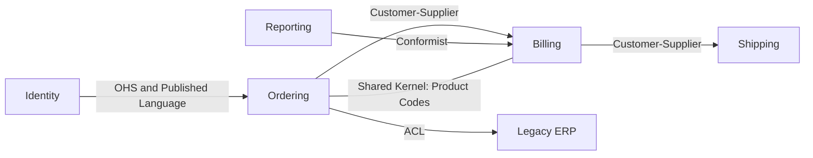

# Context Map

> Document bounded contexts and their relationships so teams can reason about upstream/downstream influence, translation, and integration risk.

**Scale:** architectural · **Altitude:** high · **Category:** ddd-strategic · **Maturity:** time-tested

## Description

A Context Map is a strategic DDD diagram and narrative that shows the bounded contexts in a system and the relationship between them. It captures organisational and integration reality: who is upstream, who conforms, where a shared kernel exists, which contexts publish stable contracts, and where an anti-corruption layer protects a model. The map is most useful when paired with explicit ownership and decision records; it is not an architecture vanity diagram but a tool for integration planning, team negotiation, and migration strategy.

**Problem.** Large systems accumulate hidden dependencies between teams and models. Without a map, teams discover too late that they depend on an upstream schema, duplicate a concept, or are forced to conform to a model that damages their own language.

**Context.** Use context maps when several bounded contexts, teams, or systems collaborate and the integration relationships differ in power, ownership, or translation cost.

## Diagram



## Consequences / Trade-offs

- Makes socio-technical dependencies visible and discussable.
- Helps choose relationship patterns such as shared kernel, conformist, or anti-corruption layer intentionally.
- Supports migration planning by showing seams around legacy systems.
- Becomes stale quickly unless maintained as ownership, APIs, and team boundaries change.

## Ratings by project size

| Project size | Score | Notes |
| --- | --- | --- |
| Small (<10k LOC) | ●○○○○ 1/5 | Avoid for tiny single-context apps; a module diagram or README is enough. |
| Medium (≤100k LOC) | ●●●●○ 4/5 | Good fit once several modules, teams, or external systems interact and relationship choices matter. |
| Large (>100k LOC) | ●●●●● 5/5 | Excellent for large organisations because it exposes ownership, upstream influence, translation costs, and integration strategy. |

## Examples

### Integration relationship made explicit

**❌ Negative (typescript)**

```typescript
import { ErpCustomer, ErpOrder } from "legacy-erp-sdk";

export function priceOrder(customer: ErpCustomer, order: ErpOrder): Money {
  if (customer.customer_type === "G") return Money.gbp(order.total * 0.9);
  return Money.gbp(order.total);
}
```

**✅ Positive (typescript)**

```typescript
// Context map decision: Ordering integrates to Legacy ERP through an ACL.
class ErpCustomerTranslator {
  toOrderingCustomer(record: LegacyErpCustomer): OrderingCustomerSnapshot {
    return new OrderingCustomerSnapshot(
      CustomerId.fromLegacy(record.CUST_NO),
      record.customer_type === "G" ? CustomerSegment.Gold : CustomerSegment.Standard,
    );
  }
}

export function priceOrder(customer: OrderingCustomerSnapshot, order: DraftOrder): Money {
  return customer.segment === CustomerSegment.Gold ? order.total().discountBy(10) : order.total();
}
```

*The positive version follows the context-map relationship: Ordering does not import the Legacy ERP model directly, so the integration choice is reflected in code rather than only in a diagram.*

## Relationships

**Synergies**

- [Bounded Context](../ddd-strategic/bounded-context.md) — A context map is built from bounded contexts and records how their models meet.
- [Shared Kernel](../ddd-strategic/shared-kernel.md) — Shared kernel is one relationship type shown on the map where teams co-own a small model subset.
- [Customer-Supplier](../ddd-strategic/customer-supplier.md) — Customer-supplier captures upstream planning commitments and downstream needs on the map.
- [Conformist](../ddd-strategic/conformist.md) — Conformist relationships identify downstream contexts that deliberately adopt an upstream model.
- [Anti-Corruption Layer](../cloud-distributed/anti-corruption-layer.md) — ACL marks boundaries where translation protects a context from external model pollution.

**Conflicts with:** [Layered (N-Tier) Architecture](../architecture/layered-architecture.md)

**Alternatives:** [Service-Oriented Architecture (SOA)](../architecture/service-oriented-architecture.md), [Microservices](../architecture/microservices.md), [Canonical Data Model](../enterprise-integration/canonical-data-model.md)

## Applicability tags

- **Languages:** language-agnostic, csharp, java, typescript
- **Frameworks:** none, spring-boot, dotnet, kafka, grpc
- **Project types:** microservices, modular-monolith, distributed-system, backend-service
- **Tags:** ddd, strategic-design, context-map, integration

## References

- Eric Evans, Domain-Driven Design, (2003)
- Vaughn Vernon, Implementing Domain-Driven Design, (2013)

