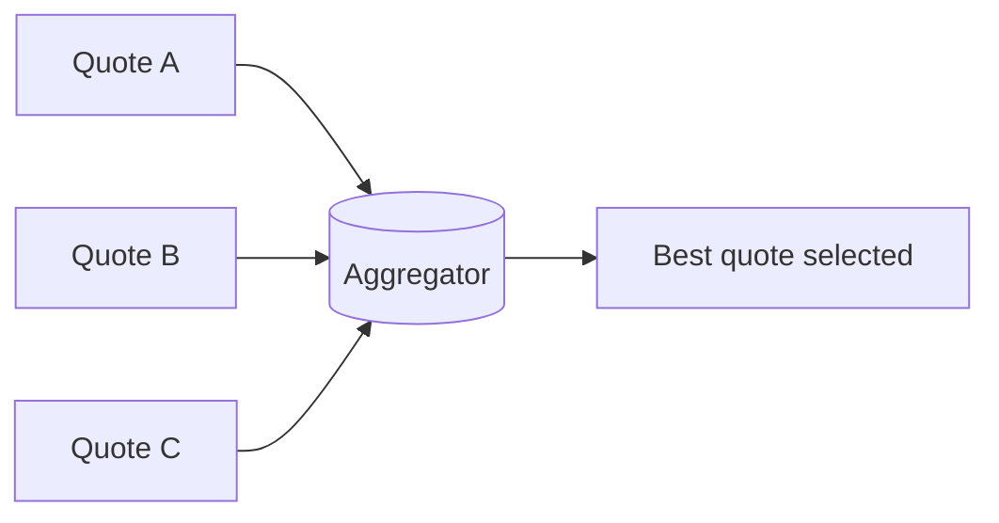

# Aggregator

> Collect related messages, decide when the group is complete, and publish a combined result or completion event.

**Scale:** integration · **Category:** enterprise-integration · **Maturity:** time-tested

## Description

An Aggregator reassembles or summarises a set of related messages. It needs three policies: a correlation strategy to decide which messages belong together, a completion condition to decide when enough messages have arrived, and an aggregation function to produce the result. It is frequently paired with Splitter or Scatter-Gather. Because messages can be late, duplicated, or missing, the aggregator must persist state, apply timeouts, and define recovery behaviour.

**Problem.** Once work has been split or scattered across services, the system needs a reliable way to know which results belong together and when it can continue without waiting forever.

**Context.** Use when multiple messages contribute to one business outcome: line-item processing, quote collection, parallel validations, partial shipments, or distributed enrichment.

## Diagram



## Consequences / Trade-offs

- Reconstructs business outcomes from independently processed messages.
- Provides a clear place for timeout, quorum, and partial-result policy.
- Requires durable correlation state; in-memory aggregation loses work on restart.
- Late, duplicate, and conflicting messages must be handled explicitly.

## Ratings by project size

| Project size | Score | Notes |
| --- | --- | --- |
| Small (<10k LOC) | ●●○○○ 2/5 | Rarely needed without parallel message flows; simple in-process joins may suffice. |
| Medium (≤100k LOC) | ●●●●○ 4/5 | Useful when split or parallel work must be reconciled with timeouts. |
| Large (>100k LOC) | ●●●●● 5/5 | Essential for integration-heavy systems, but it introduces state that must be durable and observable. |

## Examples

### Aggregating provider quotes by request id

**❌ Negative (java)**

```java
void handle(QuoteResponse response) {
  cache.put(response.provider(), response);
  if (cache.size() == 3) {
    publishBest(cache.values()); // shared cache, no request correlation, no timeout
  }
}
```

**✅ Positive (java)**

```java
from("kafka:quotes.responses")
  .routeId("quote-aggregator")
  .aggregate(header("quoteRequestId"), new BestQuoteAggregationStrategy())
    .completionSize(3)
    .completionTimeout(1500)
    .to("kafka:quotes.best");
```

*The positive route groups responses by request id, defines completion by size or timeout, and publishes one result. It avoids global mutable state and supports multiple concurrent quote requests.*

## Relationships

**Synergies**

- [Splitter](../enterprise-integration/splitter.md) — Aggregator recombines or summarises messages produced by a Splitter.
- [Scatter-Gather](../enterprise-integration/scatter-gather.md) — Scatter-Gather commonly uses an Aggregator to collect provider responses.
- [Correlation Identifier](../enterprise-integration/correlation-identifier.md) — Correlation identifiers are the key used to group related messages safely.
- [Idempotent Receiver](../enterprise-integration/idempotent-receiver.md) — Aggregators should suppress duplicate contribution messages before updating group state.

**Conflicts with:** [Choreography](../cloud-distributed/choreography.md)

**Alternatives:** [Gateway Aggregation](../cloud-distributed/gateway-aggregation.md), [Request-Reply](../enterprise-integration/request-reply.md), [Process Manager](../enterprise-integration/process-manager.md)

## Applicability tags

- **Languages:** language-agnostic, java, typescript
- **Frameworks:** spring-boot, kafka, redis, nodejs
- **Project types:** microservices, distributed-system, data-pipeline, high-throughput
- **Tags:** eip, fan-in, correlation, stateful

## References

- [Gregor Hohpe and Bobby Woolf, Enterprise Integration Patterns, (2003)](https://www.enterpriseintegrationpatterns.com/patterns/messaging/Aggregator.html)

